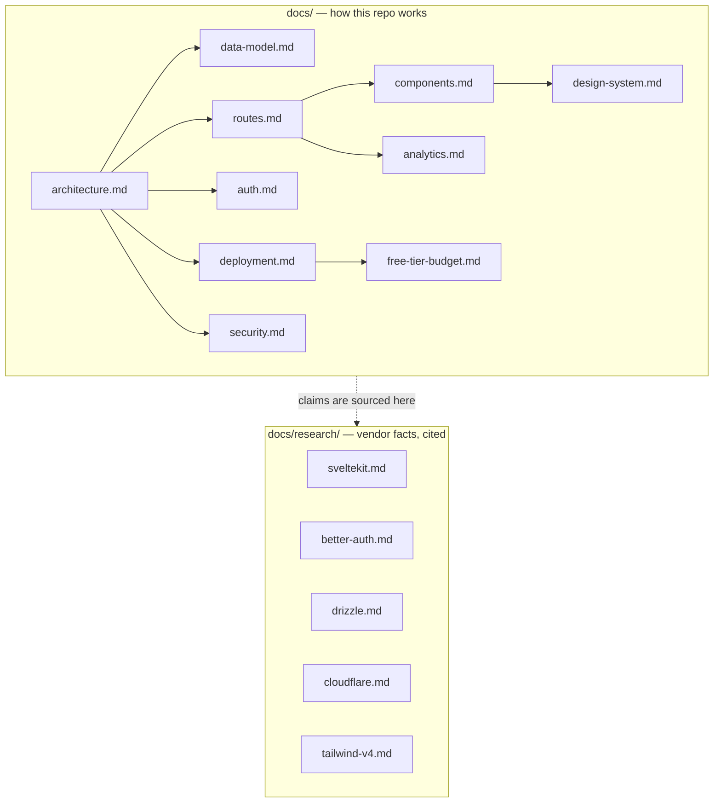

# Documentation

Job tracker is a single-tenant SvelteKit app on Cloudflare Workers free tier. It tracks job
applications through a stage pipeline, reports conversion, velocity, and dwell time, and keeps a
per-user resume library on R2 so each application records which version was sent.

**Where to start:** [`architecture.md`](architecture.md) for the shape of the system, then
[`routes.md`](routes.md) and [`data-model.md`](data-model.md) for the parts you will touch first.

## The map

| Document | What it answers | Depends on nothing but |
|---|---|---|
| [architecture.md](architecture.md) | How a request flows, where code lives, what owns what | — |
| [data-model.md](data-model.md) | Every D1 table, column, index, and migration rule | architecture |
| [auth.md](auth.md) | Better Auth setup and the approval gate | architecture, data-model |
| [routes.md](routes.md) | Every route: load, actions, redirect rules, URL state | architecture |
| [components.md](components.md) | Component tree and prop contracts | routes |
| [design-system.md](design-system.md) | Tailwind v4 tokens and the visual rules | components |
| [analytics.md](analytics.md) | What each dashboard number means and how it is computed | data-model, components |
| [deployment.md](deployment.md) | Getting it live on a free Worker | architecture, data-model |
| [free-tier-budget.md](free-tier-budget.md) | Which Cloudflare limits actually bind, and why the code is shaped this way | deployment |
| [security.md](security.md) | Headers, validation, tenancy, and what is deliberately out of scope | auth, routes |

## Two rules that keep this folder honest

**1. `docs/` and `docs/research/` do different jobs.** `docs/research/*` records what a
_vendor_ promises — SvelteKit, Better Auth, Drizzle, Cloudflare, Tailwind — with citations, and
is updated when the vendor changes. `docs/*` records what _this repo_ does. When the two
disagree, the repo wins and the research file gets corrected the same day.

**2. `AGENTS.md` is not duplicated here.** It defines _how_ to work (Bun, runes-only, no
`svelte.config.js`, `goto()` through `resolvePath()`, and so on). This folder defines _what_ the
code is. Nothing in `docs/` restates a rule from `AGENTS.md`; nothing in `AGENTS.md` describes
behaviour.

