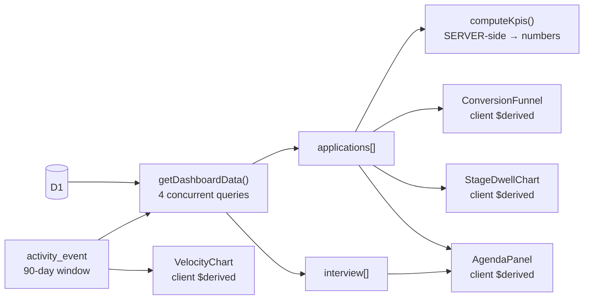
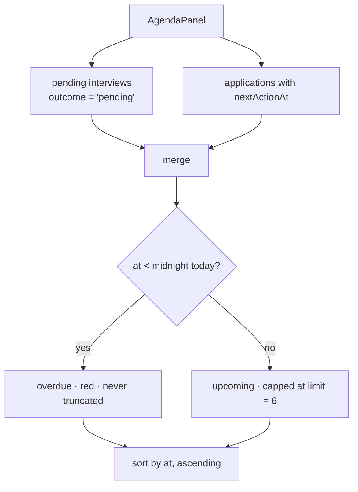
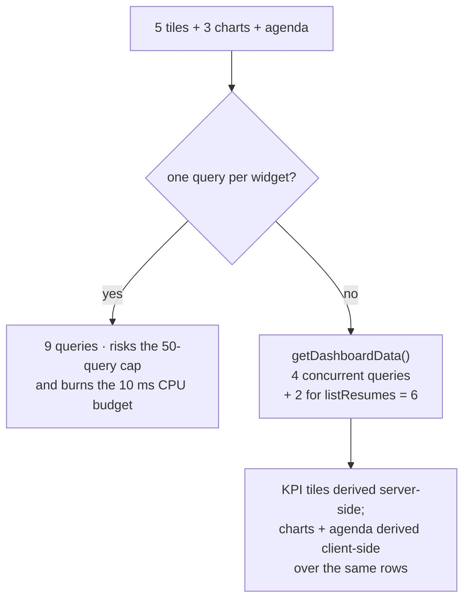

# Analytics

Five KPI tiles, three charts, and an agenda. One D1 rollup feeds all nine.

**Where the arithmetic happens differs, and it is worth being precise about.** The five KPI tiles
are computed server-side, in `computeKpis()`, and arrive as numbers. The three charts and the
agenda are computed client-side, as `$derived` values over the serialised rows the load already
returned — they cost no extra query and no extra CPU on the Worker, but they *are* re-derived in the
browser. The claim that matters for the free tier is "one query per widget-set, not one per widget",
not "nothing is derived on the client". See [Why this is one row set](#why-all-of-this-is-one-row-set).



## The KPI strip

| Tile | Definition | Excludes |
|---|---|---|
| **Active** | Rows still in play: an **open stage** *and* a status that is not `closed` | Rejected, withdrawn, accepted (terminal stages), plus anything `status: 'closed'` |
| **Interviews (next 30 days)** | Rows in `interview` with `outcome = 'pending'` and `scheduledAt` between now and 30 days out | Anything already `passed` / `failed` / `cancelled`, and anything in the past |
| **Offers pending** | Rows at stage `offer`, still in play | Closed offers |
| **Applied this month** | `appliedAt` inside the current calendar month | Nothing — deliberately not gated on being in play (see below) |
| **Needs attention** | In-play rows with status `stalled` or `ghosted` | Terminal-stage rows |

```mermaid
flowchart TD
    A["application"] --> B{"in play?<br/>open stage AND status !== closed"}
    B -- no --> F["appliedAt this month?"]
    B -- yes --> C["active += 1"]
    C --> D{"stage === 'offer'?"}
    D -- yes --> E["offersPending += 1"]
    C --> H{"stalled or ghosted?"]
    H -- yes --> I["needsAttention += 1"]
    A --> F
    F -- yes --> G["appliedThisMonth += 1"]
```

Three deliberate choices are buried in there:

- **Interviews come from the `interview` table, not from `nextActionAt`.** `nextActionAt` is a
  generic follow-up — a reminder to chase a recruiter, a deadline to reply. Counting those as
  interviews would inflate the tile with things that are not meetings.
- **"Active" is a stage test *and* a status test.** The sublabel says "Across all open stages", and
  that has to be true. An application at `onsite` with status `ghosted` is still active — that is
  precisely the row the user needs to see — but an application at stage `rejected` with status
  `active` is not, however reachable that combination is (the form sets stage and status
  independently). `isInPlay()` in `kpis.ts` is the single definition, and the dashboard's stale
  banner reads `kpis.needsAttention` rather than recomputing it, so the banner and the tile cannot
  drift apart.
- **"Applied this month" is not gated on being in play.** It is a fact about when you pressed
  apply, and it stays true after the application is rejected. Restricting it to live rows would make
  the tile drop the moment a month closed badly, which is exactly the number you want to keep
  looking at.

## Conversion funnel

A **current-state** funnel, not a historical cohort.


Each rung counts applications **at or past** that stage right now, and the rungs are the open
progression only:

```
applied → phone_screen → technical → onsite → final → offer → accepted
```

`%` is each rung's share of everything applied for; `% of prev` is the conversion from the rung
above. So an application sitting at `onsite` counts toward `applied`, `phone_screen`, `technical`
and `onsite`, and not toward `final`.

Two stage values deliberately are **not** rungs:

- **`saved`** has not entered the pipeline. Making it the first rung would put "Applied" below the
  total and invert the shape of a funnel. It is reported as a count in the footer instead, and the
  denominator for every `%` excludes it.
- **`rejected` and `withdrawn`** are exits, not rungs. This is a *current-state* funnel and the
  model records no rejection history: a row sitting at `rejected` may have died at the phone screen
  or at the final round, and nothing here can tell those apart. So they count toward `applied` (they
  definitely applied) and are never assumed to have gone further. They appear in the footer as exact
  counts — "how many am I sitting on right now" — with no `% of prev`, because a conversion rate
  between two exits that are not ordered gates would mean nothing.

That distinction is not cosmetic. An earlier version of this component put `rejected` and
`withdrawn` in the chain anyway, where the "at or past" test could never be satisfied for them, so
both bars were permanently `0` and each carried a red "0% of prev" — a sentence about nothing.

So the funnel answers "how is my pipeline shaped today", not "of the 40 I applied to in June, how
many got to onsite". Those are different questions and the second one needs a cohort table that
does not exist yet.

## Stage dwell

**Longest** wait in each live stage, anchored on `stageChangedAt`.

```mermaid
flowchart LR
    A["saved"] --> B["applied"] --> C["phone_screen"] --> D["technical"] --> E["onsite"] --> F["final"] --> G["offer"]
    H["accepted / rejected / withdrawn"] -.->|"excluded:<br/>terminal, not a stall"| I[""]
```

`accepted`, `rejected`, and `withdrawn` are excluded — they are outcomes, not places you wait.
`saved` and `offer` are both included: time spent sitting saved before applying is a real stalling
signal, and an offer sitting unanswered is the most actionable stall on the page. (An earlier
diagram here stopped at `final` and omitted `offer`.)

`longest` (`Math.max` over the stage's rows), not mean and not median: one application that sat for
400 days would drag a mean somewhere useless, and with the handful of rows a personal tracker holds
a median would collapse to whichever single application happens to sit in the middle. The longest
wait is the number that actually prompts action.

## Velocity

A **per-day** series over a 90-day window, with two lines: applications applied
(`appliedAt`) and stage transitions (from `activity_event`). The 90 days are not arbitrary —
`STAGE_MOVES_WINDOW_DAYS` in `applications-data.ts` is the same 90, and it exists to bound the
`activity_event` scan. Unbounded, that query grows with the life of the account; bounded, it costs
the same on day one and day thousand.

## Agenda

The one panel that is **not** retrospective.



Funnel, dwell, and velocity all describe what already happened. Nothing on the page answered the
question someone opens a job tracker with — *what do I do next*. The agenda does, and it does it from
data the model already had: interviews have `scheduledAt`, applications have `nextActionAt`. No new
table, no new query; `upcomingInterviews` comes out of the same rollup.

Two decisions worth keeping:

- **Overdue rows survive the cap.** `slice(0, Math.max(limit, overdue.length))`. The cap exists to
  stop the panel growing without bound; an overdue item is exactly the reason the panel exists, so
  hiding one to keep the list tidy would be worse than a long list.
- **`DAY_START` is computed once, at midnight.** Per-row `Date.now()` comparisons would let a row
  flip between overdue and upcoming mid-render, and would make the classification depend on what
  time of day you loaded the page.

## Why all of this is one row set



`getDashboardData` runs four independent D1 queries concurrently (`Promise.all`) and returns the row
set once. `listResumes` rides in the same `Promise.all` from the load and costs two more, so a plain
`/dashboard` is **6** queries — 7 with `?trash=1`, 10 with `?app=<id>` open. Against a free-tier
ceiling of 50 per invocation that is comfortable, and it is the shape that keeps it there: adding a
widget costs arithmetic, not a round trip.

The client-side derivations are pure functions over rows that were already serialised, so they cost
the Worker nothing. That is the actual free-tier argument, and it holds regardless of whether the
arithmetic happens on the server or in the tab. See [free-tier-budget.md](free-tier-budget.md).
