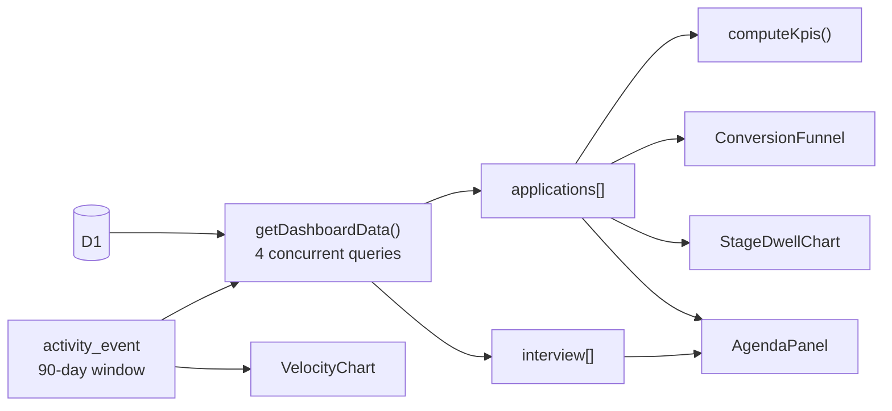
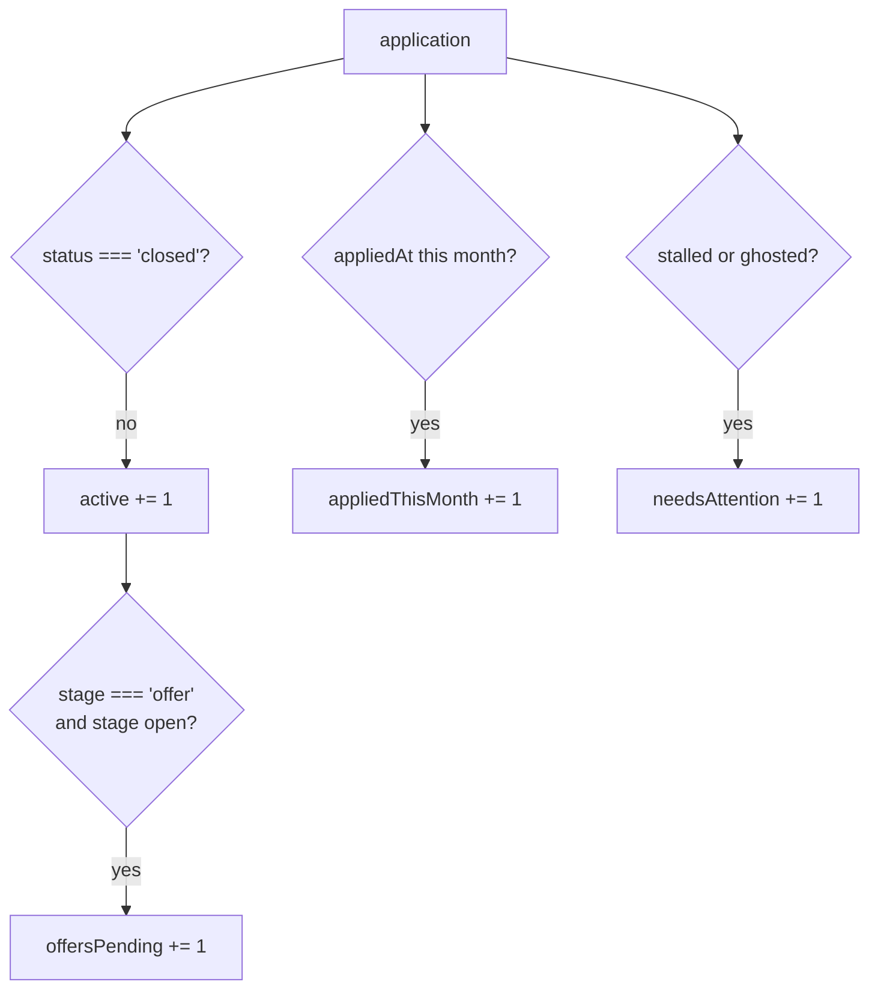
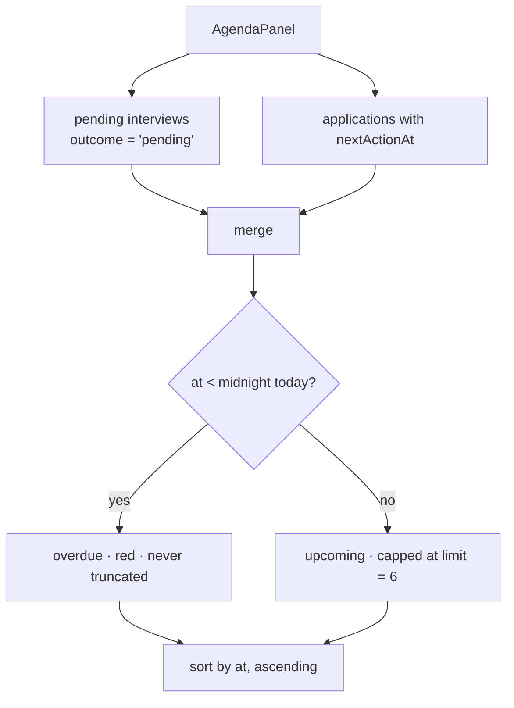
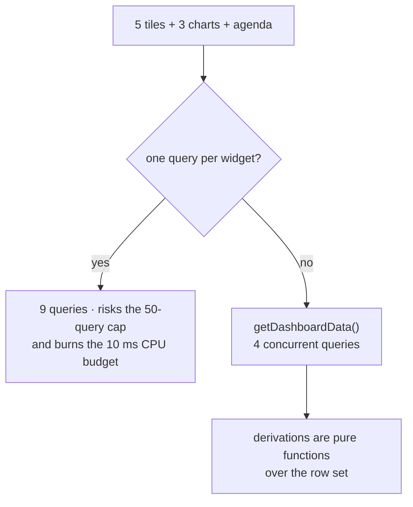

# Analytics

Five KPI tiles, three charts, and an agenda. All of them are computed **server-side** in one pass
over the already-loaded row set — the client never re-derives a number.



## The KPI strip

| Tile | Definition | Excludes |
|---|---|---|
| **Active** | Any row whose status is not `closed` | Rejected, withdrawn, accepted |
| **Interviews (next 30 days)** | Rows in `interview` with `outcome = 'pending'`, scheduled from 24 h ago to 30 days out | Anything already `passed` / `failed` / `cancelled` |
| **Offers pending** | Rows at stage `offer` with an open status | Closed offers |
| **Applied this month** | `appliedAt` inside the current calendar month | Everything else |
| **Needs attention** | Status `stalled` or `ghosted` | — |



Two deliberate choices are buried in there:

- **Interviews come from the `interview` table, not from `nextActionAt`.** `nextActionAt` is a
  generic follow-up — a reminder to chase a recruiter, a deadline to reply. Counting those as
  interviews would inflate the tile with things that are not meetings.
- **"Active" is a status test, not a stage test.** An application sitting at `onsite` with status
  `ghosted` is still counted as active, because that is precisely the thing the user needs to see.

## Conversion funnel

A **current-state** funnel, not a historical cohort.



Each bar counts applications at or past that stage *right now*. An application rejected at
`phone_screen` appears in `saved` and `applied` and then vanishes — it never reaches `technical`.
So the funnel answers "how is my pipeline shaped today", not "of the 40 I applied to in June, how
many got to onsite". Those are different questions and the second one needs a cohort table that
does not exist yet.

## Stage dwell

**Longest** wait in each live stage, anchored on `stageChangedAt`.

```mermaid
flowchart LR
    A["saved"] --> B["applied"] --> C["phone_screen"] --> D["technical"] --> E["onsite"] --> F["final"]
    G["accepted / rejected / withdrawn"] -.->|"excluded:<br/>terminal, not a stall"| H[""]
```

`accepted`, `rejected`, and `withdrawn` are excluded — they are outcomes, not places you wait.
`saved` is included, because time spent sitting saved before applying is a real stalling signal.

`longest` (`Math.max` over the stage's rows), not mean and not median: one application that sat for
400 days would drag a mean somewhere useless, and with the handful of rows a personal tracker holds
a median would collapse to whichever single application happens to sit in the middle. The longest
wait is the number that actually prompts action.

## Velocity

A **per-day** series over a 90-day window, with two lines: applications applied
(`appliedAt`) and stage transitions (from `activity_event`). The 90 days are not arbitrary —
`STAGE_MOVES_WINDOW_DAYS` in `applications-data.ts` is the same 90, and it exists to bound the
`activity_event` scan. Unbounded, that query grows with the life of the account; bounded, it costs
the same on day one and day thousand.

## Agenda

The one panel that is **not** retrospective.



Funnel, dwell, and velocity all describe what already happened. Nothing on the page answered the
question someone opens a job tracker with — *what do I do next*. The agenda does, and it does it from
data the model already had: interviews have `scheduledAt`, applications have `nextActionAt`. No new
table, no new query; `upcomingInterviews` comes out of the same rollup.

Two decisions worth keeping:

- **Overdue rows survive the cap.** `slice(0, Math.max(limit, overdue.length))`. The cap exists to
  stop the panel growing without bound; an overdue item is exactly the reason the panel exists, so
  hiding one to keep the list tidy would be worse than a long list.
- **`DAY_START` is computed once, at midnight.** Per-row `Date.now()` comparisons would let a row
  flip between overdue and upcoming mid-render, and would make the classification depend on what
  time of day you loaded the page.

## Why all of this is one row set



`getDashboardData` runs four independent D1 queries concurrently (`Promise.all`) and
returns the row set once; `computeKpis` and the chart components are pure
functions over it. That is what keeps the dashboard inside the free-tier CPU ceiling — see
[free-tier-budget.md](free-tier-budget.md).
