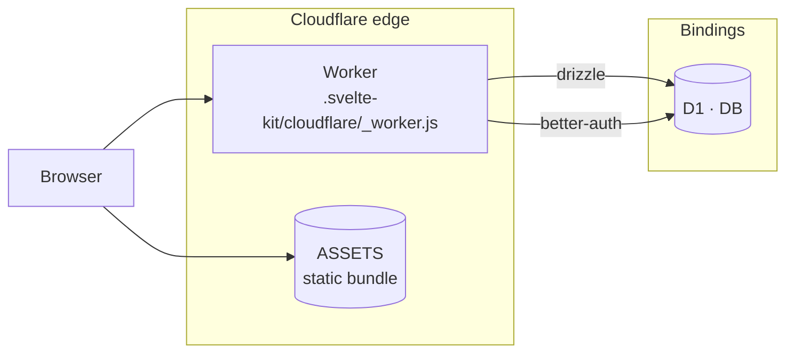
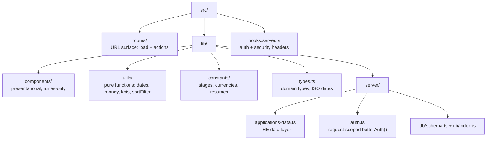
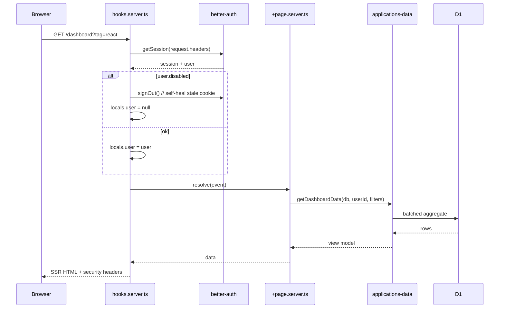
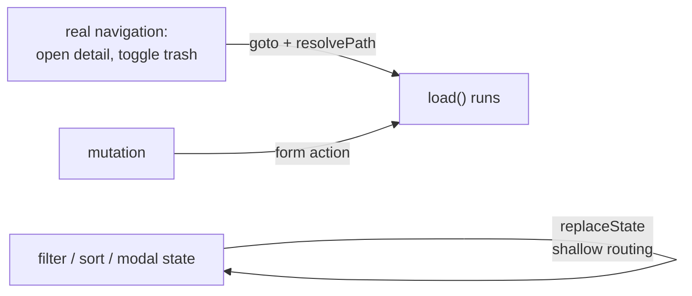

# Architecture

One Worker, one D1 database, no queues, no Durable Objects, no KV. Everything a request needs is
resolved inside that request.

## The shape

There is no service boundary to cross, no cache layer, and no background worker. That is a
deliberate consequence of the free tier — see [free-tier-budget.md](free-tier-budget.md).

## Directory ownership

| Directory | Owns | Must never |
|---|---|---|
| `src/routes/` | Reading the URL, calling the data layer, returning view models | Contain SQL, or know about money formatting |
| `src/lib/server/applications-data.ts` | Every D1 query in the app | Be imported from a `.svelte` file |
| `src/lib/server/db/schema.ts` | Table shape **and** the ISO-string ↔ unix-seconds conversion | Be bypassed by a raw `sql` query elsewhere |
| `src/lib/utils/` | Pure transformations, no I/O | Import from `$lib/server` |
| `src/lib/components/` | Presentation, snippets, local UI state | Fetch, or reach into `page` for mutable state |

## One request, end to end

The two rules that make this safe:

1. **`locals` is never trusted twice.** `hooks.server.ts` is the only place that resolves a
   session. Routes read `locals.user` and assume it is already vetted — including that a
   `disabled` user has been signed out.
2. **`getAuth()` is request-scoped.** It builds from `getRequestEvent().platform.env`, never at
   module init, because the D1 binding does not exist at build time.

## Why there is no remote-function layer

SvelteKit's remote functions are the current advice for typed client-server calls. This app does
not use them, and that is a decision, not an oversight:

Filter, sort, and modal-open state is owned by the client and applied against the already-loaded
row set, so it never costs a Worker invocation. Mutations are form actions, which re-run `load()`
and therefore re-derive everything server-side. A remote-function layer would add a second path
to the same data for no gain at this size. See [routes.md](routes.md).

## What is deliberately absent

| Not here | Why |
|---|---|
| Durable Objects | Single-user, read-mostly. Reads do not need coordination. |
| KV / R2 | No files are uploaded yet; resumes are metadata only (`resumeId` + label). |
| Queues | No background work. `ctx.waitUntil` is not used because nothing is deferred. |
| Read replicas / sessions API | One primary, and D1's own latency is well inside the budget. |
| Service-worker offline mode | An offline PWA on the free tier costs requests, not saves them. |
