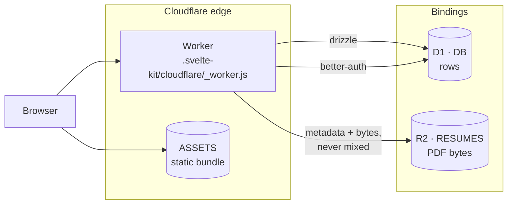
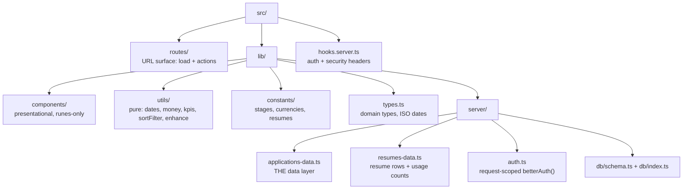
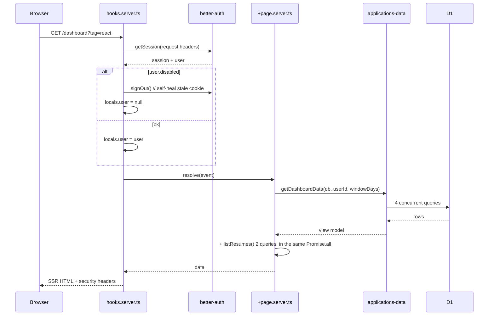
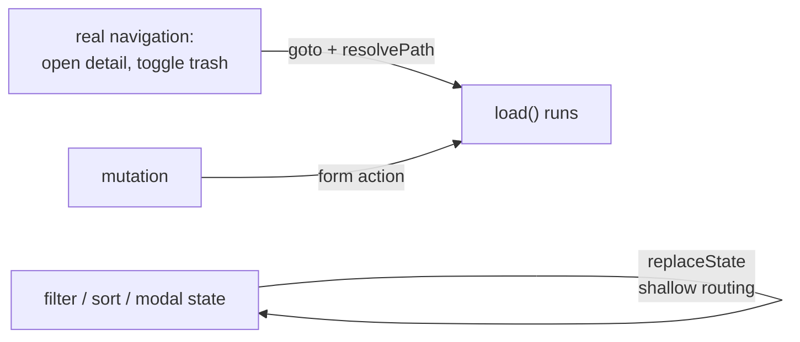
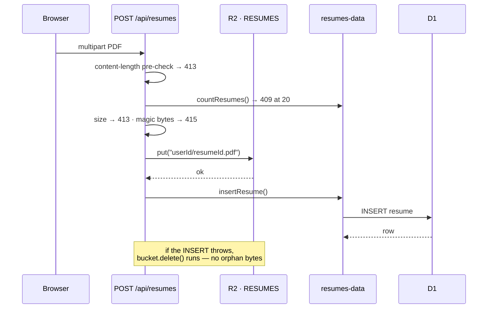
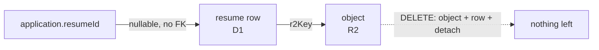

# Architecture

One Worker, one D1 database, one R2 bucket, no queues, no Durable Objects, no KV. Everything a
request needs is resolved inside that request.

## The shape

D1 holds **metadata**; R2 holds **bytes**. The split is not cosmetic — a resume row without its
object is meaningless, and an object without its row is unreachable garbage, so the write path is
ordered and the failure path cleans up. See
[resumes: the one place bytes live](#resumes-the-one-place-bytes-live).

There is no service boundary to cross, no cache layer, and no background worker. That is a
deliberate consequence of the free tier — see [free-tier-budget.md](free-tier-budget.md).

## Directory ownership

| Directory | Owns | Must never |
|---|---|---|
| `src/routes/` | Reading the URL, calling the data layer, returning view models | Contain SQL against the app tables, or know about money formatting. (The `user`-table exceptions are listed below.) |
| `src/lib/server/applications-data.ts` | Every D1 query against `application`, `interview`, `contact`, `activity_event` | Be imported from a `.svelte` file |
| `src/lib/server/db/schema.ts` | Table shape **and** the ISO-string ↔ unix-seconds conversion | Be bypassed by a raw `sql` query elsewhere |
| `src/lib/utils/` | Pure transformations, no I/O (including `enhance.ts`, which only inspects a submit result) | Import from `$lib/server` |
| `src/lib/components/` | Presentation, snippets, local UI state | Fetch, or reach into `page` for mutable state |
| `src/lib/server/resumes-data.ts` | Every D1 query against `resume` | Touch the `RESUMES` bucket — that lives in `src/routes/api/resumes/` |

The auth tables are the exception to "the data layer owns every query": Better Auth writes `user`,
`session`, `account`, `verification`, and `rate_limit` through its own Drizzle adapter, not through
these two files. `hooks.server.ts` goes through `auth.api` for everything it does with a session.

**Four call sites do reach the `user` table with Drizzle directly**, and the "must never contain
SQL" rule above has to bend for them:

| Call site | Query | Why not `auth.api` |
|---|---|---|
| `auth.ts` `user.create.before` | `SELECT id FROM user WHERE disabled = false LIMIT 1` | Runs *inside* Better Auth's own create pipeline, before a `user` object exists. It has to answer "is anyone approved yet?" to decide the new row's flags. |
| `admin/approvals/+page.server.ts` `load` | `SELECT … FROM user WHERE disabled = true AND banned = false` | The admin plugin's `listUsers` filters on `banned`, not on our approval flag, so it cannot express "the queue". |
| `admin/approvals/+page.server.ts` `approve` | `UPDATE user SET disabled = false WHERE id = ? AND disabled = true` | The admin plugin has no "unban"-equivalent for a server-owned approval flag. The `AND disabled = true` is the guard that stops a replayed approve from touching an enabled account. |
| `admin/approvals/+page.server.ts` `reject` | `DELETE FROM user WHERE id = ? AND disabled = true` | Same reason. The `disabled` predicate is what makes `reject` unable to delete an approved user. |
| `+page.server.ts` root action | three `SELECT`s on `user` by email / username | Friendly duplicate-handling and handle-collision errors. Better Auth's synthetic "created" response for an existing email is deliberate anti-enumeration, so the route has to ask the database itself to produce a better message. |

Every one of them is a `SELECT` or a single-table write against `user` with an explicit predicate;
none of them touch `session`, `account`, or `verification`. Two of them (`approve`, `reject`) are
*writes* to the gate, which is worth stating plainly: the flag is server-owned in the sense that no
client payload can set it, not in the sense that only one function may ever write it.

## One request, end to end

A plain `/dashboard` load issues **6** D1 queries: 4 from `getDashboardData`, plus 2 from
`listResumes` (the row select and the grouped attachment count), which the load awaits in the same
`Promise.all`. Add `?trash=1` and it is 7; add `?app=<id>` and the detail bundle takes it to 10.
All of that is against a free-tier ceiling of 50 queries per invocation. The number is stated
here because the "one rollup, not one query per widget" claim only means something with the real
figure attached. See [free-tier-budget.md](free-tier-budget.md).

The two rules that make this safe:

1. **`locals` is never trusted twice.** `hooks.server.ts` is the only place that resolves a
   session. Routes read `locals.user` and assume it is already vetted — including that a
   `disabled` user has been signed out.
2. **`getAuth()` is request-scoped.** It builds from `getRequestEvent().platform.env`, never at
   module init, because the D1 binding does not exist at build time.

## Why there is no remote-function layer

SvelteKit's remote functions are the current advice for typed client-server calls. This app does
not use them, and that is a decision, not an oversight:

Filter, sort, and modal-open state is owned by the client and applied against the already-loaded
row set, so it never costs a Worker invocation. Mutations are form actions, which re-run `load()`
and therefore re-derive everything server-side. A remote-function layer would add a second path
to the same data for no gain at this size. See [routes.md](routes.md).

## Resumes: the one place bytes live

Four properties come out of that ordering:

| Property | How |
|---|---|
| Bytes are never addressed by user input | The key is always `${userId}/${resumeId}.pdf`, both server-generated. The uploaded filename is stored for display and never touches a path |
| Type is proven, not declared | The browser's `Content-Type` is attacker-controlled, so the first five bytes must be `%PDF-` (`0x25 0x50 0x44 0x46 0x2d`) or the upload is 415 |
| A failed row never leaves bytes behind | The object is written first because it can fail for free; if the D1 insert then fails, the object is deleted. The row is the only pointer, so a half-written pair is worse than none |
| Reads are always proxied | `GET /api/resumes/[id]` streams through the Worker with `Cache-Control: private, no-store`. The bucket has no public URL and no presigned URL is ever minted |

`application.resume_id` is deliberately **not** a foreign key. SQLite cannot add an FK without
rebuilding the table, and rebuilding `application` against live data is a migration this project
avoids. Detaching is therefore an explicit `UPDATE application SET resume_id = NULL` inside
`deleteResume()` — which also means deleting a resume leaves the application intact rather than
taking it down with it.

"Not a rebuild we will ship" is a preference, not a law: `db/migrations/0002` is a rebuild
(`PRAGMA foreign_keys=OFF` → create `__new_rate_limit` → copy → drop → rename), taken to add the
unique constraint on `rate_limit.key`. The rule is really "don't rebuild `application`", and
`docs/research/drizzle.md` has the `PRAGMA defer_foreign_keys` recipe if a future change needs one.

## What is deliberately absent

| Not here | Why |
|---|---|
| Durable Objects | Single-user, read-mostly. Reads do not need coordination. |
| KV | D1 is already fast enough at this size; a cache would be a second source of truth. |
| Public R2 bucket / presigned URLs | Every read goes through the Worker, so authorisation cannot be bypassed by guessing a key. |
| Queues | No background work. `ctx.waitUntil` is not used because nothing is deferred. |
| Read replicas / sessions API | One primary, and D1's own latency is well inside the budget. |
| Service-worker offline mode | An offline PWA on the free tier costs requests, not saves them. |
