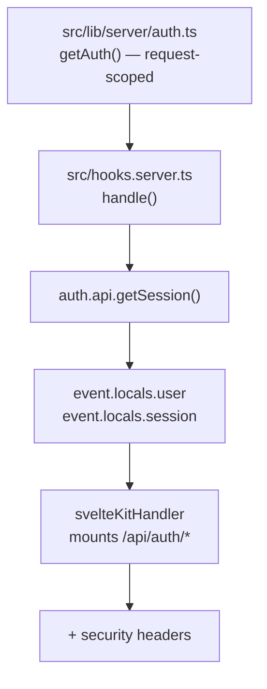
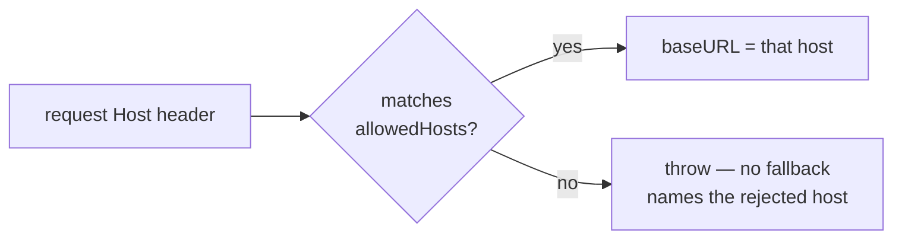
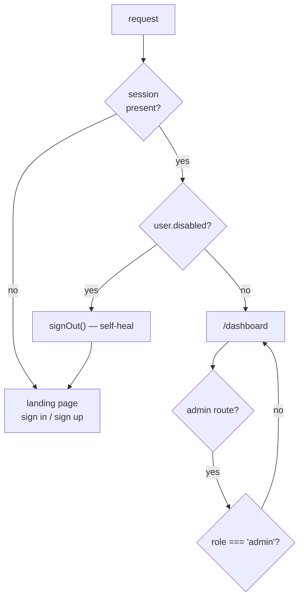
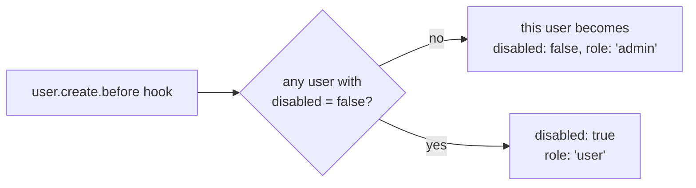
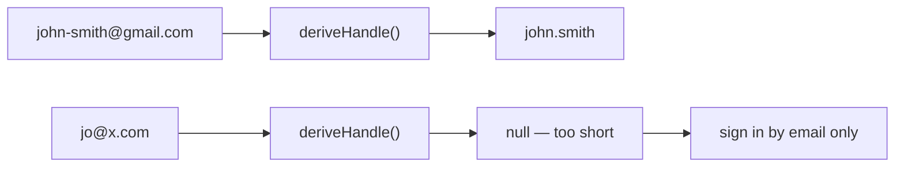

# Authentication and the approval gate

Better Auth 1.7, mounted as a SvelteKit catch-all, backed by the same D1 database as everything
else. Nobody is approved by default — the first account to exist becomes the admin, and every
account after that waits in a queue.



## How it is wired



Three things about this arrangement are load-bearing:

1. **`getAuth()` is called per request, not at module init.** The D1 binding only exists inside a
   request, so a module-level `betterAuth({...})` would either crash at build or bind to nothing.
2. **`svelteKitHandler` mounts `/api/auth/*` but does not populate `locals`.** `hooks.server.ts`
   calls `getSession()` itself.
3. **`sveltekitCookies(getRequestEvent)` is the last plugin.** Cookie writes need the SvelteKit
   request event, and plugin order decides which wrapper wins.

## Configured options, and why

| Option | Value | Reason |
|---|---|---|
| `baseURL` | `{ allowedHosts, protocol: 'auto' }`, or a pinned string when `BETTER_AUTH_URL` is set | Per-request origin, validated against an allowlist. See [Base URL](#base-url) |
| `user.additionalFields.disabled` | `{ type: 'boolean', input: false, defaultValue: true }` | `input: false` makes it server-owned — a crafted POST cannot set it |
| `emailAndPassword.autoSignIn` | `false` | Sign-up returns `{ token: null, user }`. No cookie, so an unapproved user cannot be half-signed-in |
| `emailAndPassword.requireEmailVerification` | `false` | No mail sender is wired up yet |
| `session.expiresIn` / `updateAge` | 7 days / 1 day | Sliding expiry; `updateAge` stops every request rewriting the row |
| `session.cookieCache` | 5 min, `compact` | Reads session data from a signed cookie instead of a D1 query, inside the CPU budget |
| `advanced.ipAddress.ipAddressHeaders` | `['cf-connecting-ip']` | `x-forwarded-for` is spoofable; Cloudflare's header is not |
| `advanced.database.generateId` | `'uuid'` | Text primary keys throughout |
| `advanced.database.joins` | `true` | Lets the adapter resolve relations in one query |
| `rateLimit` | `window: 60, max: 100, storage: 'database'` | Memory storage is decorative on Workers — isolates reset between requests |
| `plugins` | `admin()`, `username()`, `sveltekitCookies()` | Role checks, username sign-in, cookie plumbing |
| `username()` validation | `/^[a-zA-Z0-9_.]+$/`, length 3–30 | Better Auth defaults (`defaultUsernameValidator`), not overridden — see [Sign-in handles](#sign-in-handles) |

## Base URL

There is no `BETTER_AUTH_URL` in `wrangler.jsonc`, and that is deliberate — but it is not the same
thing as leaving `baseURL` unset. Left unset, Better Auth logs this on every request:

```
WARN [Better Auth]: [better-auth] Base URL is not set. Set the baseURL option or
BETTER_AUTH_URL env, or use a dynamic baseURL with allowedHosts for multi-host setups.
Without it the origin is derived from the incoming request, and callbacks and redirects
may not work correctly.
```

The warning is not cosmetic. The docs put it plainly: *"Relying on request inference is not
recommended."* With `baseURL` undefined, whatever `Host` header arrives becomes the origin **and**
a trusted origin — there is no allowlist at all.

So `auth.ts` uses the object form instead, which keeps the per-request behaviour we want and adds
validation:



| Host pattern | Why it is there |
|---|---|
| `job-tracker.sanctum.workers.dev` | The deployed origin |
| `*.workers.dev` | Workers Builds preview branches get a generated host under the same domain |
| `localhost:*`, `127.0.0.1:*` | `bun run dev` (5173) and `bun run preview` (8787) with zero config. `*` covers the port |
| hosts derived from `DEV_ORIGINS` | Anything else — e.g. a LAN IP for testing on your phone |

Two things this buys over the old setup. An unlisted host is **rejected** rather than trusted (it
returns 500 and logs the host plus the fix, which is the right shape for a config mistake). And
loopback being in the list is still strictly narrower than before, where *every* host was
accepted.

**The gotcha that bites when you switch to this form:** a direct `auth.api.*` call has no request
of its own, so there is nothing to read a `Host` from. Without it you get
`Dynamic baseURL could not be resolved for this direct auth.api call`. Every direct call in this
repo therefore passes `headers`:

```ts
await auth.api.signInEmail({ headers: request.headers, body: { email, password } });
```

Six calls in this repo pass `headers`, and any new one must too or it will fail at runtime rather
than at typecheck:

| Call | Where |
|---|---|
| `getSession` | `hooks.server.ts` |
| `signOut` (self-heal) | `hooks.server.ts` |
| `signUpEmail` | `+page.server.ts` |
| `signInEmail` | `+page.server.ts` |
| `signOut` (approval gate) | `+page.server.ts` |
| `signOut` (dashboard action) | `dashboard/+page.server.ts` |

## The four gates



Gates 3 and 4 are the same check at two layers: `hooks.server.ts` runs on every request, and
`/admin/approvals` re-checks in its own `load` because `locals` is a convenience, not an
authorisation boundary.

1. **Sign-up** — creates the row with `disabled: true` and issues **no session**. The user lands
   on `/pending-approval`. The one exception is the bootstrap admin: the action reads the row back
   after `signUpEmail` and, if the hook approved it, redirects to `/?approved=1` instead. There is
   nobody to wait for in that case, and telling the person setting the app up to go and approve
   themselves was nonsense.
2. **Sign-in** — `src/routes/+page.server.ts` calls `signInEmail` **first** and only then checks
   `disabled`, revoking the session it just created if the flag is set.

   The order is deliberate and was inverted on purpose. Checking `disabled` *before* verifying the
   password made the form an account-existence oracle: send an email, read whether you got
   "this account is waiting for approval" or "incorrect", and you have enumerated the user list
   without guessing anything. Verifying first means only the account's owner can ever reach that
   message.

   The cost is that an unapproved account briefly holds a real session. It is revoked on the spot,
   and gate 3 below revokes any disabled user's session on every request regardless — so even if
   that sign-out failed, the account still cannot reach a guarded route. Two independent backstops
   for one condition.
3. **`hooks.server.ts`** — if a session resolves to a `disabled` user, the session is revoked on
   the spot. It fires for the sign-in case above when the route-level revoke failed, and for a
   legacy cookie from before `autoSignIn` was switched off. Either way the user ends up cleanly
   signed out instead of bouncing between redirects.
4. **Admin routes** — `/admin/approvals` re-checks `role` in its own `load`, because `locals` is a
   convenience, not an authorisation boundary.

**Do not "optimise" gate 2 back into a pre-check.** It looks tidier and it is an information leak.

## Bootstrap



The check is `disabled = false`, not "does any user exist". If you delete the only approved admin,
the next sign-up bootstraps again rather than leaving the install permanently unlocked.

The bootstrapped user is redirected to `/?approved=1`, not `/pending-approval` — see gate 1 above.
They still have to sign in, because `autoSignIn` is off for everyone.

## Anti-enumeration, and the price of it

With `autoSignIn: false`, signing up with an existing email returns a generic synthetic success
instead of a "user already exists" error. That is deliberate — it stops the form being an oracle
for which emails have accounts — but it means the route cannot rely on Better Auth to detect
duplicates. `src/routes/+page.server.ts` pre-checks the email itself and returns the friendly
error.

## Sign-in handles

Sign-up asks for an email. Sign-in says "username or email". Both are true, and the join between
them is a derived handle — `src/routes/+page.server.ts` computes it from the email's local part at
sign-up time and stores it in `user.username`.



The derivation is not cosmetic. `username()` validates against `/^[a-zA-Z0-9_.]+$/` inside a 3–30
window, and real local parts fall outside that constantly — `john-smith`, `me+tag`, `jo`. Passing
the raw local part through made `signUpEmail` throw `Username is invalid` / `Username is too
short`, which took the whole page to a 500. So:

| Input | Handle | Note |
|---|---|---|
| `noa@noa.com` | `noa` | Already valid, unchanged |
| `john-smith@gmail.com` | `john.smith` | `-` becomes a dot, which stays readable |
| `noa+tag@gmail.com` | `noa.tag` | Same rule |
| `mary.jane@x.com` | `mary.jane` | Dots survive as-is |
| `jo@x.com` | `null` | Under 3 characters — no handle, email sign-in only |

When the derivation returns `null` the account is created with no `username` at all. That is a
supported state, not a fallback: sign-in branches on the `@` and only resolves a handle when the
input has none, so those users simply always use their email.

Two consequences worth knowing:

- **The handle is shown once, at sign-up.** `/pending-approval?handle=…` echoes it, re-validated
  server-side against `/^[a-z0-9_.]{3,30}$/` because it arrives through a URL. There is no
  settings page to change or add one later — see below.
- **Two emails can derive the same handle.** Sign-up pre-checks `user.username` and returns a
  friendly "try a different address" instead of Better Auth's `USERNAME_IS_ALREADY_TAKEN`.
  `signUpEmail` is additionally wrapped in try/catch, so any remaining Better Auth rejection
  degrades to a form error rather than the error boundary.

## What is not implemented

| Not here | Consequence |
|---|---|
| Email verification | `verification` table exists and is empty; no sender is configured |
| Password reset | Needs the same sender |
| OAuth | `account` table is ready; no provider is registered |
| 2FA / passkeys | Not enabled |
| Session revocation UI | Only the self-heal path in `hooks.server.ts` |
| Choosing or editing your handle | Derived once at sign-up; `username()` treats it as immutable, so there is no UI to change it |

Any of these needs a mail sender first. Better Auth hands you a `sendEmail` callback — on Workers,
hand it to `ctx.waitUntil` so the response is not blocked.
