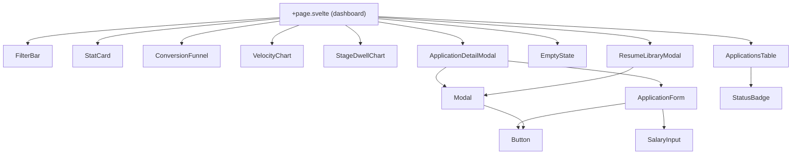
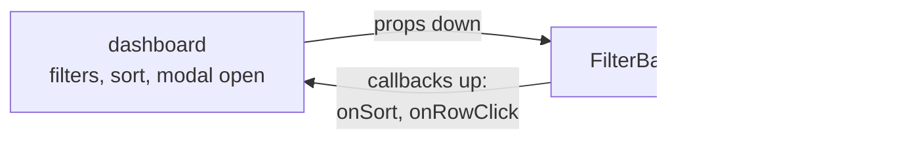
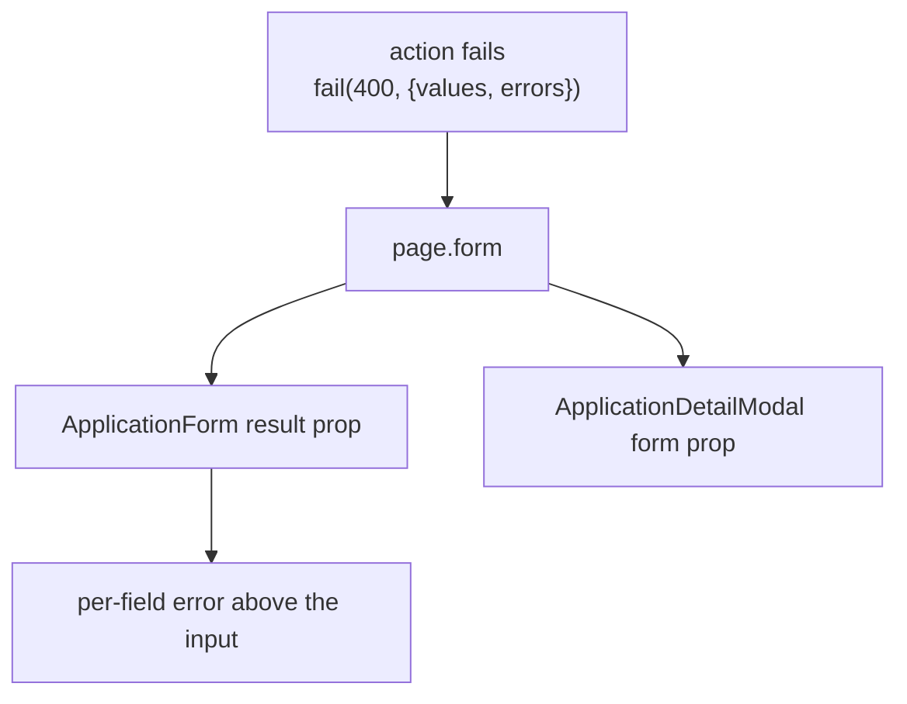

# Components

Thirteen components in `src/lib/components/`. All of them are presentational: none fetch, none
read `page` for mutable state, none touch `$lib/server`.

## Contract table

| Component | Required props | Optional / bindable | Notes |
|---|---|---|---|
| `Modal.svelte` | `open` (bindable), `title` | `subtitle`, `size` (`sm`/`md`/`lg`/`xl`), `hideCloseButton`, `children` snippet | Owns focus trap, Esc, backdrop click. `open` is `$bindable` so parents use `bind:open` |
| `Button.svelte` | — | `variant`, `size`, `type`, `disabled`, `busy`, `onclick`, `icon` snippet | `busy` swaps in a spinner and sets `aria-busy`; the button stays focusable so the state is announced |
| `EmptyState.svelte` | `title` | `description`, `action` snippet, `icon` snippet | Used for both "no results" and "no applications yet" |
| `StatCard.svelte` | `label`, `value` | — | Headline KPI tile |
| `FilterBar.svelte` | `filters` (bindable), `sort` (bindable), `hasApplications`, `tagFacets` | — | Hides itself when there is nothing to filter |
| `ApplicationsTable.svelte` | `rows`, `sort` | `trashView`, `onRowClick`, `onSort` | Rows arrive already filtered and sorted. In trash view, row actions swap to Restore / Delete permanently |
| `StatusBadge.svelte` | stage + status | — | Renders the `-100`/`-700` pair for the value |
| `ApplicationForm.svelte` | — | `application` (edit mode), `create`, `result` | One form for create and edit; `result` carries `page.form` so server-side field errors surface above the fields |
| `SalaryInput.svelte` | `shape`, `currency`, `exact`, `min`, `max`, `inputClass` | `error` | All money values bindable; shape switches between exact / range / none / unspecified |
| `ApplicationDetailModal.svelte` | `detail` (`ApplicationDetail \| null`) | `open` (bindable), `form` | Renders timeline, interviews, contacts |
| `ResumeLibraryModal.svelte` | `applications` | `open` (bindable) | Inventory of `resumeId` values; upload is not implemented |
| `ConversionFunnel.svelte` | `apps` | — | Current-state funnel |
| `VelocityChart.svelte` | — | — | Applications per week over a 90-day window |
| `StageDwellChart.svelte` | `apps` | — | Median days in each live stage |

## Two conventions worth keeping

**1. The parent owns state, the child renders it.**

Sort lives in the URL, so the table cannot own it — the table receives `sort` and calls `onSort`,
and the dashboard decides whether that means `replaceState` or a navigation. Same for filters.

**2. Server errors travel through `page.form`, not through prop drilling.**

When validation fails, the action echoes the submitted values back. The form re-renders with them
so nothing the user typed is lost.

## Accessibility notes that are load-bearing

| Component | What it does |
|---|---|
| `Modal.svelte` | Moves focus in on open, restores it on close, traps Tab, closes on Esc |
| `Button.svelte` | Real `<button>`; `busy` sets `aria-busy` and keeps the element focusable |
| `ApplicationsTable.svelte` | Real `<table>` with `<th scope="col">`; sortable headers are buttons with `aria-sort` |
| `EmptyState.svelte` | Heading, not a styled `
` |
| Charts | Bar widths are visual; the same numbers are present as text |

There is no custom focus-ring reset anywhere. If you add one, you have broken keyboard navigation.
