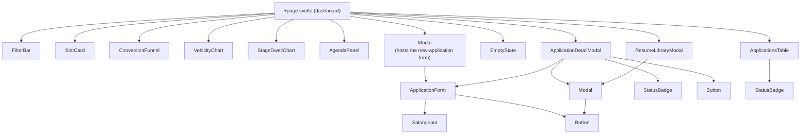
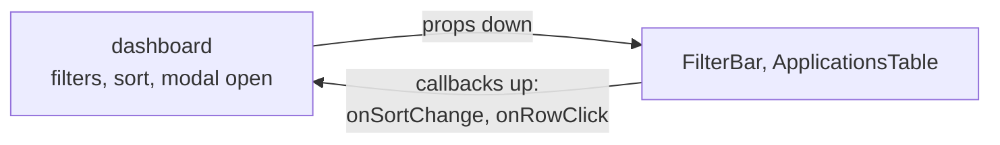
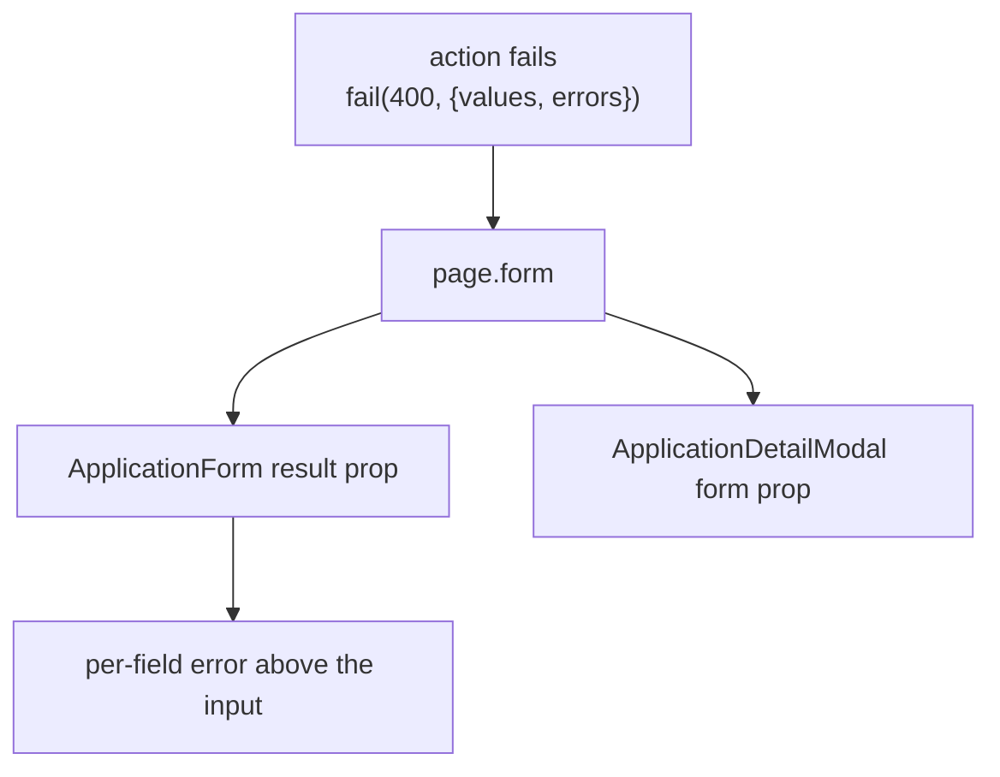
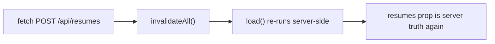

# Components

Fifteen components in `src/lib/components/`. All of them are presentational: none read `page` for
mutable state, none touch `$lib/server`. One of them fetches — `ResumeLibraryModal`, and the reason
it is allowed to is in [the one exception](#the-one-exception-resumelibrarymodal-fetches).

## Contract table

Complete as of this writing — every prop each component declares is listed. If you add one, add it
here; a contract table that silently omits half the props is worse than none.

| Component | Required props | Optional / bindable | Notes |
|---|---|---|---|
| `Modal.svelte` | `open` (bindable), `title` | `subtitle`, `size` (`sm`/`md`/`lg`/`xl`), `hideCloseButton`, `children` snippet, `footer` snippet | Owns focus trap, Esc, backdrop click, body scroll lock. `open` is `$bindable` so parents use `bind:open`. `footer` is declared and rendered but no caller passes it yet |
| `Button.svelte` | — | `variant`, `size`, `type`, `disabled`, `busy`, `onclick`, `icon` snippet, `children` snippet, `title`, `ariaLabel`, `class` | `disabled` sets the native attribute (leaves the tab order); `busy` sets `aria-busy` + `aria-disabled` and **stays focusable**. See [Two ways to say no](#two-ways-to-say-no) |
| `EmptyState.svelte` | `title` | `description`, `action` snippet, `icon` snippet | Used for both "no results" and "no applications yet" |
| `StatCard.svelte` | `label`, `value` | `sublabel`, `tone` (`default`/`danger`/`success`/`warning`), `accent` (`danger`/`success`/`warning`/`accent`/`null`), `icon` snippet, `loading` | Headline KPI tile. `accent` draws the strip at the top edge and is set on all five dashboard tiles; `loading` swaps the number for a skeleton |
| `FilterBar.svelte` | `filters` (bindable), `sort` (bindable), `hasApplications`, `tagFacets` | — | Hides itself when there is nothing to filter. Owns `queryInput` as local state and pushes it to `filters.q` on a 150 ms debounce, re-syncing from `filters.q` when a navigation changes it from outside |
| `ApplicationsTable.svelte` | `rows`, `sort` | `trashView`, `onRowClick`, `onSortChange`, `resumes` | Rows arrive already filtered and sorted. `resumes` is only used to turn `resumeId` into a filename for the attachment icon's label. In trash view, row actions swap to Restore / Delete permanently |
| `StatusBadge.svelte` | `kind` (`stage`/`status`/`arrangement`), `value` | `variant` (`compact`/`full`) | One prop pair, not two: `kind` picks the lookup table, `value` is the enum member. Renders the `-100`/`-700` pair for the value |
| `ApplicationForm.svelte` | — | `application` (edit mode), `create`, `result`, `resumes`, `onsuccess` | One form for create and edit. Field *defaults* are a mount-time snapshot (the create modal remounts on open, so the echo-back is picked up as it initialises); `errors` is `$derived` from `result`, so a failed `?/edit` inside the detail modal renders its messages instead of silently refusing to save. The resume `<select>` lists `resumes` with size, and shows `errors.resume`. The form is `novalidate` — see [security.md](security.md#why-the-browser-is-not-allowed-to-validate) |
| `SalaryInput.svelte` | `shape`, `currency`, `exact`, `min`, `max`, `inputClass` | `error` | All money values bindable; `shape` switches between exact / range / min_only / max_only / none. Amounts reach the server through hidden inputs, not `name` on the visible ones, so only one value per field is ever submitted |
| `ApplicationDetailModal.svelte` | `detail` (`ApplicationDetail \| null`) | `open` (bindable), `form`, `resumes` | Renders timeline, interviews, contacts, and — when `detail.resumeId` resolves to a row in `resumes` — the filename, a download link, and an inline preview |
| `ResumeLibraryModal.svelte` | `resumes` | `open` (bindable) | Upload (PDF, 10 MB, 20 max), list with size / date / `usedBy`, open, download, two-click delete |
| `ConversionFunnel.svelte` | `apps` | — | Current-state funnel over the open progression only; `rejected` / `withdrawn` / `saved` are reported as exact counts in the footer, never as rungs. See [analytics](analytics.md#conversion-funnel) |
| `VelocityChart.svelte` | `apps` | `stageMoves` (server-computed, for the transitions line), `windowDays` (default `90`) | Two **per-day** lines over a 90-day window: applications created on `appliedAt`, and stage transitions from the activity timeline |
| `StageDwellChart.svelte` | `apps` | — | **Longest** (`Math.max`) days in each live stage, not the median — see [analytics](analytics.md#stage-dwell) |
| `AgendaPanel.svelte` | `apps`, `interviews`, `onSelect` | `limit` (default `6`) | Merges pending interviews and `nextActionAt` follow-ups into one chronological list. Overdue rows are never truncated away by `limit`. Tapping a row calls `onSelect(id)` and the parent opens the detail modal |

## Two ways to say no

`Button` draws a hard line between two states that look alike and behave very differently:

| Prop | Rendered as | In the tab order? | Use for |
|---|---|---|---|
| `disabled` | native `disabled` | **No** — every browser drops it from sequential focus | Permanently unavailable. "Restore" on an application that is not in the trash. |
| `busy` | `aria-disabled="true"` + `aria-busy="true"`, spinner | **Yes** | Temporarily unavailable, mid-request. |

The distinction is not pedantry. A native `disabled` button vanishes from the page the moment you
activate it, so a screen-reader user who has just triggered a save loses their place entirely. The
earlier version of this component set `disabled={disabled || busy}`, which contradicted both this
table and the comment in the component; `busy` is now `aria-disabled` and the click is swallowed in
`handleClick` (including `preventDefault()`, without which a submit button would still post the
form from a click whose handler did nothing).

## Two conventions worth keeping

**1. The parent owns state, the child renders it.**

Sort lives in the URL, so the table cannot own it — the table receives `sort` and calls
`onSortChange`, and the dashboard decides whether that means `replaceState` or a navigation. Same
for filters.

**2. Server errors travel through `page.form`, not through prop drilling.**

When validation fails, the action echoes the submitted values back. The form re-renders with them
so nothing the user typed is lost.

## The one exception: `ResumeLibraryModal` fetches

Uploading a file cannot be a form action — a `<form method="POST">` would send the whole PDF
through the SSR round-trip and re-render the page for what is really a background write. So this
one component calls `fetch` directly.

The discipline that keeps it honest: **every mutation ends in `invalidateAll()`**. The component
never optimistically appends to its own list, so the rows you see after an upload are the ones the
server returned, not a local guess. Errors are surfaced inline with `role="alert"`; success uses
`role="status"` so it is announced politely rather than interrupting.

## Accessibility notes that are load-bearing

| Component | What it does |
|---|---|
| `Modal.svelte` | Moves focus in on open, restores it on close, traps Tab, closes on Esc. Background is `inert` + `aria-hidden` from the dashboard, so nothing behind the dialog is reachable |
| `Button.svelte` | Real `<button>`. `busy` uses `aria-disabled`, not the native attribute, so the element stays in the tab order while the request is in flight |
| `ApplicationsTable.svelte` | Real `<table>` with `<th scope="col">`; sortable headers are buttons with `aria-sort`. The row-level click is a mouse convenience only — the keyboard path is the company `<button>`, and a click inside any control is ignored, so the row is not a second tab stop |
| `ApplicationDetailModal.svelte` | WAI-ARIA tabs with a roving tabindex, arrow-key movement, and Home/End. All four panels are always in the DOM with `hidden` on the inactive ones, so every `aria-controls` resolves to a real element |
| `EmptyState.svelte` | Heading, not a styled `
` |
| `ResumeLibraryModal.svelte` | Two-click delete, and the confirm step names how many applications will be detached before you commit. `role="status"` for success, `role="alert"` for failure. Every row action carries an `aria-label` naming the file (`Open ada-resume.pdf in a new tab`, `Download …`, `Delete …`, `Cancel deleting …`) — with 20 rows in the list, bare "Open ↗ / Download / Delete" gives a screen-reader user nothing to anchor on |
| Charts | Bar widths are visual; the same numbers are present as text. Rows carry no `aria-label` — an `aria-label` on a bare `<li>` is not reliably announced and would *replace* the visible text rather than supplement it |
| `AgendaPanel.svelte` | An `<ol>` of real `<button>`s. The whole row is the target, and `aria-label` repeats the date so the row is not "Phone screen" repeated six times in a screen reader |
| `FilterBar.svelte` | Every chip is `inline-flex min-h-6` — WCAG 2.2 SC 2.5.8 needs a 24×24 target even when the chip itself is visually smaller |

There is no custom focus-ring reset anywhere. If you add one, you have broken keyboard navigation.

### What is *not* automated, and why that matters here

Accessibility in this repo is **not** lint-enforced, and that is a real gap rather than a choice:

- `eslint-plugin-svelte@3` **removed the entire `svelte/a11y_*` rule set.** The package exports 86
  rules and not one of them is an accessibility rule; `configs.recommended` and
  `configs['flat/recommended']` are identical in that respect. Verified against the installed
  plugin, not assumed.
- Svelte 5.57's compiler — which is what `bun run check` runs — retains only a small subset of
  `a11y_*` warnings. Probed directly against the installed compiler: a missing `alt` is caught;
  an `aria-label` on a roleless ``, a click handler on a `<tr>`, and an `aria-controls`
  pointing at a non-existent id are **not**.

So `bun run check` passing means "no compiler-level a11y warnings", which is a much weaker
statement than "accessible". The defects listed in the table above were found by reading, and a
future one can slip through the same way. There is no in-repo test suite to hang an axe-core run
on, and the Playwright suite that could carry it lives outside the repo tree at `/tmp/pw-tests/`.
