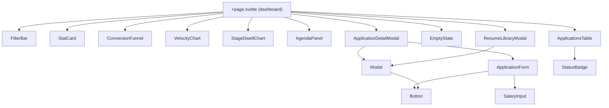
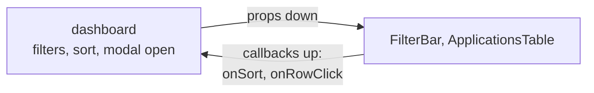
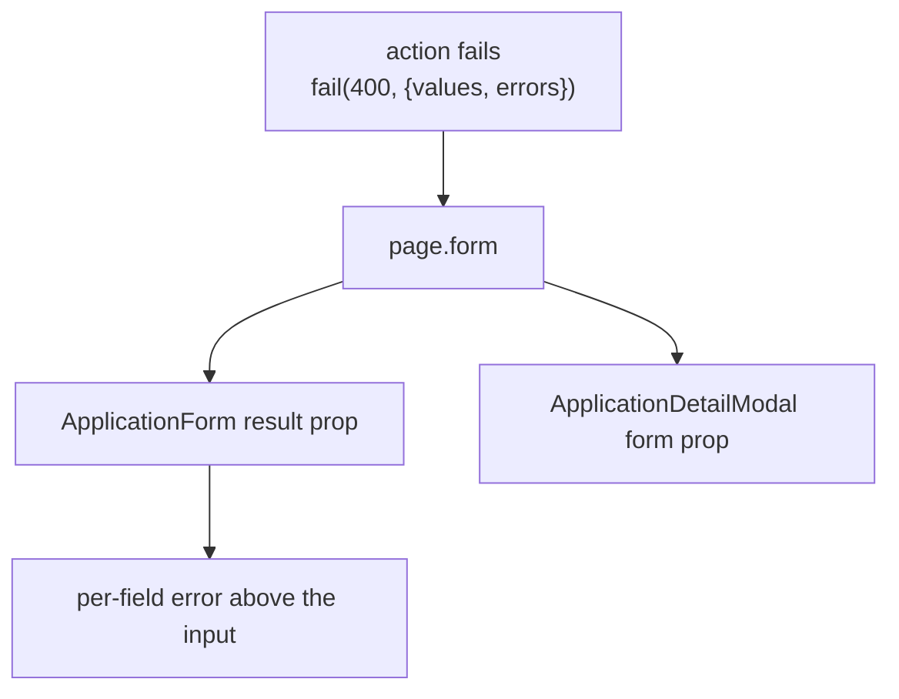
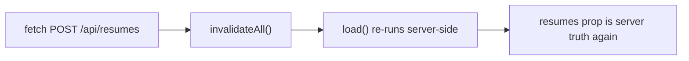

# Components

Fifteen components in `src/lib/components/`. All of them are presentational: none read `page` for
mutable state, none touch `$lib/server`. One of them fetches — `ResumeLibraryModal`, and the reason
it is allowed to is in [the one exception](#the-one-exception-resumelibrarymodal-fetches).

## Contract table

| Component | Required props | Optional / bindable | Notes |
|---|---|---|---|
| `Modal.svelte` | `open` (bindable), `title` | `subtitle`, `size` (`sm`/`md`/`lg`/`xl`), `hideCloseButton`, `children` snippet | Owns focus trap, Esc, backdrop click. `open` is `$bindable` so parents use `bind:open` |
| `Button.svelte` | — | `variant`, `size`, `type`, `disabled`, `busy`, `onclick`, `icon` snippet | `busy` swaps in a spinner and sets `aria-busy`; the button stays focusable so the state is announced |
| `EmptyState.svelte` | `title` | `description`, `action` snippet, `icon` snippet | Used for both "no results" and "no applications yet" |
| `StatCard.svelte` | `label`, `value` | — | Headline KPI tile |
| `FilterBar.svelte` | `filters` (bindable), `sort` (bindable), `hasApplications`, `tagFacets` | — | Hides itself when there is nothing to filter |
| `ApplicationsTable.svelte` | `rows`, `sort` | `trashView`, `onRowClick`, `onSort`, `resumes` | Rows arrive already filtered and sorted. `resumes` is only used to turn `resumeId` into a filename for the attachment icon's label. In trash view, row actions swap to Restore / Delete permanently |
| `StatusBadge.svelte` | stage + status | — | Renders the `-100`/`-700` pair for the value |
| `ApplicationForm.svelte` | — | `application` (edit mode), `create`, `result`, `resumes` | One form for create and edit; `result` carries `page.form` so server-side field errors surface above the fields. The resume `<select>` lists `resumes` with size, and shows `errors.resume` |
| `SalaryInput.svelte` | `shape`, `currency`, `exact`, `min`, `max`, `inputClass` | `error` | All money values bindable; shape switches between exact / range / none / unspecified |
| `ApplicationDetailModal.svelte` | `detail` (`ApplicationDetail \| null`) | `open` (bindable), `form`, `resumes` | Renders timeline, interviews, contacts, and — when `detail.resumeId` resolves to a row in `resumes` — the filename, a download link, and an inline preview |
| `ResumeLibraryModal.svelte` | `resumes` | `open` (bindable) | Upload (PDF, 10 MB, 20 max), list with size / date / `usedBy`, open, download, two-click delete |
| `ConversionFunnel.svelte` | `apps` | — | Current-state funnel |
| `VelocityChart.svelte` | `apps` | `stageMoves` (server-computed, for the transitions line), `windowDays` (default `90`) | Applications per week over a 90-day window |
| `StageDwellChart.svelte` | `apps` | — | Median days in each live stage |
| `AgendaPanel.svelte` | `apps`, `interviews`, `onSelect` | `limit` (default `6`) | Merges pending interviews and `nextActionAt` follow-ups into one chronological list. Overdue rows are never truncated away by `limit`. Tapping a row calls `onSelect(id)` and the parent opens the detail modal |

## Two conventions worth keeping

**1. The parent owns state, the child renders it.**

Sort lives in the URL, so the table cannot own it — the table receives `sort` and calls `onSort`,
and the dashboard decides whether that means `replaceState` or a navigation. Same for filters.

**2. Server errors travel through `page.form`, not through prop drilling.**

When validation fails, the action echoes the submitted values back. The form re-renders with them
so nothing the user typed is lost.

## The one exception: `ResumeLibraryModal` fetches

Uploading a file cannot be a form action — a `<form method="POST">` would send the whole PDF
through the SSR round-trip and re-render the page for what is really a background write. So this
one component calls `fetch` directly.

The discipline that keeps it honest: **every mutation ends in `invalidateAll()`**. The component
never optimistically appends to its own list, so the rows you see after an upload are the ones the
server returned, not a local guess. Errors are surfaced inline with `role="alert"`; success uses
`role="status"` so it is announced politely rather than interrupting.

## Accessibility notes that are load-bearing

| Component | What it does |
|---|---|
| `Modal.svelte` | Moves focus in on open, restores it on close, traps Tab, closes on Esc |
| `Button.svelte` | Real `<button>`; `busy` sets `aria-busy` and keeps the element focusable |
| `ApplicationsTable.svelte` | Real `<table>` with `<th scope="col">`; sortable headers are buttons with `aria-sort` |
| `EmptyState.svelte` | Heading, not a styled `
` |
| `ResumeLibraryModal.svelte` | Two-click delete, and the confirm step names how many applications will be detached before you commit. `role="status"` for success, `role="alert"` for failure |
| Charts | Bar widths are visual; the same numbers are present as text |
| `AgendaPanel.svelte` | An `<ol>` of real `<button>`s. The whole row is the target, and `aria-label` repeats the date so the row is not "Phone screen" repeated six times in a screen reader |
| `FilterBar.svelte` | Every chip is `inline-flex min-h-6` — WCAG 2.2 SC 2.5.8 needs a 24×24 target even when the chip itself is visually smaller |

There is no custom focus-ring reset anywhere. If you add one, you have broken keyboard navigation.
