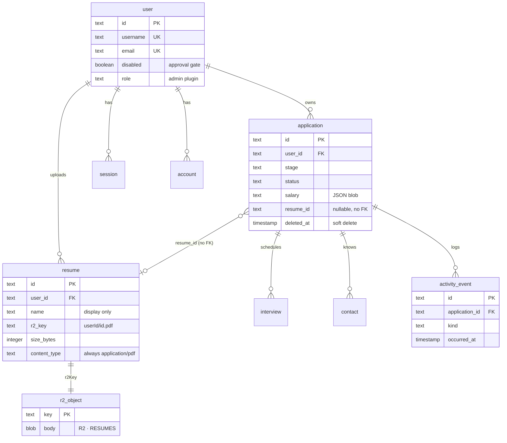
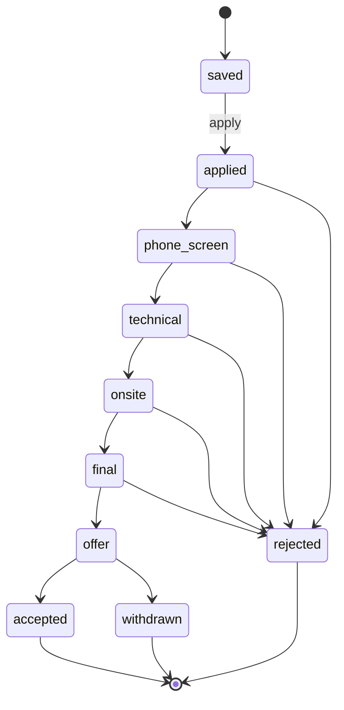
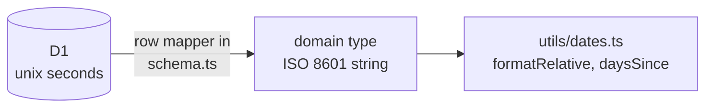
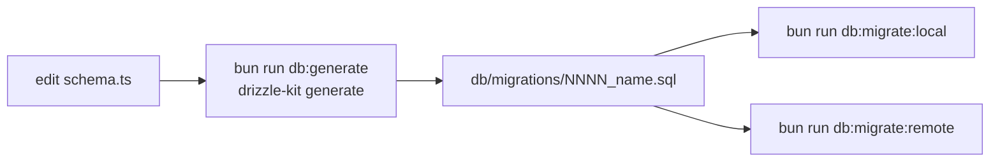

# Data model

Ten tables in one D1 database, plus one R2 bucket. Four tables belong to Better Auth; six belong
to the app. Every app table cascades from `user`, so a deleted account takes its whole subtree
with it — and `resume` is the only table whose rows point at bytes that live somewhere else.

## The tables

| Table | Owner | Purpose |
|---|---|---|
| `user` | Better Auth + app | Identity, plus `disabled` (approval gate) and `role` (admin plugin) |
| `session` | Better Auth | Session rows; `token` is what the cookie points at |
| `account` | Better Auth | Credentials. Provider `credential` holds the password hash |
| `verification` | Better Auth | Email verification / reset tokens |
| `rate_limit` | Better Auth | Counters, because `storage: 'database'` is mandatory on Workers |
| `application` | app | The job application itself |
| `interview` | app | Interviews attached to an application |
| `contact` | app | People met at a company |
| `activity_event` | app | Append-only timeline: creates, stage moves, interviews, contacts |
| `resume` | app | Metadata for a PDF in R2. The row is the only pointer to the object |

## `resume` in detail

The one table that points outside D1.

| Column | Type | Notes |
|---|---|---|
| `name` | text | Original filename. **Display only** — never used to build a path or a URL |
| `r2Key` | text | Always `${userId}/${id}.pdf`, both halves server-generated. Never sent to the client |
| `sizeBytes` | integer | Checked against `MAX_RESUME_BYTES` (10 MB) before the object is written |
| `contentType` | text | Always `application/pdf`, because the upload is rejected unless the first five bytes are `%PDF-` |
| `createdAt` | unix seconds | Row mappers convert it to an ISO string like every other date |

`application.resume_id` references it **without a foreign key**, on purpose: SQLite cannot add an
FK without rebuilding the table, and `deleteResume()` handles the link instead by setting
`resume_id = NULL` on both live and trashed applications before deleting the row. The application
survives; the attachment does not.

## `application` in detail

The one table that carries real domain weight.

| Column | Type | Notes |
|---|---|---|
| `stage` | enum | `saved → applied → phone_screen → technical → onsite → final → offer → accepted / rejected / withdrawn` |
| `status` | enum | Independent of stage: `active`, `stalled`, `ghosted`, `paused`, `closed` |
| `salary` | JSON text | A 4-way union (exact / range / none / unspecified), money as **integer minor units** |
| `tags` | JSON text | `string[]`, defaulted to `'[]'` in SQL so a raw insert still satisfies `notNull` |
| `appliedAt` / `stageChangedAt` / `nextActionAt` | unix seconds | `stageChangedAt` is the dwell-time anchor |
| `deletedAt` | unix seconds, nullable | Non-null means **in trash**; `restore` clears it, `purge` deletes the row |
| `resumeId` | text, nullable | Which uploaded resume was sent. No FK — see [`resume`](#resume-in-detail) |

**Stage and status are orthogonal on purpose.** Stage answers "how far did it get". Status answers
"is anything happening". An application can sit at `onsite` with status `ghosted` — that
combination is exactly what the dashboard exists to surface.

## Dates: one conversion point

Domain types (`src/lib/types.ts`) use **ISO strings**. D1 stores **unix seconds**. The only place
the two meet is the row mapper in `src/lib/server/db/schema.ts`. Nothing else in the codebase does
timestamp arithmetic on a raw integer, and no component receives a `Date` object.

## Money: never a float

`Salary` is a union, stored as a JSON blob rather than flattened into nullable `min`/`max`
columns plus a discriminator. Inside the blob, every amount is an **integer in minor units** —
`12_500_000` is ¥125,000.00, not `125000.0`. Parsing and formatting live in
`src/lib/utils/money.ts`; `parseSalaryFromForm` is the only entry point from user input.

## Indexes, and why exactly these

| Index | Serves |
|---|---|
| `application_user_idx` | Every list query filters on `userId` first |
| `application_user_deleted_idx` | The trash toggle — `userId` plus `deletedAt is null` |
| `interview_application_idx` | Detail modal loads interviews for one application |
| `contact_application_idx` | Same, for contacts |
| `activity_application_idx (applicationId, occurredAt)` | Timeline scan **and** the 90-day bounded stage-moves query |
| `resume_user_idx` | The library list and the per-user upload cap both filter on `userId` |
| `user_username_unique` | Username sign-in; also stops two people claiming one handle |
| `account_provider_id_account_id_unique` | One credential row per provider identity |

There is no index on `stage` or `status`. They are low-cardinality and every query that touches
them is already scoped by `userId`, so a composite index would cost writes and buy nothing.

## Migrations

`db/migrations/` is drizzle-kit output. **Never hand-edit it** — change `schema.ts` and regenerate.
Migrations are flat files (`0000_useful_butterfly.sql`), not one folder per migration, and
`wrangler.jsonc` points at `db/migrations/*.sql`. See [docs/research/drizzle.md](research/drizzle.md).

`0003_mixed_caretaker.sql` adds `resume` and is **additive only** — a `CREATE TABLE` plus one
index, no `ALTER`, no table rebuild. That is the standard to hold new migrations to: SQLite
rewrites a table to change its constraints, and a rewrite is the one thing this project will not
ship against live data.

## Query discipline

Every read and write goes through `src/lib/server/applications-data.ts` (and `resumes-data.ts` for
resumes), and every function there takes the per-request `Db` plus the acting `userId`, and filters
on `userId`. There is no "get all applications" query and no way to reach another user's rows.

Resume reads go one step further: `getResumeForUser()` 404s on a foreign id rather than 403ing, so
a probing request cannot even confirm that the id exists. `isResumeOwned()` is the same predicate
exposed as a boolean, and it is what guards the `resumeId` field on the `create` and `edit`
actions — that field arrives as free text from the form, so it is checked the same way any other
user-supplied id would be.

Deletes are **hard** deletes once they leave the trash. Nothing keeps a versioned row history,
which is what keeps the database inside the free-tier size ceiling — see
[free-tier-budget.md](free-tier-budget.md).
