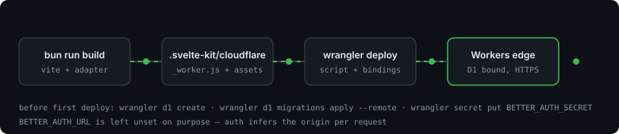
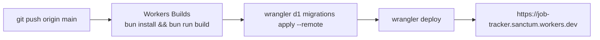
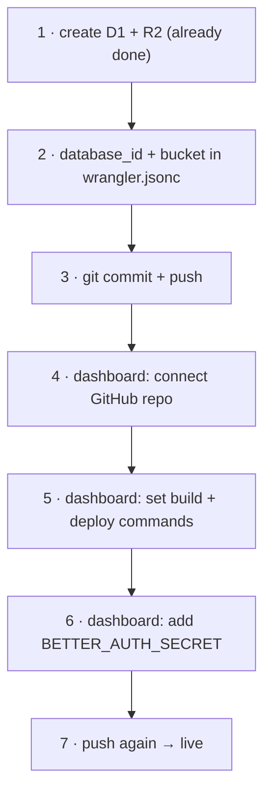
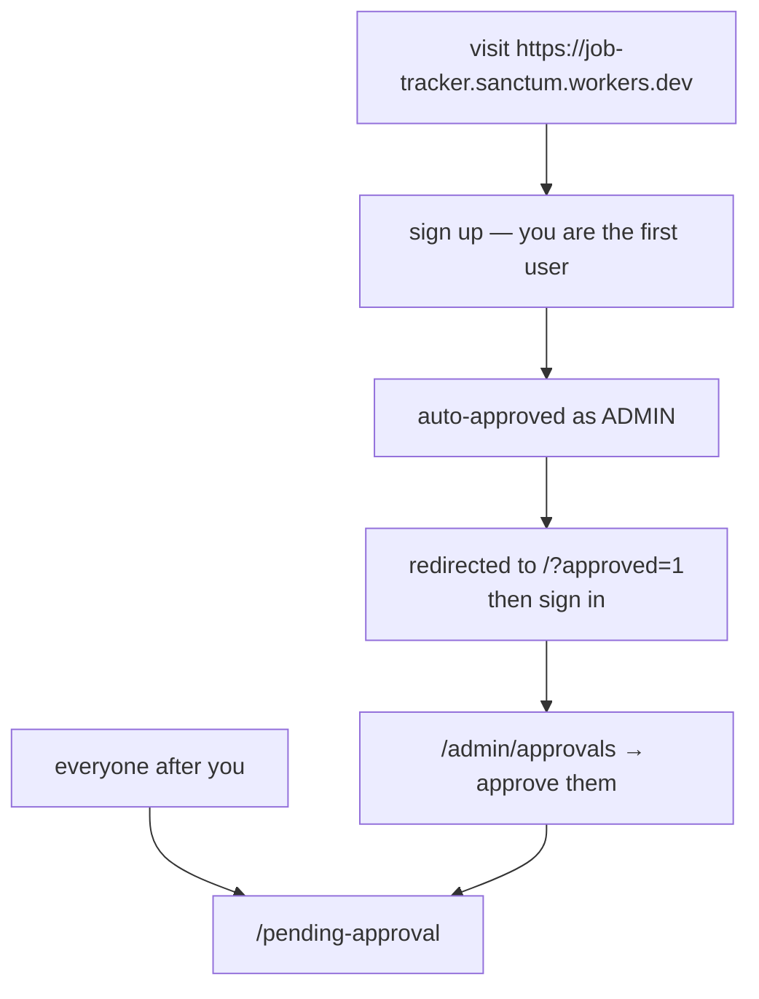
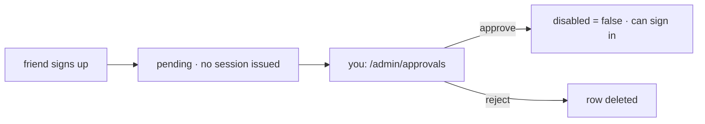
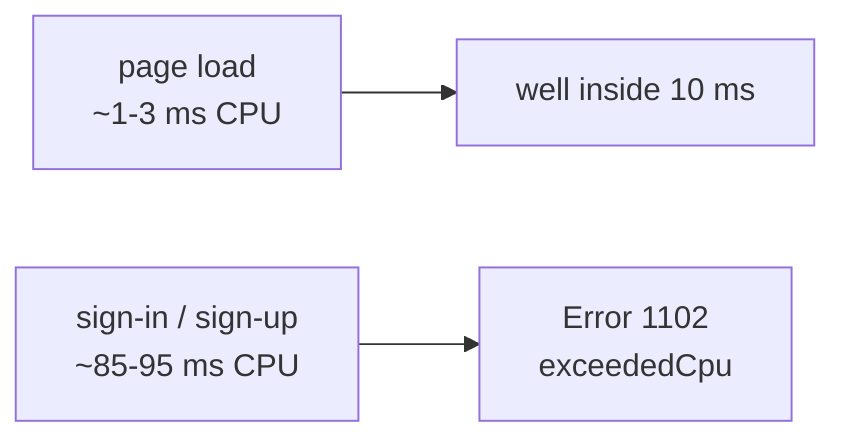

# Deployment

The repo is public and deploys through **Cloudflare Workers Builds** (the Git integration): push to
`main`, Cloudflare builds and ships it. Nothing runs from your laptop.





## One-time setup

You do these **once, by hand**. Everything after that is a push.



### 1 · Create the D1 database and the R2 bucket

Both exist already and are committed in `wrangler.jsonc`. Recreate them only if you start over:

```bash
bunx wrangler d1 create job-tracker
bunx wrangler r2 bucket create job-tracker-resumes
```

| Resource | Name | Referenced by |
|---|---|---|
| D1 database | `job-tracker` | `wrangler.jsonc` → `d1_databases[0].database_id` |
| R2 bucket | `job-tracker-resumes` | `wrangler.jsonc` → `r2_buckets[0].bucket_name`, bound as `RESUMES` |

Both were created with `wrangler` on this account, so D1 and R2 are already enabled there and no
dashboard sign-up step is left. A bucket is bound by **name**, not by id — so unlike D1 there is
nothing to paste back into `wrangler.jsonc` after creating one.

`wrangler d1 create` prints a `database_id`; paste it into `wrangler.jsonc` and commit. Every
`--remote` command fails with code `7404` until the id is real.

The D1 **name** must stay `job-tracker` — `db:migrate:remote` looks the database up by name, not
by id. R2 holds the resume PDFs; D1 holds only their metadata (see [data-model.md](data-model.md)).

> An id or a bucket name is an identifier, not a credential. Committing them to a public repo is
> fine; they only work together with an API token on your account.

### 2 · Add the secret

**Workers & Pages → job-tracker → Settings → Variables & Secrets → Add → Secret**

| Name | Value |
|---|---|
| `BETTER_AUTH_SECRET` | 32+ random bytes — `openssl rand -hex 32` |

This is the only thing that must stay secret. It is encrypted at rest and never appears in build
logs. `.dev.vars` is gitignored, and nothing sensitive has ever been committed — verified against
full git history.

### 3 · Connect the GitHub repo

**Workers & Pages → Create → Import a repository** (or, for the existing Worker:
**Settings → Builds → Connect**).

> The Worker name in the dashboard must be **`job-tracker`**, matching `"name"` in
> `wrangler.jsonc`. If they differ, the build fails.

| Setting | Value |
|---|---|
| Git repository | `job-tracker` |
| Production branch | `main` |
| Root directory | *(leave empty)* |

### 4 · Build settings

**Settings → Build**

| Field | Value |
|---|---|
| Build command | `bun install --frozen-lockfile && bun run build` |
| Deploy command | `bun run db:migrate:remote && bunx wrangler deploy` |
| Non-production branch deploy command | `bunx wrangler versions upload` |

Why the deploy command runs migrations: Workers Builds does **not** apply D1 migrations for you.
Putting `db:migrate:remote` in the *deploy* command (not the build command) means migrations run
for production deploys only — a preview branch will not touch your real database.

Why `bun` works in CI: the Workers Builds image preinstalls Bun under **Tools and languages**, but
its default is **1.2.15** — older than the 1.4.x this repo was developed against. `BUN_VERSION`
accepts any version, so add the build variable **`BUN_VERSION=1.4.2`** to make CI match local
rather than relying on whatever the image happens to ship. Pinning is also the documented way to
stop a silent image update from changing your build: the image bumps minor versions without
notice. See
[Build image](https://developers.cloudflare.com/workers/ci-cd/builds/build-image/).

| Build variable | Value | Why |
|---|---|---|
| `BUN_VERSION` | `1.4.2` | Matches local; the image default (1.2.15) is older |
| `SKIP_DEPENDENCY_INSTALL` | `1` — optional | Only if the automatic install misbehaves; the build command above already installs explicitly |

### 5 · Runtime variables

**Settings → Variables and Secrets** (runtime, not build). Build variables are *not* visible at
runtime — that is a separate screen.

| Variable | Needed? | Notes |
|---|---|---|
| `BETTER_AUTH_SECRET` | **yes** | Secret, encrypted |
| `BETTER_AUTH_URL` | no | Leave unset — see below |
| `DEV_ORIGINS` | no | Must stay empty in production |

**`BETTER_AUTH_URL` is deliberately not set.** When it is unset, `auth.ts` uses Better Auth's
dynamic baseURL object form: the origin is resolved per request and validated against
`allowedHosts`, so one build works on `http://localhost:5173` and
`https://job-tracker.sanctum.workers.dev` alike — but a host that is not listed is rejected
instead of silently trusted. Pin it only if you want auth locked to exactly one origin.

That list lives in `src/lib/server/auth.ts`. If you put this app behind a **custom domain**, add
that host to it, or every auth call will 500 with `Host "…" is not in the allowed hosts list`.
Full reasoning in [docs/auth.md](auth.md#base-url).

## After it is live



### Becoming the admin

The **first account ever created** bootstraps as an approved admin — no ceremony. Sign up with your
own email at the deployed URL and you are done. The sign-up action reads the row back after
`signUpEmail` and, seeing `disabled = false`, redirects to `/?approved=1` with a confirmation
rather than to `/pending-approval` — the person setting the app up should not be told to go and
approve themselves. `autoSignIn` is off for everyone, so the next step is signing in, and
`/dashboard` is where `?next=` defaults to. The check is "does any user with `disabled = false`
exist", so if you ever delete the only admin, the next sign-up bootstraps again.

### Letting your girlfriend and friends in

They sign up normally at the same URL. Their account lands in the approval queue and they see
"waiting for approval". You go to **`/admin/approvals`**, and approve or reject. Approved users can
sign in immediately.



Every user sees **only their own** applications. Every list query and every write filters on
`userId` in SQL, and the six single-row-by-id reads assert ownership in JS before returning
anything — so there is no shared view and no way to reach another account's rows. See
[data-model.md](data-model.md#query-discipline) for the two shapes and why both are safe.

Rejecting deletes the account row, so a mistyped email just means signing up again.

## Deploying by hand instead

If you ever need to push from your laptop:

```bash
bun run build
bun run db:migrate:remote     # wrangler d1 migrations apply job-tracker --remote
wrangler deploy
```

That deploys whatever is in your working tree, bypassing CI. Fine for emergencies; the Git
integration is the normal path.

## Preview branches

Non-production branches upload a version and give you a **preview URL** instead of promoting to
production. Previews do not run migrations, so a branch that changes the schema will deploy but its
SQL will not be applied until it lands on `main`.

## Troubleshooting

| Symptom | Cause | Fix |
|---|---|---|
| `code: 7404` on any `--remote` command | D1 database does not exist | `wrangler d1 create job-tracker`, paste the id |
| Resume upload returns 500 | `RESUMES` binding missing or the bucket name is wrong | `wrangler r2 bucket create job-tracker-resumes`, check `r2_buckets` |
| Upload rejected with 415 | The file is not really a PDF | Only files whose first bytes are `%PDF-` are accepted, whatever their name says |
| Build fails immediately with a name error | Dashboard Worker name ≠ `name` in `wrangler.jsonc` | Rename one to match (`job-tracker`) |
| Deploy succeeds but every page 500s | `BETTER_AUTH_SECRET` missing | Add it under **Variables & Secrets** |
| Auth works locally, fails in prod | `BETTER_AUTH_URL` pinned to localhost | Unset it; the dynamic baseURL resolves the origin per request |
| Every auth call 500s, log says `Host "…" is not in the allowed hosts list` | You are reaching the worker on a host not in `allowedHosts` | Add the host to `ALLOWED_HOSTS` in `src/lib/server/auth.ts`, or set `DEV_ORIGINS` (a custom domain is the usual cause) |
| New tables missing in prod | Migrations not run | `db:migrate:remote` is in the deploy command — check the build log |
| `bun: command not found` in build | Bun missing or renamed | Set build variable `BUN_VERSION` |
| Sign-in or sign-up returns **1102**, but page loads are fine | The password hash costs more CPU than the free tier allows | Read [free-tier-budget.md](free-tier-budget.md#the-one-request-that-does-not-fit-sign-in) before changing anything |

## Build log lines you can safely ignore

A clean `bun run preview` or `bun run build` still prints three things. None of them means
anything is wrong.

| Line | Why it is there |
|---|---|
| `Run npm run preview to preview your production build locally.` | SvelteKit prints a hardcoded string; it does not detect that you used bun. `bun run preview` is what you actually ran, and it is correct. |
| `▲ [WARNING] Ignoring this import because "node_modules/devalue/index.js" was marked as having no side effects` | SvelteKit emits a bare `import "devalue"` in its server output; devalue declares `sideEffects: false`, so the bundler drops the redundant import and says so. `devalue` is still bundled and is what encodes form results — the app is not missing it. |
| `GET /.well-known/appspecific/com.chrome.devtools.json 404` | Chrome probes this path when DevTools is open, looking for a workspace file. A 404 is the right answer. |

The one that *was* actionable used to appear between them: a `[PLUGIN_TIMINGS] Plugin hooks ran
for …` block. It is off in `vite.config.ts` (`build.rolldownOptions.checks.pluginTimings`) because
for SvelteKit it is always true and never actionable — `vite-plugin-sveltekit-compile` legitimately
is most of the build. Newer rolldown versions rename that option to `checks.bundlerTimings`, so if
the block ever comes back after an upgrade, change the key.

## One dashboard setting worth adding

Not code, so it is easy to miss: **add a rate limiting rule to the sign-in form.** Better Auth's own
limiter only guards `/api/auth/*`, and the sign-in form does not post there — so out of the box
there is no ceiling on password guesses. The Free plan includes one WAF rate limiting rule, which is
exactly enough:

| Setting | Value |
|---|---|
| Expression | Path **equals** `/` |
| Characteristic | IP |
| Period / requests | 10 seconds / 20 |
| Action | Block |

The reasoning, and why this beats an in-app counter, is in
[security.md](security.md#throttling).

## The one thing to know before you go live

Everything in this app fits the Workers free tier except **one request**: sign-in and sign-up.
Password verification is scrypt at `N=16384, r=16`, which measures at roughly 85–95 ms of CPU.
The free tier allows **10 ms** per request. Normal page loads are nowhere near the ceiling — they
mostly wait on D1, and waiting does not count as CPU — but a sign-in is about nine times over.



Cloudflare gives isolates slack for occasional overruns and only terminates a Worker that is
hitting the limit consistently, so this may well never surface for a handful of users. But if you
see 1102 on the auth page and nowhere else, that is the cause, not a bug in the app.

The two ways out are in [free-tier-budget.md](free-tier-budget.md#the-one-request-that-does-not-fit-sign-in):
Workers Paid, which removes the ceiling entirely, or a cheaper scrypt cost via a custom
`password.hash` / `password.verify` — which is a genuine security trade, not a free win, so it is
documented there rather than recommended here.

## Rollback

**Deployments** tab → pick an earlier version → **Roll back**. For data, D1 Time Travel gives 7
days on the free tier: `wrangler d1 time-travel restore`.
