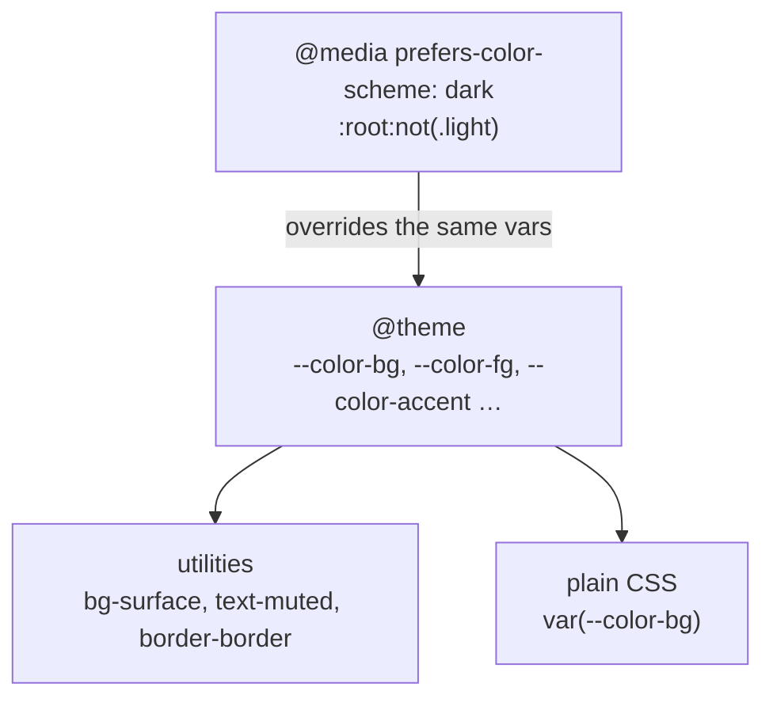
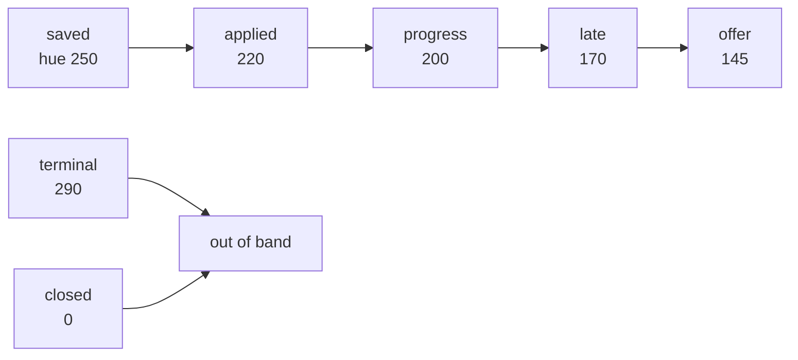
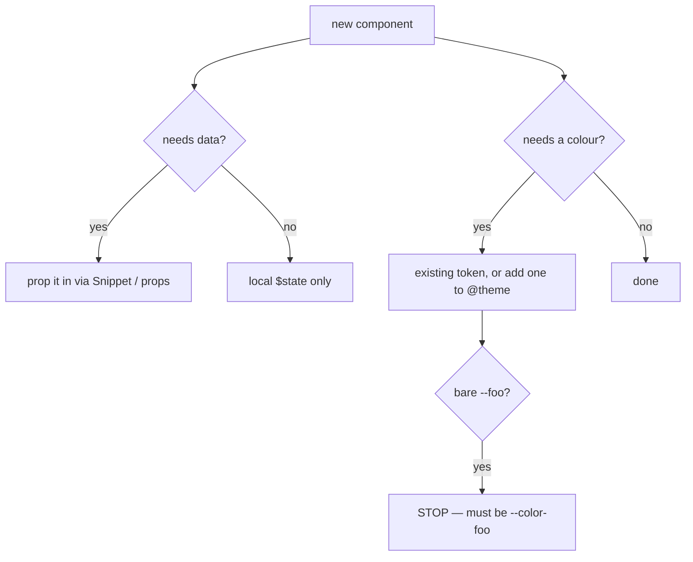

# Design system

Tailwind v4, CSS-first. Every token lives in one `@theme` block in `src/routes/layout.css`. There
is no `tailwind.config.js` and no PostCSS — the `@tailwindcss/vite` plugin handles it.

## The token layer

Because the dark overrides re-declare the *same* variables, every utility follows automatically.
No component knows which theme is active and no component carries a `dark:` variant.

## Colour

| Token | Light | Dark | Used for |
|---|---|---|---|
| `--color-bg` | `oklch(0.99 0 0)` | `oklch(0.16 0 0)` | Page background — off-white, never `#fff` |
| `--color-surface` | `oklch(1 0 0)` | `oklch(0.19 0 0)` | Cards, modals |
| `--color-surface-2` | `oklch(0.97 0 0)` | `oklch(0.23 0 0)` | Nested / hovered surfaces |
| `--color-fg` | `oklch(0.21 0 0)` | `oklch(0.97 0 0)` | Body text |
| `--color-muted` | `oklch(0.5 0 0)` | `oklch(0.7 0 0)` | Secondary text, labels |
| `--color-border` | `oklch(0.92 0 0)` | `oklch(0.28 0 0)` | Hairlines — **thin borders only** |
| `--color-accent` | `oklch(0.21 0 0)` | `oklch(0.97 0 0)` | The single neutral accent |

One accent. No gradients, no rainbow dashboards, no AI purple.

## Status colour, without a rainbow

Stages and statuses get a `-100` / `-700` pair each — a pale fill and a readable text colour in
the same hue family, all low chroma.

Tags are the one place colour is arbitrary. Instead of hashing a tag name to a random hue — which
is how you get a rainbow — tag colours snap to six low-chroma buckets driven by four variables:
`--tag-bg-l`, `--tag-bg-c`, `--tag-fg-l`, `--tag-fg-c`, plugged into
`oklch(var(--tag-bg-l) var(--tag-bg-c) <hue>)`. Retune all six at once by editing four numbers.

## Typography

| Token | Value |
|---|---|
| `--font-sans` | System UI stack |
| `--font-mono` | UI monospace stack |

**Mono is for labels, not for prose.** Small uppercase-ish mono labels mark the structure of the
page; everything a human reads is sans.

## Rules for writing UI here

- **Namespaced tokens only.** A bare `--primary` in `@theme` produces no utilities — Tailwind v4
  only scans namespaces (`--color-*`, `--font-*`, `--text-*`, …). Non-token variables go in
  `:root`. See [research/tailwind-v4.md](research/tailwind-v4.md).
- **No em-dashes in UI copy.**
- **Semantic HTML first.** `<button>` for actions, `<table>` for the grid, labelled inputs, a real
  `<dialog>`-style focus trap in `Modal.svelte`.
- **WCAG 2.2 AA is the target,** not a stretch goal: visible focus rings, `aria-busy` on the busy
  button state, `aria-labelledby` on modals, and contrast held by the `-100`/`-700` pairing rather
  than checked after the fact.

## Motion

Motion is information, not decoration. Chart bars animate their width once on mount to show
magnitude; the funnel grows stage by stage so the drop-off reads as a sequence. Nothing loops,
nothing parallaxes, and `prefers-reduced-motion` is respected where an animation carries no
information.

