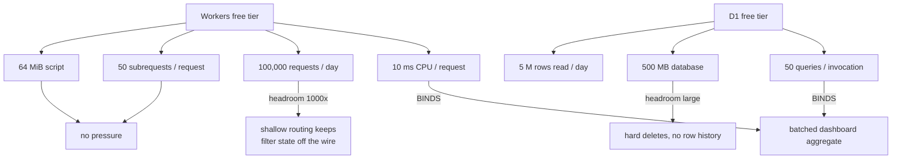
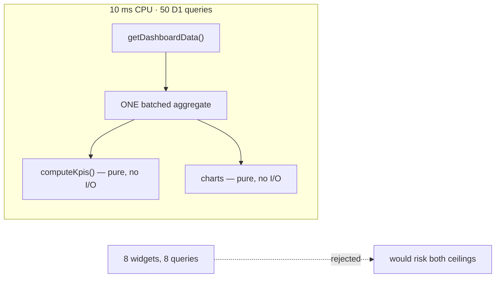
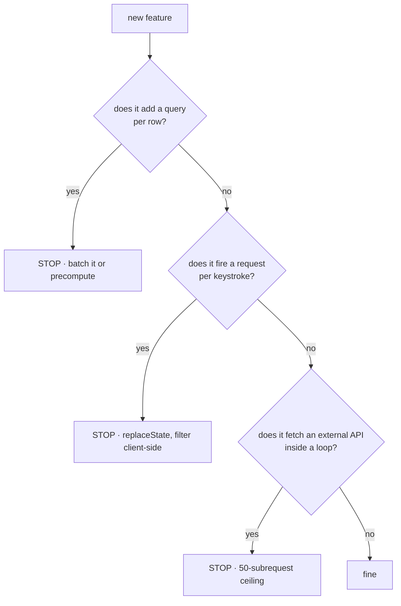
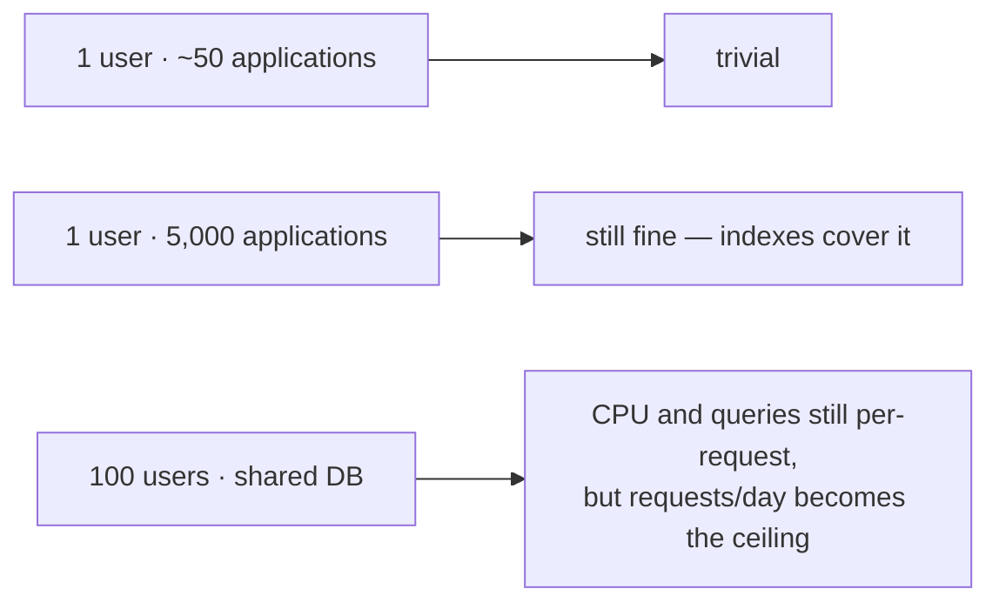

# Free-tier budget

The app is designed against the Cloudflare free tier, and the shape of the code is a consequence
of that, not a coincidence. Raw vendor numbers live in
[research/cloudflare.md](research/cloudflare.md); this file is about which of them bind and what
the code does about it.

## What actually binds

**Two limits matter: CPU per request, and D1 queries per invocation.** Everything else has
orders of magnitude of headroom for a single-user application.

| Limit | Ceiling | Typical use | Verdict |
|---|---|---|---|
| CPU per request | 10 ms | ~2-3 ms | **Tight — the one to design around** |
| D1 queries / invocation | 50 | single digits | **Design constraint** |
| Requests / day | 100,000 | tens | Large headroom |
| Rows read / day | 5,000,000 | thousands | Large headroom |
| Database size | 500 MB | ~1 MB | Large headroom |
| Script size | 64 MiB | well under | No pressure |
| Subrequests / request | 50 | 0 | No pressure |

## What the code does about it

| Decision | Buys |
|---|---|
| One batched aggregate, not a query per widget | Keeps D1 queries in single digits and CPU at ~2-3 ms |
| `STAGE_MOVES_WINDOW_DAYS = 90` | The `activity_event` scan costs the same on day 1 and day 1000 |
| `session.cookieCache` (5 min, `compact`) | Session reads skip D1 entirely on most requests |
| `replaceState` for filter / sort / modal state | Those interactions cost zero Worker invocations |
| `goto` only for real navigations | Invocations are spent where the server actually has work to do |
| Hard deletes, no versioned row history | Database stays flat instead of growing quadratically |
| No polling, no websockets, no background jobs | Request count stays proportional to actual use |

## What would break it, and what to do instead

| If you want to add | The cost | Do this instead |
|---|---|---|
| Full-text search | A scan per request | D1 FTS5 with an index; not `LIKE '%…%'` |
| Resume file storage | R2 is a paid-adjacent surface | Keep metadata only until there is a real need |
| Email digests | Needs Queues or a cron | `ctx.waitUntil` for a single call, nothing recurring |
| Real-time collaboration | Durable Objects | Not on the free tier |
| Semantic "more like this" | Workers AI + Vectorize | Feasible, but only past ~50k rows |

## The honest ceiling

Per-request limits do not care how many users you have; per-day limits do. The design is sound up
to roughly the point where daily request volume becomes the binding constraint, and by then the
answer is a paid plan rather than a rewrite.
