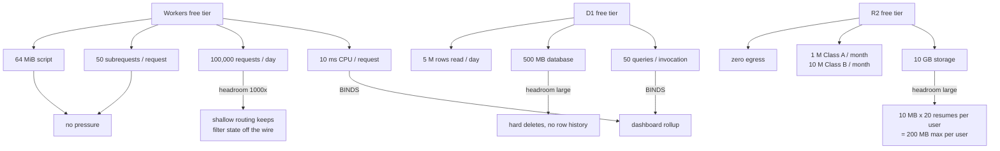
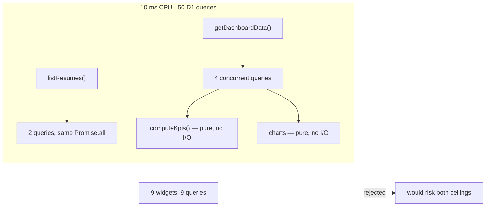
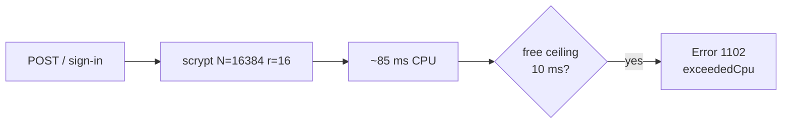
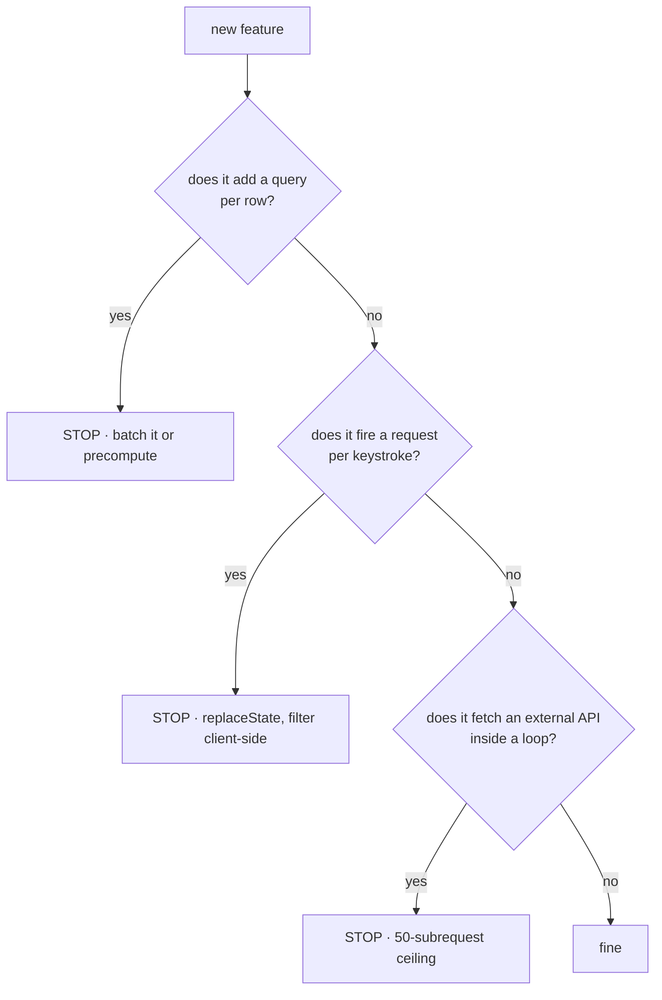
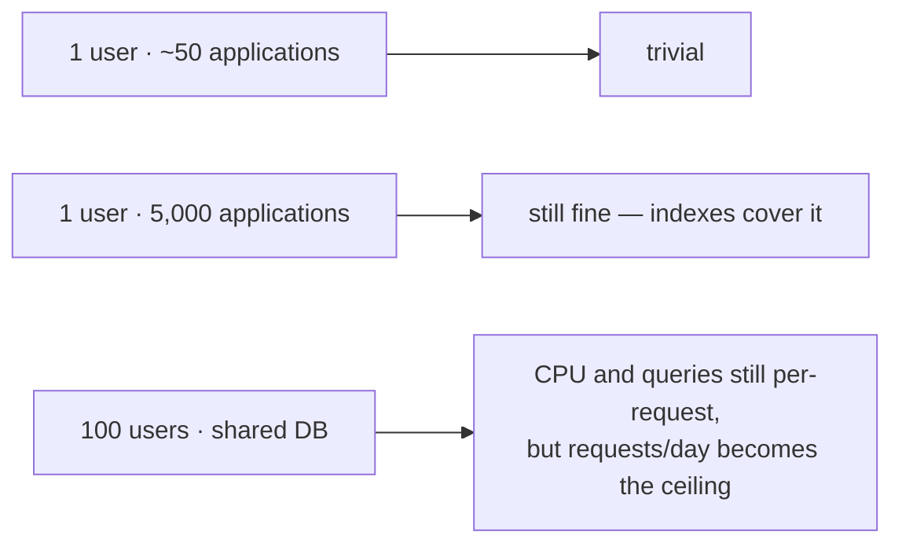

# Free-tier budget

The app is designed against the Cloudflare free tier, and the shape of the code is a consequence
of that, not a coincidence. Raw vendor numbers live in
[research/cloudflare.md](research/cloudflare.md); this file is about which of them bind and what
the code does about it.

## What actually binds

**Two limits matter: CPU per request, and D1 queries per invocation.** Everything else has
orders of magnitude of headroom for a single-user application.

| Limit | Ceiling | Typical use | Verdict |
|---|---|---|---|
| CPU per request | 10 ms | ~1-3 ms | **Tight — the one to design around** |
| D1 queries / invocation | 50 | 6 (10 with the detail modal open) | **Design constraint** |
| Requests / day | 100,000 | tens | Large headroom |
| Rows read / day | 5,000,000 | thousands | Large headroom |
| Database size | 500 MB | ~1 MB | Large headroom |
| Script size | 64 MiB | well under | No pressure |
| Subrequests / request | 50 | 0 | No pressure |
| R2 storage | 10 GB | ≤ 200 MB per user | Large headroom |
| R2 Class A ops (writes, lists) | 1 M / month | tens | Large headroom |
| R2 Class B ops (reads) | 10 M / month | hundreds | Large headroom |
| R2 egress | free | every byte a user downloads | **Never a cost — this is why the bucket holds files** |

## What the code does about it

The real figure, so the "one rollup" claim means something: a plain `/dashboard` is **6** queries
(4 from `getDashboardData` plus 2 from `listResumes`), 7 with `?trash=1`, and 10 with the detail
modal open — `?app=<id>` adds the application row plus interviews, contacts, and activities. That
is not single digits and this file should not pretend otherwise. It is comfortably inside 50, and
it is flat with respect to the number of widgets.

| Decision | Buys |
|---|---|
| One rollup instead of a query per widget | 6 queries for 9 widgets; adding a widget costs arithmetic, not a round trip. Without it, 9 widgets would be 9 queries plus one for the resume library |
| The agenda reuses `upcomingInterviews` from that same rollup | The one *prospective* panel costs zero extra queries — it is pure derivation over data already fetched |
| `STAGE_MOVES_WINDOW_DAYS = 90` | The `activity_event` scan costs the same on day 1 and day 1000 |
| `session.cookieCache` (5 min, `compact`) | Session reads skip D1 entirely on most requests |
| `replaceState` for filter / sort / modal state | Those interactions cost zero Worker invocations |
| `goto` only for real navigations | Invocations are spent where the server actually has work to do |
| Hard deletes, no versioned row history | Database stays flat instead of growing quadratically |
| No polling, no websockets, no background jobs | Request count stays proportional to actual use |
| Resume bytes in R2, metadata in D1 | 200 MB ceiling per user against a 10 GB bucket, and egress is free |
| Resume PDFs proxied by the Worker, not a public bucket | No presigned URL to leak; a read is one Class B op, which is 10 M/month |
| Upload rejected on `content-length` before the body is read | An oversized POST never reaches R2 or the CPU budget |

## The one request that does not fit: sign-in

Everything above is about keeping *page loads* small, and that part works. But there is one route
where the 10 ms ceiling is not something a design decision can buy back.

Better Auth hashes passwords with scrypt at `N=16384, r=16, dkLen=64`
(`@better-auth/utils` → `password.node.mjs`). Measured on a desktop CPU that is **~85–95 ms** of
pure compute — and unlike the D1 round-trips above, hashing is CPU, so it counts. Cloudflare's own
limits page says as much: *"Heavier workloads that handle authentication, server-side rendering, or
parse large payloads typically use 10-20 ms."*

What that means in practice:

- **Page loads are fine.** With `session.cookieCache` on, a normal dashboard request verifies a
  signed cookie instead of touching D1, and the SSR pass is a few ms.
- **Sign-in and sign-up are the risk.** They are roughly 9× over the documented ceiling.
- Cloudflare gives each isolate slack for *occasional* overruns and only terminates a Worker that
  "starts hitting the limit consistently" — so logins will usually succeed. When they don't, the
  symptom is **Error 1102 / `Worker exceeded resource limits`** on the sign-in POST.

If you see that, in order of preference:

1. **Move to Workers Paid** ($5/month) — the CPU ceiling goes from 10 ms to 30 s. This is the
   honest fix, and it is the only one that keeps the password hashing as strong as it is.
2. **Lower the scrypt cost** via `emailAndPassword.password.hash` / `.verify` in `auth.ts`.
   Halving `N` halves the time; you would need to go much lower than is comfortable to fit 10 ms,
   which is a real security trade, not a free win.

Do not "fix" it by caching sessions harder — the cost is in the password verify, which only runs
when someone actually logs in.

## What would break it, and what to do instead

| If you want to add | The cost | Do this instead |
|---|---|---|
| Full-text search | A scan per request | D1 FTS5 with an index; not `LIKE '%…%'` |
| Unlimited resume storage | 10 GB is the free ceiling | Keep the 10 MB × 20 per-user cap; it is enforced in code, not policy |
| Email digests | Needs Queues or a cron | `ctx.waitUntil` for a single call, nothing recurring |
| Real-time collaboration | Durable Objects | Not on the free tier |
| Semantic "more like this" | Workers AI + Vectorize | Feasible, but only past ~50k rows |

## The honest ceiling

Per-request limits do not care how many users you have; per-day limits do. The design is sound up
to roughly the point where daily request volume becomes the binding constraint, and by then the
answer is a paid plan rather than a rewrite.
