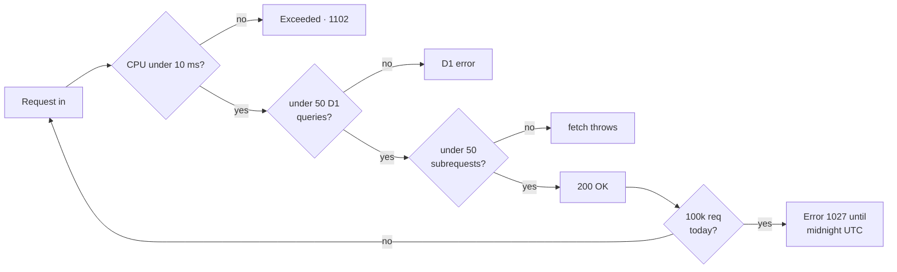

# Cloudflare (Workers, D1, DO, KV, R2, Queues, Hyperdrive, AI, Vectorize) — research notes

> Sources: Cloudflare docs MCP (`mcp__cloudflare_docs_search_cloudflare_documentation`, `mcp__cloudflare_docs_migrate_pages_to_workers_guide`), official changelogs. Mapped 2026-09-04.
> Focused on what the job-tracker needs to make a decision: D1 vs DO-SQLite vs Hyperdrive, R2 for files, KV for rate-limit cache, Queues for background jobs, Workers AI for embeddings/parsing, Vectorize for semantic search.

## Current state of the platform (mid-2026)

- `workerd` runtime is 1.2026-series. `compatibility_date` is the runtime version pin; pick a recent date and the runtime will activate the matching workerd build. Latest dates seen in docs: `2026-08-28`, `2026-09-03`, `2026-08-25`.
- `compatibility_flags: ["nodejs_compat"]` is the right default for this stack. Better Auth's official Cloudflare guidance ([Installation → Mount Handler](https://better-auth.com/docs/installation#mount-handler)) says to add `nodejs_compat`; it lists `nodejs_als` only as a narrower fallback for AsyncLocalStorage alone. `nodejs_als` does **not** enable the `node:*` built-ins — it only polyfills `AsyncLocalStorage`. This project ships `nodejs_compat`.
- The Vite plugin is stable (`@cloudflare/vite-plugin`); `wrangler dev` still works. SvelteKit's `adapter-cloudflare` builds with the Vite plugin by default; you do not need to write `vite.config.ts` Cloudflare plugin yourself.

## Free-tier budget (the ceiling this app is designed against)

Every number below is from the official limits pages ([Workers](https://developers.cloudflare.com/workers/platform/limits/), [D1](https://developers.cloudflare.com/d1/platform/limits/)), not from memory. The app is single-user and read-mostly, so none of these bind in practice — but they decide *how* the data layer is written.



| Resource | Workers Free | Paid | Where it bites |
|---|---|---|---|
| Requests | **100,000 / day** (resets midnight UTC; over → Error 1027) | Included 10 M, then usage | A runaway polling loop. This app has none. |
| CPU per request | **10 ms** | 5 min (30 s default) | The real constraint. Batched dashboard rollups exist for this. |
| Memory | 128 MB | 128 MB | Never a factor at this size. |
| Subrequests / request | **50** | 10,000 | Only relevant if we later fetch an external API per row. |
| Worker script size | **64 MiB**, uncompressed (no compressed limit) | 65 MiB | `auth.js` (~418 kB) is the biggest chunk; CSS ships as a static asset and does not count. |
| Worker startup | 1 s (400 ms after 30 s idle) | — | Cold start, not CPU. |
| Simultaneous connections | 6 | — | Parallel `fetch` fan-out ceiling. |
| Workers per account | 100 | — | One per environment + previews. |
| Env vars / Worker | 64 (5 KiB each) | — | Fine. |

| D1 | Free | Paid | Where it bites |
|---|---|---|---|
| Databases | 10 | 10 | One is enough. |
| Max database size | **500 MB** | 10 GB | A 5 GB D1 read a day, forever, stays trivial. |
| Max storage / account | 5 GB | — | Shared across all databases. |
| **Queries per Worker invocation** | **50** | 1,000 | **This is the sharpest D1 limit.** `getDashboardData` is one batched aggregate for exactly this reason. |
| Rows read / written | 5 M read, 100 k written / day | Included + usage | Bounded by the 90-day stage-moves window. |
| Max SQL statement duration | 30 s | 30 s | Index-backed queries land in ms. |
| Max row size | 2 MB | 2 MB | Job descriptions are ~10 kB. |
| Max statement length | 100 kB | 100 kB | Drizzle batches inserts. |
| Time Travel / backup | 7 days | 30 days | Rollback window. |
| Simultaneous connections / invocation | 6 | 6 | A *separate* budget from the Workers row above, not the same one — D1 caps concurrent queries per invocation, Workers caps `fetch` fan-out. Both happen to be 6. |

For which of these actually bind this app, and what the code does about each, see [free-tier-budget.md](../free-tier-budget.md).

## `wrangler.jsonc` (the project-relevant shape)

A tour of the bindings that exist, not a copy of the repo's config. This app ships items **1, 2, 3,
6 and 7** — assets, D1, R2, empty `vars`, observability. KV, Queues, Hyperdrive and the SPA
fallback are shown for reference and are deliberately not in `wrangler.jsonc`.

```jsonc
{
  "$schema": "node_modules/wrangler/config-schema.json",
  "name": "job-tracker",
  "main": ".svelte-kit/cloudflare/_worker.js",
  "compatibility_date": "2026-08-28",
  "compatibility_flags": ["nodejs_compat"],

  // 1) Static assets (prebuilt client bundle + prerendered HTML)
  "assets": {
    "binding": "ASSETS",
    "directory": ".svelte-kit/cloudflare",
    // optional: "not_found_handling": "single-page-application" — only for SPA shells
  },

  // 2) D1 — the database
  "d1_databases": [
    {
      "binding": "DB",
      "database_name": "job-tracker",
      "database_id": "<UUID-from-wrangler-d1-create>",
      // Drizzle-kit 0.31 emits FLAT migration files (migrations/0000_name.sql).
      // Paths are repo-root-relative and must match the real tree: the
      // project keeps them under db/, so the pattern is db/migrations/*.sql.
      "migrations_dir": "db/migrations",
      "migrations_pattern": "db/migrations/*.sql"
    }
  ],

  // 3) R2 — for resume PDFs, profile photos, etc. (optional)
  "r2_buckets": [
    { "binding": "RESUMES", "bucket_name": "job-tracker-resumes" }
  ],

  // 4) KV — for rate-limit cache, feature flags (optional)
  "kv_namespaces": [
    { "binding": "CACHE", "id": "<UUID>" }
  ],

  // 5) Queues — background processing (later)
  "queues": {
    "producers": [{ "binding": "EMAIL_QUEUE", "queue": "email-out" }],
    "consumers": [{
      "queue": "email-out",
      "max_batch_size": 10,
      "max_batch_timeout": 30,
      "max_retries": 3,
      "dead_letter_queue": "email-out-dlq"
    }]
  },

  // 6) Vars (public + private build-time-injected). Secrets go via `wrangler secret put`.
  // BETTER_AUTH_URL intentionally absent — Better Auth infers it from
  // request.url. Add it here only to pin auth to a single origin.
  "vars": {},

  // 7) Observability
  "observability": { "enabled": true },

  // 8) Workers Static Assets SPA fallback (only if you have a SPA)
  // "assets": { ..., "not_found_handling": "single-page-application" },

  // 9) Hyperdrive (later, only if we adopt Postgres)
  // "hyperdrive": [{ "binding": "HYPERDRIVE", "id": "<UUID>" }]
}
```

`.assetsignore` file — in this repo at `static/.assetsignore`, i.e. inside the assets directory that `wrangler.jsonc` points `assets.directory` at, not next to `wrangler.jsonc` — prevents the built worker JS from being served as a static asset:

```
_worker.js
_routes.json
```

## Storage decision matrix (the core question for the job-tracker)

| Need | D1 (SQLite) | DO + SQLite | R2 | KV | Hyperdrive (Postgres) |
|---|---|---|---|---|---|
| Relational data (jobs, applications, contacts, sessions) | ✅ primary pick | ✅ for hot aggregate rows | ❌ | ❌ | overkill until scale |
| Object storage (resumes, screenshots) | ❌ | ❌ | ✅ | ❌ | ❌ |
| Low-latency key cache (feature flags, rate limit) | ❌ | ❌ | ❌ | ✅ | ❌ |
| Real-time coordination (multi-user edit, presence) | ❌ | ✅ | ❌ | ❌ | ❌ |
| Already-on-Postgres | ❌ | ❌ | ❌ | ❌ | ✅ |

For the job-tracker:

- **D1** is the primary store. Cheap, replicates globally, SQLite semantics (easy to reason about), great Drizzle story.
- **DO with SQLite storage** is the right call only if we need strongly consistent per-user/per-org state (e.g. live collaborative editing, presence, hot counters). The new `storage: "sqlite"` is the recommended path; the old KV-backed DO is being phased out for new namespaces.
- **R2** for resume PDFs and any uploaded binary.
- **KV** for rate-limit cache, optional Better Auth secondary storage, feature flags. Use sparingly — reads are eventually consistent, no list-by-prefix cross-region.
- **Hyperdrive** not needed. Re-evaluate only if we move to Postgres for a real reason (full-text search, JSONB, exotic indexes). D1's FTS5 + Better Auth's search helpers cover the common cases.

## D1 in detail

### Provisioning

```bash
wrangler d1 create job-tracker
# copy the printed database_id into wrangler.jsonc
```

### Local dev

- `wrangler dev` (or `bun run dev` via `vite dev` with the SvelteKit Cloudflare adapter) uses a local D1 simulation backed by `miniflare` — local SQLite file under `.wrangler/state/v3/d1/`.
- Seed: `wrangler d1 execute job-tracker --local --file=./seed.sql`.
- `--remote` flag connects to the live D1 (handy for verifying migrations against the real DB).

### Schema migrations

Drizzle-generated SQL is the source of truth. With the `drizzle-kit` `drizzle.config.ts` configured for `driver: 'd1-http'`, you can introspect and push during dev. For deploy:

```bash
# 1. Drizzle generates SQL into migrations/
bunx drizzle-kit generate

# 2. Apply to local D1
wrangler d1 migrations apply job-tracker --local

# 3. Apply to remote D1
wrangler d1 migrations apply job-tracker --remote
```

The `migrations_pattern` setting in `wrangler.jsonc` is `migrations/*.sql` — drizzle-kit 0.31's actual FLAT output (corrected 2026-09-11; the nested `migrations/*/migration.sql` layout was the unpublished Drizzle 1.0 RC plan). Don't use `wrangler d1 migrations create` to scaffold new ones — let Drizzle own it.

For foreign key changes that would violate constraints mid-migration, wrap with `PRAGMA defer_foreign_keys = true;` then `PRAGMA foreign_keys = on;`.

### Programmatic migrations (when CLI is unavailable, e.g. a `/admin/migrate` endpoint)

```ts
import { getMigrations } from 'better-auth/db/migration';
// or for Drizzle: use `migrate(db, { migrationsFolder: './migrations' })` from drizzle-orm/d1/migrator
```

For Drizzle specifically (not Better Auth's Kysely path), use `drizzle-orm/d1/migrator`:

```ts
import { migrate } from 'drizzle-orm/d1/migrator';
import { db } from './db';
await migrate(db, { migrationsFolder: 'migrations' });
```

### D1 API quick reference

```ts
// D1Database
const stmt = env.DB.prepare("SELECT * FROM jobs WHERE id = ?").bind(id);
const row = await stmt.first<Job>();
const rows = await stmt.all<Job>();
await env.DB.batch([stmt1, stmt2, stmt3]);
const dump = await env.DB.dump(); // SQL text — local dev only
```

Limits, from the [official D1 limits page](https://developers.cloudflare.com/d1/platform/limits/): **2 MB** max row size, **100 kB** max SQL statement length, **30 s** max query duration, **50 queries per Worker invocation**, **6** simultaneous connections per invocation, Time Travel **7 days** on Free (30 days on Paid). Numbers like "10 MB rows / 50,000 rows per query" float around older docs — treat the page above as authoritative. Good for typical CRUD; for large scans use D1's Time Travel (point-in-time recovery) rather than a homegrown audit table.

## Durable Objects (DO)

### Pick DO when

- Strict consistency is required (single-instance per id, replicated writes go through the DO).
- You need WebSockets, hibernating connections, alarms, or `ctx.blockConcurrencyWhile` for transactional mutations.
- Per-user/per-org hot aggregate row needs to avoid read-modify-write races (DO methods are serialized per id).

### New-SQLite-backed DO is the default (mid-2026+)

```ts
// src/worker.ts (or a dedicated module)
import { DurableObject } from 'cloudflare:workers';

export class JobCounter extends DurableObject<Env> {
  async increment(jobId: string) {
    const cur = (await this.ctx.storage.get<number>(`count:${jobId}`)) ?? 0;
    const next = cur + 1;
    await this.ctx.storage.put(`count:${jobId}`, next);
    return next;
  }
}
```

```jsonc
// wrangler.jsonc
{
  "durable_objects": {
    "bindings": [
      { "name": "JOB_COUNTER", "class_name": "JobCounter" }
    ]
  },
  "exports": {
    "JobCounter": { "type": "durable-object", "storage": "sqlite" }
  },
  "migrations": [
    { "tag": "v1", "new_sqlite_classes": ["JobCounter"] }
  ]
}
```

- `migrations` array is required to add new DO classes (each tag is immutable; only ever add, never modify).
- KV-backed DO namespaces are no longer creatable for new accounts. Existing ones continue to work; a future migration path to SQLite storage is planned.
- DO class code lives in a separate `worker.ts` (or similar). SvelteKit's `adapter-cloudflare` handles this — set the `main` to your custom worker module if you have one, otherwise it uses `.svelte-kit/cloudflare/_worker.js` which re-exports the SvelteKit `Server.handle`.

### Drizzle + DO

- Drizzle ships a `drizzle-orm/durable-sqlite` driver for SQLite-backed DOs (experimental but real). For our use case, raw `this.ctx.storage.sql.exec(sql)` is fine for the simple counters/aggregates the job-tracker would need.

## R2

- S3-compatible, zero egress. Free tier ([pricing](https://developers.cloudflare.com/r2/pricing/),
  updated 2026-08-07): **10 GB-month storage, 1 million Class A operations, 10 million Class B
  operations** per month. Class A mutates state (write, list, delete), Class B reads. Egress is
  free on every storage class. The free tier applies to Standard storage only, not Infrequent
  Access.
- Use `R2.put(key, body, { httpMetadata, customMetadata })`, `R2.get(key)`, `R2.delete(key)`, `R2.list({ prefix })`.
- Public bucket: bind separately, exposes `R2_BUCKET.get(key).then(r => r.body)`. Don't do this for user data — use presigned URLs (`R2.createPresignedUrl`).
- CORS: set via dashboard or via S3 API on the bucket. Worker upload pattern: client requests a presigned URL from your Worker, uploads directly to R2.
- Lifecycle: configure retention rules in dashboard; objects can be auto-deleted after N days.

## KV

- Eventually consistent (~60s global propagation). Reads from nearest edge.
- `getWithMetadata`, `list({ prefix, limit, cursor })`, `put(value, { expirationTtl, metadata })`.
- Good for: rate-limit counters, feature flags, session denylist, idempotency keys. Bad for: any data you need to read-your-own-writes.
- Use `wrangler kv:namespace create job-tracker-cache` to provision, then copy the id into `wrangler.jsonc`.

## Queues

- Producer/consumer pattern with batching, retries, dead-letter.
- Bind: `env.EMAIL_QUEUE.send({ id, payload, contentType })` from a producer Worker.
- Consumer is a separate Worker with `[[queues.consumers]]` in `wrangler.jsonc`, an `export default { async queue(batch, env) {...} }` handler. SvelteKit on Workers doesn't natively serve as a queue consumer — you need a small `worker.ts` entry that the SvelteKit worker delegates to, or split: SvelteKit does `ctx.waitUntil(env.EMAIL_QUEUE.send(...))` and a separate "worker-queue" deploys with `main: src/workers/queue.ts`.
- For the job-tracker, the email-send path is the only one that benefits. Wait until that becomes a real bottleneck.

## Workers AI (env.AI)

Binding-only inference. Models include Llama, Mistral, embeddings (`@cf/baai/bge-base-en-v1.5`, 768-dim), Stable Diffusion / Flux image gen, Deepgram speech-to-text (`nova-3`), Whisper, NVIDIA Nemotron for agentic. Streaming supported for chat.

```ts
const vectors = await env.AI.run('@cf/baai/bge-base-en-v1.5', { text: stories });
// vectors.data: number[][]

const answer = await env.AI.run('@cf/meta/llama-3.1-8b-instruct', {
  messages: [{ role: 'user', content: prompt }],
  stream: true, // returns ReadableStream
});
```

`env.AI.toMarkdown([{ name, blob }])` is a Workers AI utility for PDF/image→markdown conversion — useful for resume parsing.

For the job-tracker:
- Embeddings of job descriptions for semantic "more like this" search.
- Resume → structured JSON parsing (use `toMarkdown` then an LLM call to extract fields).
- No GPU code; only HTTP-like inference.

## Vectorize

GA. Use for semantic search at scale (millions of vectors). Index config: dimensions + metric (cosine/euclidean/dot) is **immutable** — pick the same dim as your embedding model (768 for BGE-base, 1024 for BGE-large, 1536 for OpenAI text-embedding-3-small).

```jsonc
// wrangler.jsonc
{
  "vectorize": [{ "binding": "VECTORIZE", "index_name": "job-embeddings" }],
  "ai": { "binding": "AI" }
}
```

```bash
wrangler vectorize create job-embeddings --dimensions=768 --metric=cosine
wrangler vectorize create-metadata-index job-embeddings --property-name=jobId --type=string
```

```ts
const vectors: VectorizeVector[] = (await env.AI.run('@cf/baai/bge-base-en-v1.5', { text: jobDescriptions }))
  .data.map((values, i) => ({ id: jobIds[i], values, metadata: { jobId: jobIds[i] } }));
await env.VECTORIZE.upsert(vectors);
const matches = await env.VECTORIZE.query(queryVec, { topK: 10, returnMetadata: 'all' });
```

Up to 10 metadata indexes per index (string/number/boolean). `filters` syntax: `filters: { field: 'value' }` or `filters: { field: { $gte: x } }`.

For 5-10K vectors or fewer, D1 + a brute-force `cosineDistance()` SQL function is fine. Reach for Vectorize when you cross ~50K vectors, or when you want sub-50ms query latency.

## Hyperdrive (Postgres acceleration)

Don't need it for the job-tracker. Worth knowing:

- `wrangler hyperdrive create my-pg --connection-string="postgres://..."` produces a config id.
- `env.HYPERDRIVE.connectionString` is a regional pooler URL. Pass to any Postgres driver (`pg`, `postgres.js`).
- Best practice: create a new `Client` per request; the pool is managed by Hyperdrive.
- Use `ctx.waitUntil(connection.end())` to ensure cleanup.

## Analytics Engine

For event/observability data. `env.ANALYTICS.writeDataPoint({ blobs: [...], doubles: [...], indexes: [...] })`. SQL queryable from dashboard. Cheap; high cardinality; ~90-day retention.

## Local dev

- `wrangler dev` for a raw Workers experience.
- `vite dev` with `adapter-cloudflare` for SvelteKit (recommended). Hot reload works; `event.platform.env` is populated by the platform proxy.
- `wrangler dev --remote` for some bindings → use remote D1. Avoid in shared dev; mutations are real.
- Miniflare stores local D1 / KV / R2 under `.wrangler/state/`. Safe to delete if you want a clean slate.

## Observability

- `wrangler.jsonc` → `observability.enabled: true`. Logs go to dashboard.
- `wrangler tail` for live tailing.
- Workers Logs (`console.log`, `console.error`) → searchable. Head-based sampling via `wrangler.jsonc`.

## CI / deploy

- `wrangler deploy` reads `wrangler.jsonc` and ships everything in one command.
- The SvelteKit build (`bun run build`) produces `.svelte-kit/cloudflare/_worker.js`; `wrangler deploy` then picks it up via `main`.
- For CI: set `CLOUDFLARE_API_TOKEN` + `CLOUDFLARE_ACCOUNT_ID`. `wrangler deploy` is non-interactive. No state to persist between runs.
- Preview environments: per-branch `wrangler deploy` to a unique worker name (`job-tracker-pr-123`). Use a wildcard route or Pages-style URL — Cloudflare gives preview URLs automatically with `preview_urls: true` in `wrangler.jsonc`.

### Workers Builds build image

Verified against [Build image](https://developers.cloudflare.com/workers/ci-cd/builds/build-image/)
(last updated 2026-07-30).

| Tool | Default | Override variable |
|---|---|---|
| Node.js | 24.18.0 (22.23.2 also preinstalled) | `NODE_VERSION`, `.nvmrc`, `.node-version` |
| **Bun** | **1.2.15** | `BUN_VERSION` |
| pnpm | 10.11.1 | `PNPM_VERSION` |
| yarn | 4.9.1 | `YARN_VERSION` |
| npm | 10.9.2 | *(none — tracks Node)* |

Two things follow for this repo, which is built with Bun 1.4.x locally:

- **The image default is older than local.** Set `BUN_VERSION=1.4.2` as a build variable rather
  than assuming CI matches your machine.
- **Minor versions bump without notice.** Cloudflare's own policy is that minor updates happen
  silently and only major ones get three months' notice, so pinning is the only way to keep a
  build reproducible.

Build environment is Ubuntu 24.04 / x86_64. `SKIP_DEPENDENCY_INSTALL=1` disables the automatic
install if you would rather run your own.

## Key pitfalls for SvelteKit on Cloudflare

- **No `fs`**: don't import anything that reads files at runtime. `import.meta.glob` is build-time only.
- **No `process.env` at runtime**: use `event.platform.env` or `cloudflare:workers.env`. Build-time `import { X } from '$env/static/private'` is fine; reads happen at build, get inlined.
- **No `node:*` unless `nodejs_compat` is on**: importing `node:fs` or `node:crypto` fails at runtime without it. `nodejs_als` is *not* a substitute — it polyfills `AsyncLocalStorage` only, not the `node:` built-ins. Better Auth reaches for `node:async_hooks` (dynamic `import()` with a `.catch()` that falls back to `globalThis.AsyncLocalStorage`, so it degrades rather than crashes) and hashes passwords through `@better-auth/utils/password`, which picks `node:crypto` scrypt only under the `node` export condition and otherwise falls back to pure-JS `@noble/hashes`. So it runs either way, but `nodejs_compat` is the documented and safer setting.
- **Cookie `Secure` flag**: only set automatically in production. For preview URLs (`*.workers.dev`), use HTTPS — they are.
- **Bundle size**: the Worker script limit is **64 MiB** (raised from the old 1 MiB / 10 MiB tiers — see [Workers limits](https://developers.cloudflare.com/workers/platform/limits/)). Not a practical concern here: the built server bundle is well under it, with `auth.js` (~418 kB) the largest chunk. CSS is served as a static asset, so it never counts against the script size.
- **`adapter-cloudflare` + remote functions**: `experimental.remoteFunctions: true` must be set in the SvelteKit plugin options AND the `compileOptions.experimental.async: true` flag. A `[compilation]` section in `wrangler.jsonc` is not needed — the adapter handles it. (This repo has no `svelte.config.js` at all; SvelteKit config lives in `vite.config.ts` via `sveltekit({...})`, so the option belongs there.)

## What the job-tracker needs (decision sheet)

| Concern | Pick | Why |
|---|---|---|
| Primary store | **D1** | Relational, cheap, global, great Drizzle story, easy migrations. |
| Sessions/auth | **D1** (via Better Auth tables) | Same DB; one less moving part. |
| Resume PDFs, screenshots | **R2** | Cheap, zero egress, S3-compatible. |
| Feature flags, rate limit cache | **KV** (or D1 row count) | KV is fine for 1-2 keys. For high-cardinality rate limit, store in D1. |
| Background work (digest email, slow exports) | **Queues** (later) | Only when volume warrants. Until then, `ctx.waitUntil` from the request handler. |
| Real-time, presence, collaborative editing | **Durable Objects** (only if needed) | SQLite-backed. For the job-tracker's use case (read-mostly, single-user) we don't need this. |
| Full-text search | **D1 FTS5** (start) → Vectorize (later, for semantic "more like this") | D1 has FTS5; pair with `bm25()` ranking. Migrate to Vectorize once you have embeddings for >50K jobs. |
| Email sending | **Resend / SES / Postmark** over HTTPS | Better Auth just calls your `sendEmail` function; we wire it to a provider. Use `ctx.waitUntil` to avoid blocking. |
| LLM / embeddings / resume parsing | **Workers AI** | Built-in; no extra accounts. BGE-base-en-v1.5 (768-dim) covers English resume/description embeddings. |
| Hyperdrive / external Postgres | not now | Defer until product complexity demands it. |

## Sources for the curious

- Workers: https://developers.cloudflare.com/workers/
- Static Assets: https://developers.cloudflare.com/workers/static-assets/
- Pages → Workers migration: https://developers.cloudflare.com/workers/static-assets/migration-guides/migrate-from-pages/
- Wrangler config: https://developers.cloudflare.com/workers/wrangler/configuration/
- D1: https://developers.cloudflare.com/d1/
- D1 migrations (with `migrations_pattern`): https://developers.cloudflare.com/d1/reference/migrations/
- Durable Objects + SQLite storage: https://developers.cloudflare.com/durable-objects/reference/durable-objects-migrations/
- Hyperdrive: https://developers.cloudflare.com/hyperdrive/
- Vectorize: https://developers.cloudflare.com/vectorize/
- Workers AI: https://developers.cloudflare.com/workers-ai/
- Workers best practices: https://developers.cloudflare.com/workers/best-practices/workers-best-practices/
- Workers Builds build image (default tool versions): https://developers.cloudflare.com/workers/ci-cd/builds/build-image/
