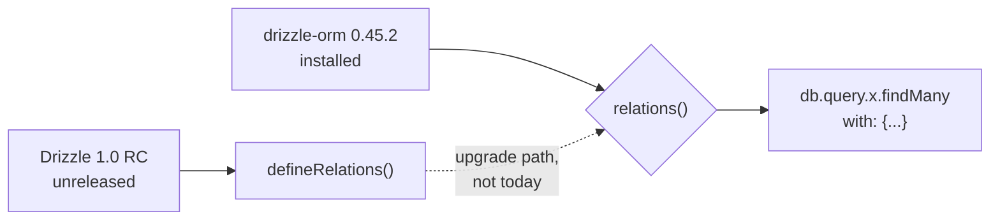

# Drizzle ORM — research notes

> Sources: Drizzle llms.txt sitemap. Drizzle 1.0 RC is in flight; v1 stable is the target. Mapped 2026-09-04.
> **UPDATE 2026-09-11 (post-install correction):** `drizzle-orm` 0.45.2 /
> `drizzle-kit` 0.31.10 are the CURRENT published versions — "Drizzle 1.0
> RC" with `defineRelations` / `defineRelationsPart` is NOT published as of
> this date. Use the relations v1 API (`relations()` from 'drizzle-orm').
> drizzle-kit 0.31 emits FLAT migration files (`db/migrations/0000_name.sql`),
> NOT the nested per-folder layout described below — wrangler.jsonc uses
> `migrations_pattern: 'db/migrations/*.sql'`. The @better-auth/drizzle-adapter
> v2 entry (`relations-v2`) exists but pairs with the v1 relations schema we
> ship today. This note overrides the "1.0 RC" sections below until 1.0
> actually ships.

## Versions and what to install

```bash
bun add drizzle-orm
bun add -d drizzle-kit
```

- `drizzle-orm` is the runtime ORM (driver + query builder + relations). For Cloudflare D1, import from `drizzle-orm/d1` (HTTP driver for prod, SQLite for local).
- `drizzle-kit` is the migration tool. It generates SQL migrations from your schema and can push to the DB.

## Schema definition (Drizzle 1.0 conventions)

```ts
// src/lib/server/db/schema.ts
import { sqliteTable, text, integer, index, uniqueIndex } from 'drizzle-orm/sqlite-core';
import { relations, sql } from 'drizzle-orm';

export const user = sqliteTable('user', {
  id: text('id').primaryKey(),
  name: text('name').notNull(),
  email: text('email').notNull().unique(),
  emailVerified: integer('email_verified', { mode: 'boolean' }).notNull().default(false),
  image: text('image'),
  createdAt: integer('created_at', { mode: 'timestamp' }).notNull(),
  updatedAt: integer('updated_at', { mode: 'timestamp' }).notNull(),
});

export const session = sqliteTable('session', {
  id: text('id').primaryKey(),
  userId: text('user_id').notNull().references(() => user.id, { onDelete: 'cascade' }),
  token: text('token').notNull().unique(),
  expiresAt: integer('expires_at', { mode: 'timestamp' }).notNull(),
  ipAddress: text('ip_address'),
  userAgent: text('user_agent'),
  createdAt: integer('created_at', { mode: 'timestamp' }).notNull(),
  updatedAt: integer('updated_at', { mode: 'timestamp' }).notNull(),
});

export const account = sqliteTable('account', {
  id: text('id').primaryKey(),
  userId: text('user_id').notNull().references(() => user.id, { onDelete: 'cascade' }),
  accountId: text('account_id').notNull(),      // provider subject
  providerId: text('provider_id').notNull(),     // 'credential' | 'github' | etc
  accessToken: text('access_token'),
  refreshToken: text('refresh_token'),
  idToken: text('id_token'),
  accessTokenExpiresAt: integer('access_token_expires_at', { mode: 'timestamp' }),
  refreshTokenExpiresAt: integer('refresh_token_expires_at', { mode: 'timestamp' }),
  scope: text('scope'),
  password: text('password'),
  createdAt: integer('created_at', { mode: 'timestamp' }).notNull(),
  updatedAt: integer('updated_at', { mode: 'timestamp' }).notNull(),
}, (t) => ({
  // Better Auth's unique constraint on (providerId, accountId). There is no
  // `issuer` column in 1.7.5 and no `identityStrategy` option - an earlier
  // draft of this file named both, which does not match the installed
  // package. The repo's own index is `account_provider_id_account_id_unique`.
  uniqProviderAccount: uniqueIndex('account_provider_id_account_id_unique').on(
    t.providerId,
    t.accountId
  ),
}));

export const verification = sqliteTable('verification', {
  id: text('id').primaryKey(),
  identifier: text('identifier').notNull(),
  value: text('value').notNull(),
  expiresAt: integer('expires_at', { mode: 'timestamp' }).notNull(),
  createdAt: integer('created_at', { mode: 'timestamp' }),
  updatedAt: integer('updated_at', { mode: 'timestamp' }),
});

// App tables
export const job = sqliteTable('job', {
  id: text('id').primaryKey(),
  userId: text('user_id').notNull().references(() => user.id, { onDelete: 'cascade' }),
  title: text('title').notNull(),
  company: text('company').notNull(),
  url: text('url'),
  status: text('status', { enum: ['saved', 'applied', 'interviewing', 'offer', 'rejected', 'withdrawn'] }).notNull().default('saved'),
  salaryMin: integer('salary_min'),
  salaryMax: integer('salary_max'),
  location: text('location'),
  notes: text('notes'),
  appliedAt: integer('applied_at', { mode: 'timestamp' }),
  createdAt: integer('created_at', { mode: 'timestamp' }).notNull(),
  updatedAt: integer('updated_at', { mode: 'timestamp' }).notNull(),
}, (t) => ({
  userIdx: index('job_user_idx').on(t.userId),
  statusIdx: index('job_status_idx').on(t.userId, t.status),
}));

// Relations v1 (or v2 — see "Relations" below)
export const jobRelations = relations(job, ({ one, many }) => ({
  user: one(user, { fields: [job.userId], references: [user.id] }),
  applications: many(application),
}));

export const application = sqliteTable('application', {
  id: text('id').primaryKey(),
  userId: text('user_id').notNull().references(() => user.id, { onDelete: 'cascade' }),
  jobId: text('job_id').notNull().references(() => job.id, { onDelete: 'cascade' }),
  stage: text('stage', { enum: ['applied', 'phone_screen', 'technical', 'onsite', 'final', 'rejected', 'accepted', 'withdrawn'] }).notNull().default('applied'),
  contactName: text('contact_name'),
  contactEmail: text('contact_email'),
  nextActionAt: integer('next_action_at', { mode: 'timestamp' }),
  notes: text('notes'),
  createdAt: integer('created_at', { mode: 'timestamp' }).notNull(),
  updatedAt: integer('updated_at', { mode: 'timestamp' }).notNull(),
});
```

### Column types cheat sheet (D1 / SQLite)

| Need | Drizzle column |
|---|---|
| id (string/uuid) | `text('id').primaryKey()` |
| id (auto-increment) | `integer('id').primaryKey({ autoIncrement: true })` |
| created/updated | `integer('created_at', { mode: 'timestamp' }).notNull().$default(() => new Date())` |
| json | `text('payload', { mode: 'json' }).$type<MyShape>()` |
| bool | `integer('enabled', { mode: 'boolean' }).notNull().default(false)` |
| enum | `text('status', { enum: ['a','b'] as const }).notNull()` |
| decimal | `integer('cents').notNull()` (store money as integer cents) |
| foreign key | `.references(() => other.id, { onDelete: 'cascade' \| 'restrict' \| 'set null' })` |
| unique | `t => ({ uniq: uniqueIndex('t_col_unique').on(t.col) })` |
| index | `t => ({ idx: index('t_col_idx').on(t.col) })` |
| composite unique | `uniqueIndex('t_a_b_unique').on(t.a, t.b)` |

The `.references()` callback must reference a column, not a callback, and you cannot have forward references (define tables in dependency order).

## Database client

```ts
// src/lib/server/db/index.ts
import { drizzle } from 'drizzle-orm/d1';
import { env } from 'cloudflare:workers';
import * as schema from './schema';

export function getDb(d1: D1Database) {
  return drizzle(d1, { schema, logger: true });
}

// In a server context, get the D1 binding from the platform:
// import { error } from '@sveltejs/kit';
// const d1 = (event.platform?.env as Env).DB;
// const db = getDb(d1);
```

D1's prepared-statement batching helps a lot: `db.batch([q1, q2, q3])` for grouped reads/writes inside one roundtrip.

## Queries

```ts
// Select
const all = await db.select().from(job).where(eq(job.userId, userId)).all();
const one = await db.select().from(job).where(eq(job.id, id)).get();

// Insert
const inserted = await db.insert(job).values({
  id: crypto.randomUUID(),
  userId,
  title: 'Senior Frontend Engineer',
  company: 'Acme',
  status: 'saved',
  createdAt: new Date(),
  updatedAt: new Date(),
}).returning();

// Update
await db.update(job).set({ status: 'applied', appliedAt: new Date() })
  .where(and(eq(job.id, id), eq(job.userId, userId)))
  .run();

// Delete
await db.delete(application).where(eq(application.id, id)).run();

// Pagination (limit/offset)
const { rows, total } = await db.select({ row: job, total: sql<number>`count(*)` })
  .from(job)
  .where(eq(job.userId, userId))
  .orderBy(desc(job.createdAt))
  .limit(20).offset(0);
```

Operators: `eq`, `ne`, `gt`, `gte`, `lt`, `lte`, `and`, `or`, `not`, `inArray`, `notInArray`, `isNull`, `isNotNull`, `like`, `ilike`, `between`, `sql` template for raw fragments.

## Relations v1 (current stable) vs v2 (Drizzle 1.0 RC)

Drizzle has two relation APIs:

### v1 (works with Drizzle 0.x and 1.0)

```ts
import { relations } from 'drizzle-orm';
export const jobRelations = relations(job, ({ one, many }) => ({
  user: one(user, { fields: [job.userId], references: [user.id] }),
  applications: many(application),
}));
// Drizzle infers `db.query.jobs.findFirst({ with: { applications: true } })`.
```

### v2 (`defineRelations`) — NOT PUBLISHED, DO NOT USE

The v2 API was announced with the Drizzle 1.0 RC:

```ts
import { defineRelations } from 'drizzle-orm';   // ✗ does not exist in 0.45.2
```

**It does not exist in the installed version.** `drizzle-orm@0.45.2` exports no `defineRelations` and no `defineRelationsPart`; importing either fails at type-check. The "alternation engine" it feeds is likewise unreleased. Any instruction in this file to "use the v2 API from day 1" is stale — the repo is on v1 (`relations()`) and must stay there until 1.0 actually ships and `package.json` is bumped.



**For this project**: v1 `relations()`, unconditionally. If a future `drizzle-orm@1.x` lands, the migration is mechanical — rewrite each `relations(table, ({ one, many }) => …)` block — and should be done in one commit with a fresh `svelte-check` run.

## Migrations

```bash
# 1. Drizzle config
# drizzle.config.ts
import { defineConfig } from 'drizzle-kit';
export default defineConfig({
  dialect: 'sqlite',
  driver: 'd1-http',
  schema: './src/lib/server/db/schema.ts',
  out: './db/migrations',
  casing: 'snake_case',
  dbCredentials: {
    accountId: process.env.CLOUDFLARE_ACCOUNT_ID!,
    databaseId: process.env.CLOUDFLARE_D1_DATABASE_ID!,
    token: process.env.CLOUDFLARE_D1_TOKEN!,
  },
});

# 2. Generate SQL from schema
bunx drizzle-kit generate

# 3. Apply to local D1
bunx wrangler d1 migrations apply job-tracker --local

# 4. Apply to remote D1
bunx wrangler d1 migrations apply job-tracker --remote
```

For ORM-style migrations (Drizzle tracks which SQL files ran), use the local SQLite driver during dev and the D1 HTTP driver for prod, swapping the `drizzle.config.ts` via env var.

`migrations_dir` and `migrations_pattern` on the D1 binding in `wrangler.jsonc`:

```jsonc
"d1_databases": [{
  "binding": "DB",
  "database_name": "job-tracker",
  "database_id": "<UUID>",
  "migrations_dir": "db/migrations",
  "migrations_pattern": "db/migrations/*.sql"
}]
```

The repo uses drizzle-kit 0.31's FLAT layout (`db/migrations/0000_name.sql`) with `migrations_pattern: 'db/migrations/*.sql'` — see the correction note at the top of this file. (The nested one-folder-per-migration layout was the unpublished Drizzle 1.0 RC plan.)

## Typed Drizzle (relations v1 + Better Auth + Cloudflare D1)

The full setup path:

1. Define your own schema in `src/lib/server/db/schema.ts` using `relations()` from `drizzle-orm` (the v1 API — not `defineRelations`, which is unpublished).
2. Run `bunx auth@latest generate --adapter drizzle --dialect sqlite` — produces a parallel `auth-schema.ts` you merge in (or re-export everything from one file).
3. `bunx drizzle-kit generate` — produces migration SQL.
4. `wrangler d1 create job-tracker` → copy id into `wrangler.jsonc`.
5. `wrangler d1 migrations apply job-tracker --local` then `--remote`.
6. `drizzleAdapter(db, { provider: 'sqlite', schema: { ...schema, ...authSchema }, usePlural: false })`.

## Edge cases & gotchas

- **D1 read replicas** (regional) eventually read-after-write inconsistently for a few seconds. If the user creates a job and immediately navigates, the new job may not appear. Use `event.platform.env.DB` (the primary) for write, accept eventual reads.
- **D1 row cap**: 2 MB per row and 100 kB per statement ([D1 limits](https://developers.cloudflare.com/d1/platform/limits/)). Job descriptions are ~10 kB, so no risk; big exports go through the CSV endpoint, which streams rather than buffering whole rows.
- **Drizzle relations** when used with `joins: true` in Better Auth need a `many()`/ `one()` per relationship. The generator handles this; if you hand-roll, double-check.
- **Naming**: use `casing: 'snake_case'` in `drizzle.config.ts` to translate camelCase TS names to snake_case columns. Or just write columns in snake_case and TS in camelCase manually.
- **Date handling**: SQLite has no native datetime — Drizzle's `mode: 'timestamp'` stores unix seconds. Be aware when reading raw rows.
- **Migrations on D1**: foreign keys exist. Use `PRAGMA defer_foreign_keys = true;` at the top of complex migrations to allow dropping/recreating tables in one batch.

## Reference cheatsheet

| Operation | Drizzle syntax |
|---|---|
| Insert one | `db.insert(t).values(v).returning()` |
| Insert many | `db.insert(t).values([v1, v2]).run()` |
| Select all | `db.select().from(t).all()` |
| Select one | `db.select().from(t).where(eq(t.id, x)).get()` |
| Update | `db.update(t).set({ col: v }).where(...).run()` |
| Delete | `db.delete(t).where(...).run()` |
| Transaction | `db.transaction(async (tx) => { ... })` |
| Batch (D1) | `db.batch([q1, q2, ...])` |
| Raw SQL | `sql\`...${value}...\`` template |
| Relations query | `db.query.jobs.findFirst({ where: ..., with: { applications: true } })` |
| Upsert | `onConflictDoUpdate({ target: t.id, set: { col: sql\`excluded.col\` } })` |
| Returning | `.returning({ id: t.id })` to pick columns |
| Aggregate | `sql\`count(*)\`` in select |
| CTE | `db.$with('cte').as(db.select()...)` then `.from(cte)` |

## Sources

- Drizzle ORM llms.txt: https://orm.drizzle.team/llms.txt
- Schema declaration: https://orm.drizzle.team/docs/sql-schema-declaration
- Data querying: https://orm.drizzle.team/docs/data-querying
- Relations: https://orm.drizzle.team/docs/relations
- Migrations: https://orm.drizzle.team/docs/kit-overview
- Drizzle config: https://orm.drizzle.team/docs/drizzle-config-file
- Drizzle + D1 guide: https://orm.drizzle.team/docs/get-started/d1-new
- Better Auth Drizzle adapter: https://better-auth.com/docs/adapters/drizzle
