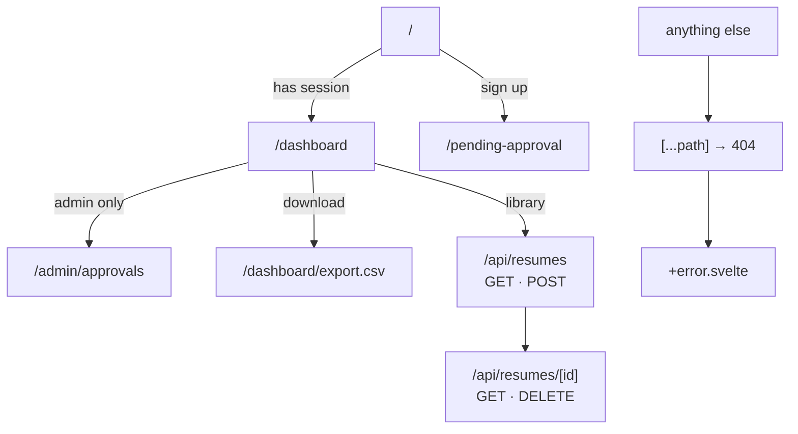
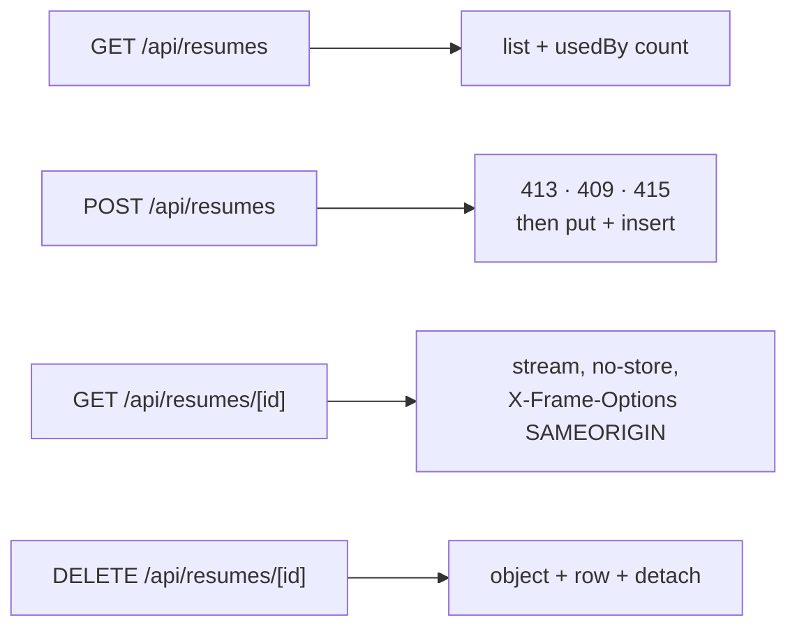
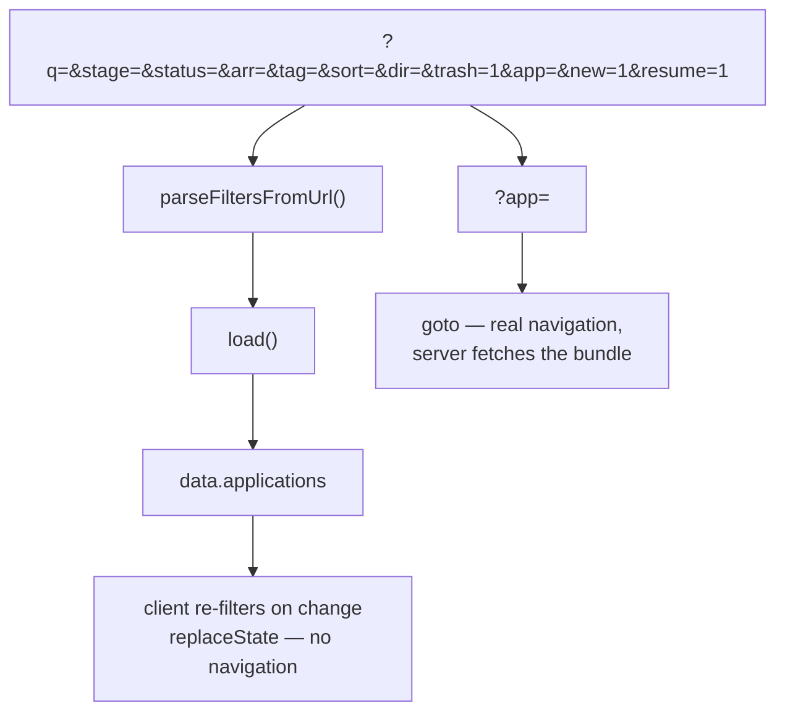
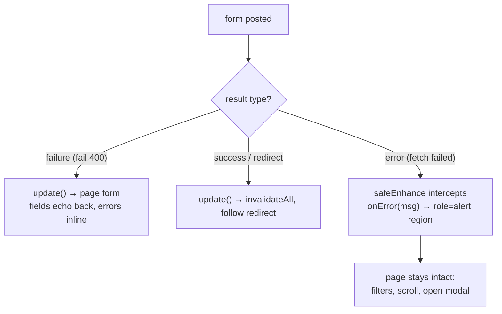

# Routes

Eight route groups. Every one of them is server-rendered; there is no SPA fallback and no client
router doing data fetching.



## The table

| Route | File | Guard | Purpose |
|---|---|---|---|
| `/` | `+page.server.ts` | Redirects to `/dashboard` if signed in | Sign-in / sign-up. Also answers two one-shot banners: `?signedout=1`, `?approved=1` |
| `/pending-approval` | `+page.server.ts` | Redirects to `/dashboard` if signed in | "Wait for an admin" notice; `?handle=` echoes the derived sign-in handle |
| `/dashboard` | `+page.server.ts` | Redirects to `/?next=<pathname+search>` if not signed in | The app |
| `/dashboard/export.csv` | `+server.ts` | Same as dashboard (401, not an HTML redirect) | CSV download of every active row |
| `/admin/approvals` | `+page.server.ts` | Signed in **and** `role === 'admin'` | Approval queue |
| `/api/resumes` | `+server.ts` | Signed in | `GET` list, `POST` upload |
| `/api/resumes/[id]` | `+server.ts` | Signed in **and** owns the row | `GET` stream the PDF, `DELETE` remove it |
| `/[...path]` | `+page.ts` | none | Throws 404 so `+error.svelte` renders |
| `/api/auth/*` | via `svelteKitHandler` | Better Auth | Auth endpoints, mounted in `hooks.server.ts` |

Two error surfaces exist and they are not interchangeable. `+error.svelte` is the SvelteKit
boundary: it renders inside the app, with the layout, the favicon, and the styled token sheet.
`src/error.html` is the static fallback SvelteKit serves when the failure happens before the app can
boot at all — a `handle` hook that throws, for instance. It is a self-contained document with its
own inline CSS and no Svelte, so it does not use `layout.css` and its only link is a hardcoded `/`
(it cannot import `$app/paths`, and `paths.base` is `/` in this app).

## The resume endpoints

The only non-form mutation surface in the app, because a form action would push a 10 MB body
through the SSR round-trip.



| Status | Where | Means |
|---|---|---|
| 200 / 201 | both | `GET` list, `POST` created |
| 400 | `POST` | No file in the body, an empty file, or a multipart body the parser could not read (a filename with a raw CR/LF does it) |
| 401 | both | No session |
| 404 | both | No such resume **for this user** — a foreign id misses, it does not deny |
| 409 | `POST` | Already at 20 resumes. Delete one first |
| 410 | `GET [id]` | The row exists but the R2 object is gone |
| 411 | `POST` | No `content-length`. Required, so a chunked body cannot be buffered before it is measured |
| 413 | `POST` | Over 10 MB, judged from `content-length` before the body is read |
| 415 | `POST` | Not a PDF. The first five bytes were not `%PDF-` |

## Actions

Every mutation is a form action, so it re-runs `load()` and the server stays the single source of
truth for what the user sees.

```mermaid
flowchart LR
    F["<form method=POST>"] -->|"use:enhance"| A["?/create · ?/edit · ?/delete"]
    A --> V["validate"]
    V -- bad --> FF["fail(400, {values, errors})"]
    V -- ok --> W["write D1"]
    W --> L["load() re-runs"]
    L --> H["fresh HTML"]
```



| Route | Action | Does |
|---|---|---|
| `/` | `default` | Branches on `mode`: `signin` or `signup`. On sign-up, reads the row back to see whether the bootstrap hook approved it (`/?approved=1`) or queued it (`/pending-approval`). On sign-in, verifies the password **first**, then checks `disabled` and revokes the session it just created — see [security.md](security.md#sign-in-what-an-attacker-can-and-cannot-learn) for why the order is that way and must not be reversed |
| `/dashboard` | `create` | New application. A submitted `resumeId` must pass `isResumeOwned()` |
| | `edit` | Update an existing one; same `resumeId` check |
| | `delete` | Soft delete — sets `deletedAt` |
| | `restore` | Clears `deletedAt` |
| | `purge` | Hard delete one row |
| | `emptyTrash` | Hard delete everything in the trash |
| | `addInterview` | Adds an interview + an `activity_event` |
| | `addContact` | Adds a contact + an `activity_event` |
| | `signout` | Ends the session |
| `/admin/approvals` | `approve` | `disabled → false`; the user can sign in at once |
| | `reject` | Deletes the user row |

## URL state: what lives where



Two kinds of state, two mechanisms, and the split is not cosmetic — each `goto` is a Worker
invocation and the free tier budgets those by the day.

| State | Mechanism | Why |
|---|---|---|
| Filters, sort, tag chips (`?q=`, `?stage=`, `?status=`, `?arr=`, `?tag=`, `?sort=`, `?dir=`) | `replaceState` from `$app/navigation` | The client already owns the rows; re-filtering is free |
| Which detail modal is open (`?app=`) | `goto(resolvePath(...))`, carrying the current query string forward | The server has to fetch interviews, contacts, and the timeline |
| Trash view (`?trash=1`) | `goto` — it is a plain `<a href>`, not a `goto()` call | Changes what the server returns |
| New-application modal (`?new=1`) | `replaceState` | Pure client state; the URL is written so a refresh reopens it |
| Resume library modal (`?resume=1`) | `replaceState` | Same |

The last two are the odd ones out and worth knowing about: the detail modal is a **real
navigation** because its data comes from the server, while the new-application and resume-library
modals are **client state that happens to be in the URL**. All three are written by the same single
effect in `dashboard/+page.svelte`, which serialises the whole query string and shallow-routes it.

That effect also sets typed `page.state` (`detailId`, `newApp`, `resumeLibrary` — declared in
`src/app.d.ts`). `replaceState` updates `page.state` but **never** `page.url`. So modal open/close
is local `$state` in the page, mirrored into `page.state`; deriving it from `page.url.searchParams`
does not work, and reading filters back out of `page.url` gives a stale value. The effect guards
against `window.location` (the native URL), not `page.url`, precisely because the latter is frozen
between real navigations.

**The same trap catches `onRowClick`, and it is the one that bites users.** Opening the detail modal
is a `goto`, so it has to build a target URL — and building it from `page.url.searchParams` silently
threw away everything the user had changed since the last real navigation:

```
user types a search, clicks a sort column   → ?q=e&sort=company&dir=asc   (replaceState, twice)
user clicks a table row (or an agenda row) → ?app=<id>                    ← filters gone
```

`page.url` still described the URL as it was when the page was first served, so the search term and
the sort were invisible to the `goto`. `onRowClick` therefore reads `window.location.search` via a
`liveSearchParams()` helper, the same source of truth the sync effect uses. `window` is safe there
because it only ever runs from a click, never during SSR.

Worth knowing when you touch this: `openRowById` (the agenda panel) routes through `onRowClick`, so
it inherits the behaviour. If you add a third "open the detail modal" entry point, route it the same
way rather than reaching for `page.url` — that is the mistake, not the helper.

## Redirects

| From | To | Condition |
|---|---|---|
| `/` | `/dashboard` | Session present |
| `/` (after sign-up) | `/?approved=1` | The bootstrap hook approved this first-ever user |
| `/` (after sign-up) | `/pending-approval[?handle=]` | Queued for approval |
| `/pending-approval` | `/dashboard` | Session present |
| `/dashboard` | `/?next=<pathname + search>` | No session — the return path is preserved, unlike `/admin/approvals` |
| `/admin/approvals` | `/?next=/admin/approvals` | No session |
| `/admin/approvals` | `/dashboard` | Signed in but not admin |

`?next=` goes through `safeNextParam`, which rejects anything starting with `//` or `/\` — both
normalise to a protocol-relative URL in a browser and would be an open redirect — and anything
containing `%`, because `/%2f%2fhost` becomes `//host` if any component decodes before resolving.

## The CSV endpoint

`GET /dashboard/export.csv` returns every **active** application the user owns. It does not
apply the table's current filters — those live in the URL and the endpoint deliberately ignores
them, so the export is a stable "everything I am tracking" snapshot rather than whatever happens
to be on screen. Three details matter:

- **Formula injection.** Any cell starting with `=`, `+`, `-`, or `@` is prefixed so a spreadsheet
  treats it as text, not a formula.
- **Buffered, and that is fine.** Rows are collected into an array and joined once. At personal
  scale that is kilobytes, far inside the 128 MB isolate; a true streaming response would add a
  TransformStream and a second code path for no measurable gain.
- **Resumes by name, not id.** The `resume` column is the filename looked up from `listResumes()`,
  batched into the same load rather than queried per row. An application whose resume was deleted
  exports an empty cell instead of a dangling id.

## Error handling

`/[...path]` throws `error(404, …)` so `src/routes/+error.svelte` renders instead of SvelteKit's
bare default. Action failures return `fail(400, { values, errors })` and the form re-renders with
the user's input echoed back — nothing typed is ever discarded on a validation error.

There are two distinct failure shapes, and they are handled differently on purpose:



| Shape | Where it comes from | Handling |
|---|---|---|
| `failure` | `fail(400, { values, errors })` in an action | Travels through `page.form`; the field keeps its value |
| `success` / `redirect` | A completed action | `update()` — `invalidateAll` and follow the redirect |
| `error` | The `fetch` itself failed: dead connection, worker restart, DNS blip | `safeEnhance()` reports inline, page is never replaced |

That third row is the one worth understanding. SvelteKit's default `enhance` callback calls
`applyAction(result)`, and applying an `error` result **throws to the nearest `+error.svelte`
boundary**. The two halves of that live in different files, which is why an earlier draft of this
paragraph cited only one and pointed at the wrong lines:

- `node_modules/@sveltejs/kit/src/runtime/app/forms.js` (~lines 192–205) is the `fetch` and its
  `catch`, which is what *produces* `{ type: 'error', error }`.
- The behaviour being defended against — *applying* that result calls
  `set_nearest_error_page(result.error, result.status)` — is in
  `node_modules/@sveltejs/kit/src/runtime/client/client.js` (~lines 2593–2600), reached from
  `forms.js`.

So a momentary network hiccup on "Move to trash" would swap the whole dashboard for an error page
and discard the user's filters, scroll position, and open modal.

`safeEnhance(onError)` in `src/lib/utils/enhance.ts` intercepts **only** `type === 'error'` and
reports it into a `role="alert"` region. Everything else falls through to `update()` untouched, so
validation echo-back and redirects behave exactly as before. It is wired into every mutating form:
row actions in `ApplicationsTable`, the detail modal's restore / delete / purge and
add-interview / add-contact, approve / reject on the admin queue, sign-out and empty-trash on the
dashboard, plus sign-in / sign-up and `ApplicationForm` (which use `enhanceErrorMessage` directly,
because they already have their own callback).
