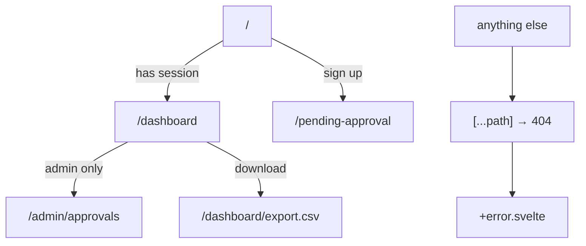
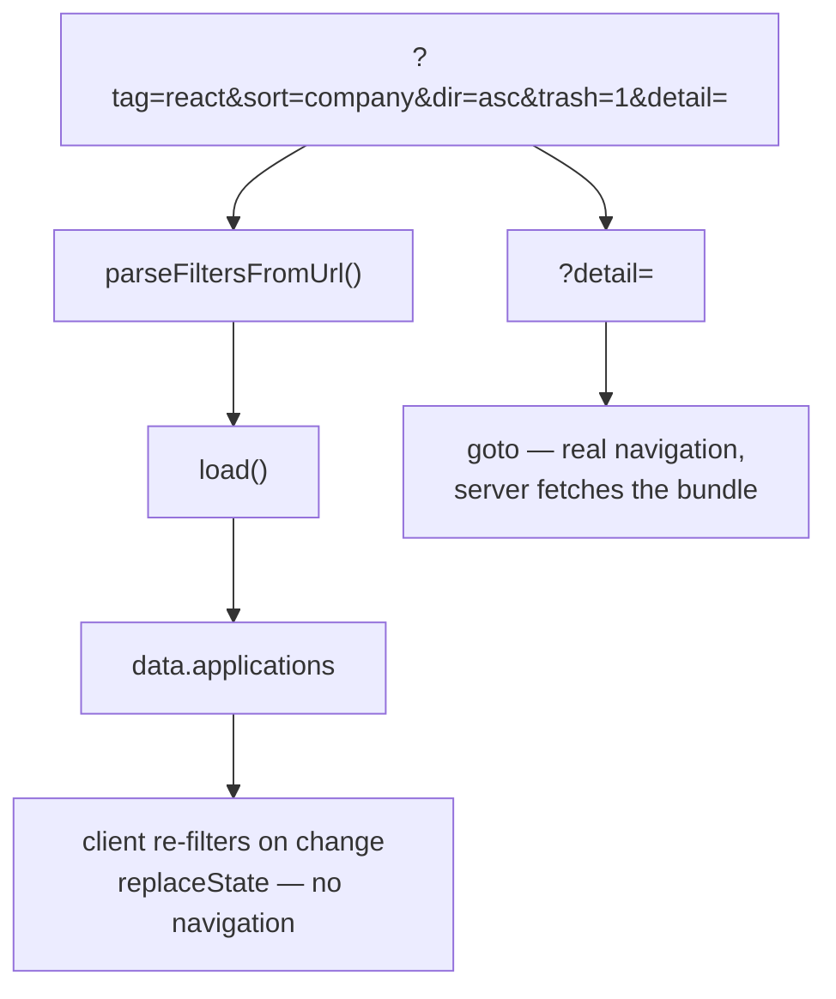

# Routes

Six route groups. Every one of them is server-rendered; there is no SPA fallback and no client
router doing data fetching.

## The table

| Route | File | Guard | Purpose |
|---|---|---|---|
| `/` | `+page.server.ts` | Redirects to `/dashboard` if signed in | Sign-in / sign-up |
| `/pending-approval` | `+page.server.ts` | Redirects to `/dashboard` if signed in | "Wait for an admin" notice |
| `/dashboard` | `+page.server.ts` | Redirects to `/` if not signed in | The app |
| `/dashboard/export.csv` | `+server.ts` | Same as dashboard | CSV download of the current view |
| `/admin/approvals` | `+page.server.ts` | Signed in **and** `role === 'admin'` | Approval queue |
| `/[...path]` | `+page.ts` | none | Throws 404 so `+error.svelte` renders |
| `/api/auth/*` | via `svelteKitHandler` | Better Auth | Auth endpoints, mounted in `hooks.server.ts` |

## Actions

Every mutation is a form action, so it re-runs `load()` and the server stays the single source of
truth for what the user sees.

```mermaid
flowchart LR
    F["<form method=POST>"] -->|"use:enhance"| A["?/create · ?/edit · ?/delete"]
    A --> V["validate"]
    V -- bad --> FF["fail(400, {values, errors})"]
    V -- ok --> W["write D1"]
    W --> L["load() re-runs"]
    L --> H["fresh HTML"]
```

| Route | Action | Does |
|---|---|---|
| `/` | `default` | Branches on `mode`: `signin` or `signup`. Pre-checks `disabled` before signing in |
| `/dashboard` | `create` | New application |
| | `edit` | Update an existing one |
| | `delete` | Soft delete — sets `deletedAt` |
| | `restore` | Clears `deletedAt` |
| | `purge` | Hard delete one row |
| | `emptyTrash` | Hard delete everything in the trash |
| | `addInterview` | Adds an interview + an `activity_event` |
| | `addContact` | Adds a contact + an `activity_event` |
| | `signout` | Ends the session |
| `/admin/approvals` | `approve` | `disabled → false`; the user can sign in at once |
| | `reject` | Deletes the user row |

## URL state: what lives where

Two kinds of state, two mechanisms, and the split is not cosmetic — each `goto` is a Worker
invocation and the free tier budgets those by the day.

| State | Mechanism | Why |
|---|---|---|
| Filters, sort, tag chips | `replaceState` from `$app/navigation` | The client already owns the rows; re-filtering is free |
| Which detail modal is open | `goto(resolvePath(...))` | The server has to fetch interviews, contacts, and the timeline |
| Trash view | `goto` | Changes what the server returns |

`replaceState` updates `page.state` but **never** `page.url`. If you need to read the current
filter out of `page.url`, you are reading a stale value — read `page.state` instead.

## Redirects

| From | To | Condition |
|---|---|---|
| `/` | `/dashboard` | Session present |
| `/pending-approval` | `/dashboard` | Session present |
| `/dashboard` | `/` | No session |
| `/admin/approvals` | `/?next=/admin/approvals` | No session |
| `/admin/approvals` | `/dashboard` | Signed in but not admin |

The `?next=` parameter goes through `safeNextParam`, which rejects anything starting with `//` or
`/\` — both normalise to a protocol-relative URL in a browser and would be an open redirect.

## The CSV endpoint

`GET /dashboard/export.csv` streams the current filtered view. Two details matter:

- **Formula injection.** Any cell starting with `=`, `+`, `-`, or `@` is prefixed so a spreadsheet
  treats it as text, not a formula.
- **No buffering.** It streams rows rather than building one giant string, which keeps it inside
  the Worker memory ceiling.

## Error handling

`/[...path]` throws `error(404, …)` so `src/routes/+error.svelte` renders instead of SvelteKit's
bare default. Action failures return `fail(400, { values, errors })` and the form re-renders with
the user's input echoed back — nothing typed is ever discarded on a validation error.
