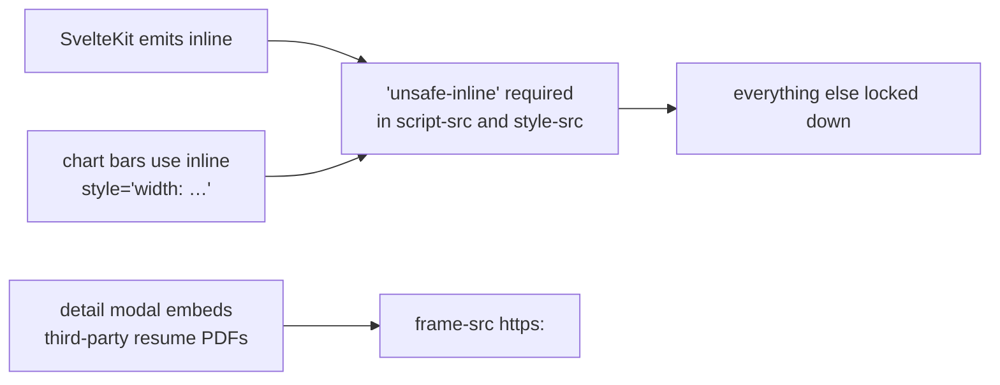
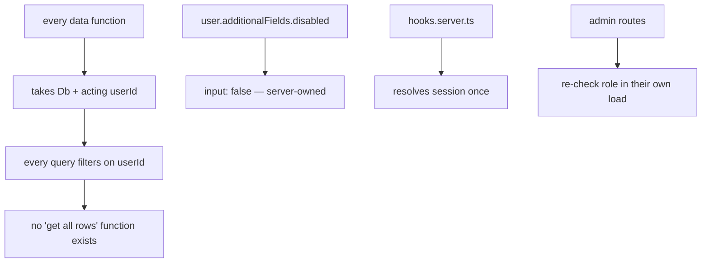
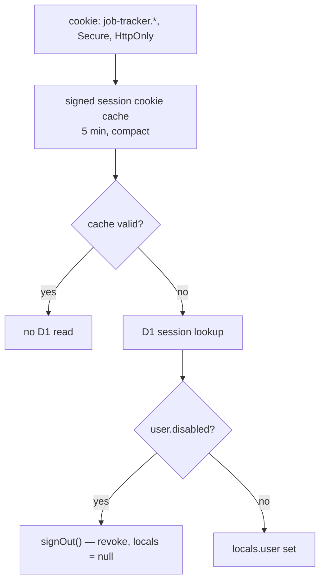

# Security

Single-tenant, authenticated, server-rendered. This file lists what is enforced, and — just as
useful — what is deliberately not.

## Response headers

`src/hooks.server.ts` sets these on **every** response, SSR and static asset alike. It only sets a
header the route has not already set, so a route can always override.

| Header | Value | Stops |
|---|---|---|
| `Content-Security-Policy` | `default-src 'self'` … | Script and asset injection |
| `X-Content-Type-Options` | `nosniff` | MIME sniffing |
| `X-Frame-Options` | `DENY` | Clickjacking |
| `Referrer-Policy` | `strict-origin-when-cross-origin` | URL leakage to third parties |
| `Cross-Origin-Opener-Policy` | `same-origin` | Cross-window tampering |
| `Permissions-Policy` | `camera=(), microphone=(), geolocation=(), interest-cohort=()` | Unused capabilities, FLoC |

The CSP is deliberately **not** strict, and that is documented in the file rather than glossed
over:

Tightening this means moving to nonce- or hash-based CSP, which needs SvelteKit's
`csp.directives` config rather than a header in `hooks.server.ts`. Worth doing; not free.

## The four tenancy guarantees

1. **Row isolation.** `applications-data.ts` has no function that omits a `userId` predicate.
2. **Server-owned fields.** `disabled` is `input: false`, so a crafted POST cannot set it.
3. **One session resolution.** Routes read `locals.user` and do not re-verify; `hooks.server.ts`
   is the only place that vets it.
4. **Authorisation is checked at the boundary that needs it.** `locals` is a convenience, not a
   gate — `/admin/approvals` re-checks `role` in its own load.

## Input handling

| Surface | Defence |
|---|---|
| Password | Length 8-128, hashed by Better Auth; never logged |
| Sign-in identifier | Length 3-254; sign-up requires a real `@` email |
| Redirect targets | `safeNextParam` rejects `//` and `/\` — both are protocol-relative in a browser |
| CSV export | Cells starting with `=`, `+`, `-`, `@` are neutralised against formula injection |
| Salary | Parsed once in `parseSalaryFromForm`; stored as integer minor units, never a float |
| Auth origin | `DEV_ORIGINS` must be empty in production; `baseURL` is the only trusted origin |
| Rate limit | `storage: 'database'` — memory storage is meaningless when isolates reset |

## Session handling

The self-heal branch matters: a `disabled` user holding a valid cookie would otherwise bounce
between routes that all redirect them somewhere else. Revoking on the spot signs them out cleanly.
It only fires for cookies issued before `autoSignIn` was turned off.

## Known gaps

Honest list. None of these is a live vulnerability at current scale; all of them are real.

| Gap | Why it is acceptable now | What changes that |
|---|---|---|
| CSP uses `'unsafe-inline'` | Required by SvelteKit's inline chunks | Wanting a strict CSP — needs `kit.csp.directives` |
| No CSRF token beyond SvelteKit's built-in origin check | Form actions are same-origin by default | Adding a non-form mutation path |
| No email verification | No mail sender configured | Turning on verification or password reset |
| No audit log of admin approvals | One admin, low volume | Multiple admins |
| Resume PDFs framed from third parties | `frame-src https:` is scoped | Storing resumes locally |
| No per-IP blocking beyond rate limits | Rate limiting covers brute force | Sustained targeted attacks |
| `robots.txt` disallows app paths but is advisory | Not a security control | Anything relying on it |

## Not in scope

Secrets are never committed: `BETTER_AUTH_SECRET` goes in via `wrangler secret put`, and
`.dev.vars` is local-only. `worker-configuration.d.ts` is regenerated by `wrangler types`, never
hand-edited. Nothing sensitive is logged — `observability.enabled` sends `console` output to the
dashboard, so keep credentials out of log statements.
