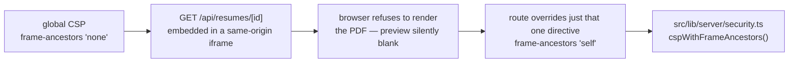
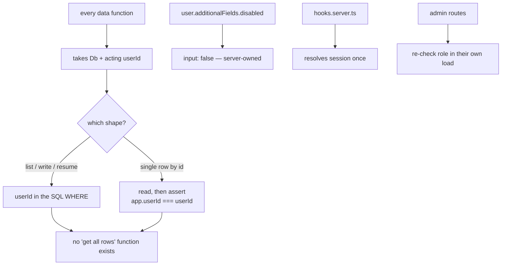
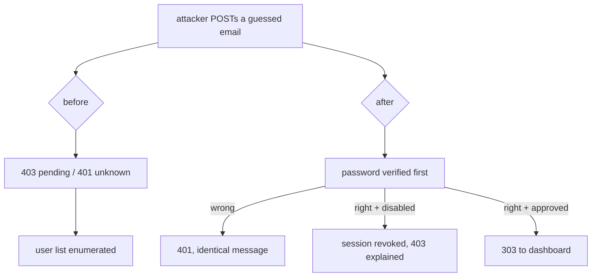
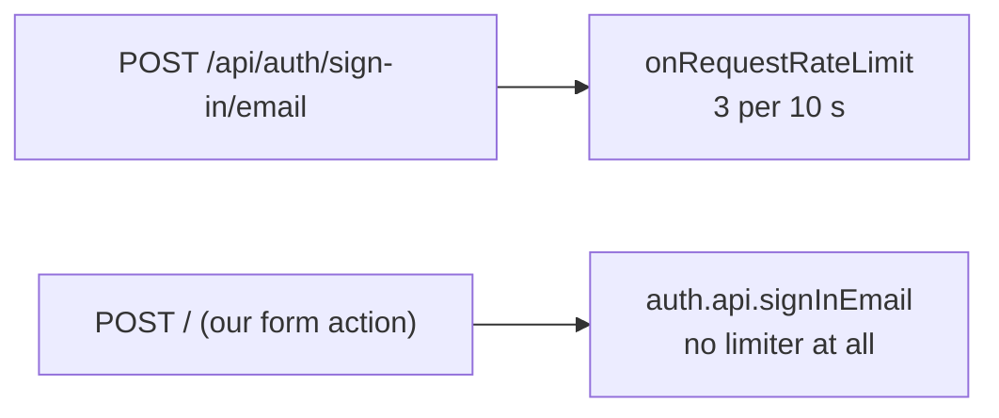
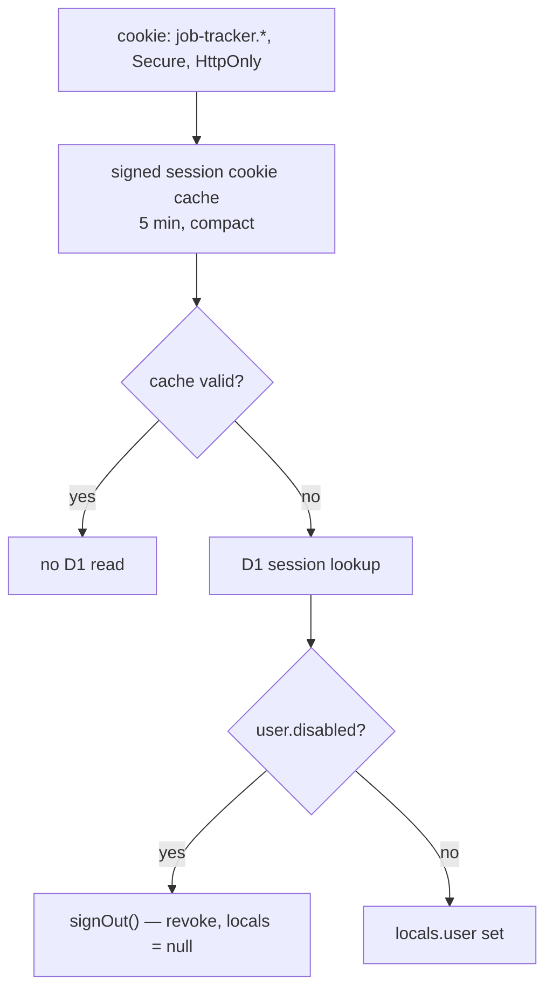

# Security

Single-tenant, authenticated, server-rendered. This file lists what is enforced, and — just as
useful — what is deliberately not.

## Response headers

`src/hooks.server.ts` sets these on every response that passes through SvelteKit's request pipeline,
which is every SSR page and every `+server.ts` endpoint. It only sets a header the route has not
already set, so a route can always override.

**Static assets are the exception.** `wrangler.jsonc` binds the built `ASSETS` directory, and
Cloudflare serves those files before the Worker is ever invoked, so `hooks.server.ts` does not run
for them and no header here applies. That is harmless — an asset is a hashed `.js`/`.css`/`.svg`
with no user data in it — but it does mean the table below is not a claim about static files.

| Header | Value | Stops |
|---|---|---|
| `Content-Security-Policy` | `default-src 'self'` … | Script and asset injection |
| `Strict-Transport-Security` | `max-age=31536000` | Cleartext downgrade on a later visit |
| `X-Content-Type-Options` | `nosniff` | MIME sniffing |
| `X-Frame-Options` | `DENY` (resume route sets `SAMEORIGIN`) | Clickjacking in browsers that ignore CSP |
| `Referrer-Policy` | `strict-origin-when-cross-origin` | URL leakage to third parties |
| `Cross-Origin-Opener-Policy` | `same-origin` | Cross-window tampering |
| `Permissions-Policy` | `camera=(), microphone=(), geolocation=(), interest-cohort=()` | Unused capabilities, FLoC |

The CSP is deliberately **not** strict, and that is documented in the file rather than glossed
over:

Resume PDFs are served by this app, not by a third party, so `frame-src` narrowed from `https:` to
`'self'`. That leaves one real problem: the app embeds the PDF in an `<iframe>` inside the detail
modal, and the global CSP says `frame-ancestors 'none'`, which blocks it.

The fix lives in `src/lib/server/security.ts`, which owns the directive list so one value can be
overridden without retyping the rest. `GET /api/resumes/[id]` calls
`cspWithFrameAncestors("'self'")`; every other response uses the base `'none'`.

Worth being precise about `X-Frame-Options`, because the obvious reading is wrong:

- `object-src 'none'` blocks `<object>` and `<embed>`. Per spec it does **not** reliably block
  `<iframe>`, so it is not what protects that preview.
- When a response carries a CSP `frame-ancestors`, browsers enforce **that** and ignore
  `X-Frame-Options` entirely. So setting `SAMEORIGIN` on the resume route fixes nothing on its
  own — it is there only for the browsers and scanners that do not speak CSP.
- The directive that actually decides whether the preview renders is `frame-ancestors`.

Tightening this means moving to nonce- or hash-based CSP, which needs SvelteKit's
`csp.directives` config rather than a header in `hooks.server.ts`. Worth doing; not free.

One header is conditional. SvelteKit sends no `Cache-Control` on rendered HTML, so a dashboard page
carrying somebody's entire job history had no caching directive at all — anything that caches by
default could hold it. `hooks.server.ts` now adds `private, no-store` to `text/html` responses that
have not set one. Static assets are served by the `ASSETS` binding and never reach the hook, so
their caching is untouched, and `/api/resumes` and the CSV export already send `no-store`
themselves.

## The five tenancy guarantees

1. **Row isolation.** Neither data module has a function that omits the acting `userId`, and there
   is no "get all rows" entry point. The `userId` reaches SQL on every list query, every write,
   and every resume query. The six single-row-by-primary-key reads
   (`getApplicationDetail`, `updateApplication`, `softDeleteApplication`, `restoreApplication`,
   `addInterview`, `addContact`) take `WHERE id = ?` and assert `app.userId === userId` in JS before
   returning anything or writing anything — and the writes that follow still carry
   `AND user_id = ?`. `id` is a unique key, so the index seek is the same either way; see
   [data-model.md](data-model.md#query-discipline) for why both shapes exist.
2. **Server-owned fields.** `disabled` is `input: false`, so a crafted POST cannot set it.
3. **One session resolution.** Routes read `locals.user` and do not re-verify; `hooks.server.ts`
   is the only place that vets it.
4. **Authorisation is checked at the boundary that needs it.** `locals` is a convenience, not a
   gate — `/admin/approvals` re-checks `role` in its own load.
5. **A foreign id is a 404, not a 403.** `getResumeForUser()` misses rather than denies, so a
   probing request cannot confirm that another user's resume exists. The bucket has no public URL
   and no presigned URL is ever minted, so there is no path that skips this check.

## Input handling

| Surface | Defence |
|---|---|
| Password | Length 8-128, hashed by Better Auth; never logged |
| Sign-in identifier | Length 3-254. Sign-up additionally requires an `@` (it keys the account on an email and derives the sign-in handle from the local part). That is a presence check, not a full RFC 5322 parse — the authoritative accept/reject is Better Auth's own email validation on the server |
| Redirect targets | `safeNextParam` rejects `//`, `/\` and any `%` — the first two are protocol-relative in a browser, and `/%2f%2fhost` decodes into one if anything resolves after decoding |
| **Every form sets `novalidate`** | The server is the only validation authority. See [Why the browser is not allowed to validate](#why-the-browser-is-not-allowed-to-validate) |
| Posting URL | `sanitizePostingUrl` accepts `http`/`https` only, so `javascript:` and `data:` cannot reach the detail modal's `<a href>`, and requires a dot in the hostname so a typo is not stored as a link. It also **prefixes a bare host with `https://`** rather than discarding it, because `linkedin.com/jobs/view/123` is what people actually paste |
| Uploaded file type | The client's `Content-Type` is attacker-controlled, so the first five bytes must be `%PDF-`. The filename is display-only and never becomes a path |
| Uploaded file size | A `content-length` is now **required** (411 without one) so a chunked body cannot be buffered before it is measured. The declared length is checked against 10 MB **plus 64 KiB of multipart framing overhead** (`MULTIPART_SLACK_BYTES` in the route) so a legitimate browser upload is not rejected for its own envelope; the real bytes are then re-checked against 10 MB after `formData()` |
| Malformed upload body | `request.formData()` is wrapped. A filename containing a raw CR/LF used to throw straight out of the worker as a bare 500; it is now a 400 |
| Field length | `FIELD_LIMITS` in `dashboard/+page.server.ts`: `short` = 200 (company, role, contact name/role/company/email, interview `withName`), `long` = 20 000 (notes, posting description, interview and contact notes), `url` = 2 048, 50 tags of 40 characters. Without these a single account could post a 2 MB `company` or 50 000 tags — one row, 538 KB — and spend the whole CPU budget doing it |
| Resume id from a form | `isResumeOwned()` on `create` and `edit` — a `resumeId` is free text, so it is checked like any other id |
| Resume object key | Always `${userId}/${id}.pdf`, both server-generated. No user string reaches the key |
| CSV export | Cells starting with `=`, `+`, `-`, `@` are neutralised against formula injection |
| Salary | Parsed once in `parseSalaryFromForm`; stored as integer minor units, never a float |
| Auth origin | `DEV_ORIGINS` must be empty in production; `baseURL` is the only trusted origin |
| Rate limit | Better Auth's own limiter, `storage: 'database'` — memory storage is meaningless when isolates reset. **It only guards `/api/auth/*`.** See [Throttling](#throttling) |

## Why the browser is not allowed to validate

Both the sign-in form and `ApplicationForm` carry `novalidate`. That is not a shortcut — the browser
was actively contradicting the server, and the failure mode was silent.

`postingUrl` is `<input type="url">`, and native constraint validation requires a full URL. But
`sanitizePostingUrl` **deliberately accepts a bare host** and prefixes `https://`, precisely because
that is what people paste from a job board. Native validation ran first, so:

1. the user typed `vercel.com/jobs/infra`,
2. the browser refused to submit and showed "Please enter a URL" in a bubble,
3. **no request was ever made** — nothing in the worker logs, no field error, no `role="alert"`,
4. the modal simply sat there looking broken.

It is redundant for the same reason: every field is validated in the action with a per-field message
that renders inline, which is strictly more informative than a native tooltip. And it is a second,
divergent copy of the rules — the moment the server relaxes or tightens a rule, the client has to be
remembered too, or the form refuses to submit on values the server is happy to accept.

The `type="url"` attribute stays. It is not there for validation; it is there for the mobile
keyboard and for semantic meaning. `novalidate` switches off the blocking behaviour, not the
semantics.

The rule for new forms: **validate on the server, render the error where the field is.** If a
constraint is worth stating in the markup, keep the attribute and add `novalidate`.

## Sign-in: what an attacker can and cannot learn

The sign-in form used to answer three different ways: **403 "waiting for approval"** for a real but
unapproved account, **400 "no account matches that username"** for an unknown handle, and **401**
for everything else. Two of those are free account-enumeration oracles — send an email address, read
the status code, and you have the user list without ever guessing a password.

So the approval gate now sits **behind** the password. That reverses the old ordering deliberately:

- Anyone who does not know the password gets one string and one status code, whichever way it
  fails.
- The account's real owner still gets told they are waiting for approval — they know the password,
  so they are the one person the message is for.
- An unapproved account does briefly get a session, because `signInEmail` has already run by then.
  It is revoked immediately in the same request, and `hooks.server.ts` revokes any disabled user's
  session on every request regardless. Two independent backstops; if both somehow failed, the
  session belongs to an account that cannot reach a guarded route anyway.

The one thing that could not be closed cheaply is **timing**. Verifying a password costs roughly
85–95 ms of scrypt on this hardware; not finding an account costs single-digit milliseconds. That
gap is measurable over a network and still tells you whether an account exists — it just no longer
tells you whether it is approved. Making it uniform means running scrypt against a dummy hash for
every unknown account, and at that cost against a 10 ms free-tier ceiling it would turn every
mistyped sign-in into an Error 1102. Throttling is the better trade. (The same 85–95 ms figure is
used in [free-tier-budget.md](free-tier-budget.md) and [deployment.md](deployment.md); an earlier
draft of this file quoted 73 ms in one place and 85–95 ms in another, which made the gap read as
~65 ms here and ~80 ms there.)

## Throttling

**Better Auth's rate limiter only runs on the `/api/auth/*` HTTP router.** The app's own sign-in
form does not go through that router — it calls `auth.api.signInEmail()` directly from the action
in `src/routes/+page.server.ts`, and a direct `auth.api` call bypasses `onRequestRateLimit`
entirely. Verified: 60 consecutive wrong passwords against the form in under four seconds, every
one a clean 401, no 429. The same burst against `/api/auth/sign-in/email` is stopped after three.

The cheapest real fix is Cloudflare's own WAF, which costs no worker CPU. On the **Free** plan
([WAF rate limiting rules, availability table](https://developers.cloudflare.com/waf/rate-limiting-rules/))
you get exactly **one** rate limiting rule, matching on **Path** only, counted **per IP**, with a
**10 second** window and a **10 second** mitigation. That is enough for this app:

| Setting | Value |
|---|---|
| Rule name | `sign-in throttle` |
| Expression | Path **equals** `/` |
| Characteristic | IP |
| Period | 10 seconds |
| Requests per period | 20 |
| Action | Block (or Managed Challenge) |

Path `/` is where both the sign-in and sign-up form actions post, so one rule covers both. It is
set high enough that nobody typing a password slowly will hit it, and low enough that a password
guessing run dies immediately.

The alternative — an application-level counter — needs a D1 table and a migration, and spends a
database write on every attempt. Take the WAF rule first; add the counter only if the app ever runs
somewhere that is not behind Cloudflare.

## Session handling

The self-heal branch matters: a `disabled` user holding a valid cookie would otherwise bounce
between routes that all redirect them somewhere else. Revoking on the spot signs them out cleanly.
It fires in two situations: for a cookie issued before `autoSignIn` was turned off, and as the
backstop for a sign-in whose route-level `signOut` failed (the sign-in action creates a real session
for an unapproved account and then revokes it; if that revoke throws, this catches it next
request).

## Known gaps

Honest list. None of these is a live vulnerability at current scale; all of them are real.

| Gap | Why it is acceptable now | What changes that |
|---|---|---|
| CSP uses `'unsafe-inline'` | Required by SvelteKit's inline chunks | Wanting a strict CSP — needs `kit.csp.directives` |
| No CSRF token beyond SvelteKit's built-in origin check | Form actions are same-origin by default | Adding a non-form mutation path |
| No email verification | No mail sender configured | Turning on verification or password reset |
| No audit log of admin approvals | One admin, low volume | Multiple admins |
| Resume PDFs are stored, so a stolen session reads them | Same as any other row: scoped by `userId`, proxied, `no-store` | Wanting per-file share links — needs presigned URLs and a real expiry policy |
| No throttle on the app's own sign-in action | Better Auth's limiter only covers `/api/auth/*`, so there is currently no ceiling on password guesses through the form. On the free tier the 10 ms CPU cap is an accidental brake — a guess costs ~85 ms of scrypt and gets killed — but that is not a control, and it hurts real sign-ins equally | Moving off the free tier, or the app running anywhere that is not behind Cloudflare. Until then, take the [WAF rule](#throttling) |
| Sign-up says when an email is already registered | Telling someone "that email already has an account, sign in instead" is worth more to a real user than hiding it is to us, at this scale. It is still an oracle | Wanting no enumeration at all — return the same redirect for both cases and let sign-in be the only answer |
| ~80 ms timing difference between "no such account" and "wrong password" | Scrypt runs for a real account and not for a missing one. Closing it means hashing a dummy for every miss, which on the free tier turns every typo into an Error 1102 | A threat model where someone is measuring response times |
| Uploaded PDFs are not scanned or sanitised | They are served `no-store` with `nosniff` and rendered in the viewer's own sandbox, and only the uploader can ever fetch one | Letting resumes be shared between users |
| Resume objects can briefly outlive a failed insert | The route deletes the object if the D1 write throws; only a crash mid-write leaves a stray object, and an unpointed object is unreachable | Storing cost becoming a concern — `r2 object list` and sweep |
| `robots.txt` disallows app paths but is advisory | Not a security control | Anything relying on it |

## Not in scope

Secrets are never committed: `BETTER_AUTH_SECRET` goes in via `wrangler secret put`, and
`.dev.vars` is local-only. `worker-configuration.d.ts` is regenerated by `wrangler types`, never
hand-edited. Nothing sensitive is logged — `observability.enabled` sends `console` output to the
dashboard, so keep credentials out of log statements.
