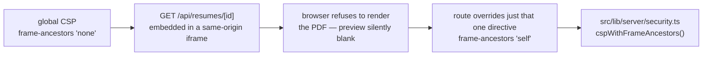
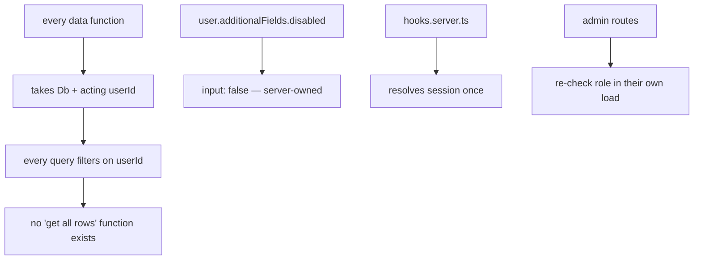
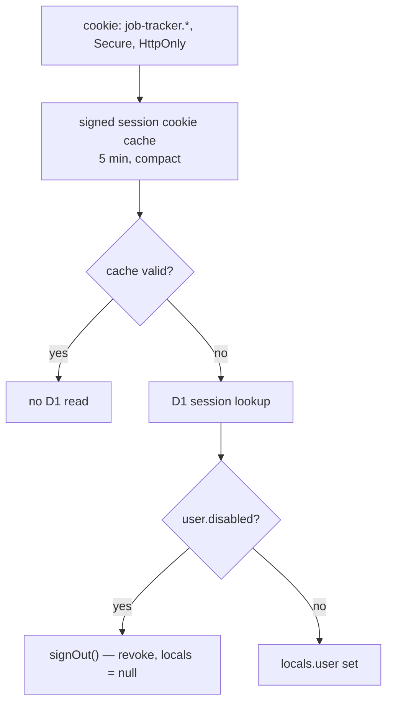

# Security

Single-tenant, authenticated, server-rendered. This file lists what is enforced, and — just as
useful — what is deliberately not.

## Response headers

`src/hooks.server.ts` sets these on **every** response, SSR and static asset alike. It only sets a
header the route has not already set, so a route can always override.

| Header | Value | Stops |
|---|---|---|
| `Content-Security-Policy` | `default-src 'self'` … | Script and asset injection |
| `Strict-Transport-Security` | `max-age=31536000` | Cleartext downgrade on a later visit |
| `X-Content-Type-Options` | `nosniff` | MIME sniffing |
| `X-Frame-Options` | `DENY` (resume route sets `SAMEORIGIN`) | Clickjacking in browsers that ignore CSP |
| `Referrer-Policy` | `strict-origin-when-cross-origin` | URL leakage to third parties |
| `Cross-Origin-Opener-Policy` | `same-origin` | Cross-window tampering |
| `Permissions-Policy` | `camera=(), microphone=(), geolocation=(), interest-cohort=()` | Unused capabilities, FLoC |

The CSP is deliberately **not** strict, and that is documented in the file rather than glossed
over:

Resume PDFs are served by this app, not by a third party, so `frame-src` narrowed from `https:` to
`'self'`. That leaves one real problem: the app embeds the PDF in an `<iframe>` inside the detail
modal, and the global CSP says `frame-ancestors 'none'`, which blocks it.

The fix lives in `src/lib/server/security.ts`, which owns the directive list so one value can be
overridden without retyping the rest. `GET /api/resumes/[id]` calls
`cspWithFrameAncestors("'self'")`; every other response uses the base `'none'`.

Worth being precise about `X-Frame-Options`, because the obvious reading is wrong:

- `object-src 'none'` blocks `<object>` and `<embed>`. Per spec it does **not** reliably block
  `<iframe>`, so it is not what protects that preview.
- When a response carries a CSP `frame-ancestors`, browsers enforce **that** and ignore
  `X-Frame-Options` entirely. So setting `SAMEORIGIN` on the resume route fixes nothing on its
  own — it is there only for the browsers and scanners that do not speak CSP.
- The directive that actually decides whether the preview renders is `frame-ancestors`.

Tightening this means moving to nonce- or hash-based CSP, which needs SvelteKit's
`csp.directives` config rather than a header in `hooks.server.ts`. Worth doing; not free.

## The five tenancy guarantees

1. **Row isolation.** `applications-data.ts` and `resumes-data.ts` have no function that omits a
   `userId` predicate.
2. **Server-owned fields.** `disabled` is `input: false`, so a crafted POST cannot set it.
3. **One session resolution.** Routes read `locals.user` and do not re-verify; `hooks.server.ts`
   is the only place that vets it.
4. **Authorisation is checked at the boundary that needs it.** `locals` is a convenience, not a
   gate — `/admin/approvals` re-checks `role` in its own load.
5. **A foreign id is a 404, not a 403.** `getResumeForUser()` misses rather than denies, so a
   probing request cannot confirm that another user's resume exists. The bucket has no public URL
   and no presigned URL is ever minted, so there is no path that skips this check.

## Input handling

| Surface | Defence |
|---|---|
| Password | Length 8-128, hashed by Better Auth; never logged |
| Sign-in identifier | Length 3-254. Sign-up additionally requires an `@` (it keys the account on an email and derives the sign-in handle from the local part). That is a presence check, not a full RFC 5322 parse — the authoritative accept/reject is Better Auth's own email validation on the server |
| Redirect targets | `safeNextParam` rejects `//` and `/\` — both are protocol-relative in a browser |
| Uploaded file type | The client's `Content-Type` is attacker-controlled, so the first five bytes must be `%PDF-`. The filename is display-only and never becomes a path |
| Uploaded file size | `content-length` is checked before the body is read (413); a 10 MB cap re-checks the real bytes |
| Resume id from a form | `isResumeOwned()` on `create` and `edit` — a `resumeId` is free text, so it is checked like any other id |
| Resume object key | Always `${userId}/${id}.pdf`, both server-generated. No user string reaches the key |
| CSV export | Cells starting with `=`, `+`, `-`, `@` are neutralised against formula injection |
| Salary | Parsed once in `parseSalaryFromForm`; stored as integer minor units, never a float |
| Auth origin | `DEV_ORIGINS` must be empty in production; `baseURL` is the only trusted origin |
| Rate limit | `storage: 'database'` — memory storage is meaningless when isolates reset |

## Session handling

The self-heal branch matters: a `disabled` user holding a valid cookie would otherwise bounce
between routes that all redirect them somewhere else. Revoking on the spot signs them out cleanly.
It only fires for cookies issued before `autoSignIn` was turned off.

## Known gaps

Honest list. None of these is a live vulnerability at current scale; all of them are real.

| Gap | Why it is acceptable now | What changes that |
|---|---|---|
| CSP uses `'unsafe-inline'` | Required by SvelteKit's inline chunks | Wanting a strict CSP — needs `kit.csp.directives` |
| No CSRF token beyond SvelteKit's built-in origin check | Form actions are same-origin by default | Adding a non-form mutation path |
| No email verification | No mail sender configured | Turning on verification or password reset |
| No audit log of admin approvals | One admin, low volume | Multiple admins |
| Resume PDFs are stored, so a stolen session reads them | Same as any other row: scoped by `userId`, proxied, `no-store` | Wanting per-file share links — needs presigned URLs and a real expiry policy |
| No per-IP blocking beyond rate limits | Rate limiting covers brute force | Sustained targeted attacks |
| Uploaded PDFs are not scanned or sanitised | They are served `no-store` with `nosniff` and rendered in the viewer's own sandbox, and only the uploader can ever fetch one | Letting resumes be shared between users |
| Resume objects can briefly outlive a failed insert | The route deletes the object if the D1 write throws; only a crash mid-write leaves a stray object, and an unpointed object is unreachable | Storing cost becoming a concern — `r2 object list` and sweep |
| `robots.txt` disallows app paths but is advisory | Not a security control | Anything relying on it |

## Not in scope

Secrets are never committed: `BETTER_AUTH_SECRET` goes in via `wrangler secret put`, and
`.dev.vars` is local-only. `worker-configuration.d.ts` is regenerated by `wrangler types`, never
hand-edited. Nothing sensitive is logged — `observability.enabled` sends `console` output to the
dashboard, so keep credentials out of log statements.
